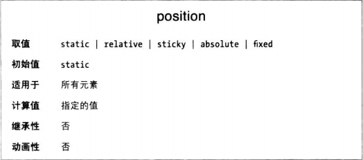

### 定位的类型

定位有五种类型，不同类型生成元素框的方式有所不同。定位类型使用 position 属性指定。

* static：正常生成元素框。块级元素生成矩形框，位于文档流中；行内元素生成一个或多个行框，随父元素流动。
* relative：元素框偏移一定的距离。元素的形状与未定义时一样，而且元素所占空间页与正常情况下相同。
* absoulte：元素框完全从文档流中移除，相对容纳块定位。此时，容纳块可能是文档中的另一个元素，也可能是初始容纳块。正常情况下元素在文档流中占据的空间不复存在。不管元素在常规文档流中生成什么类型的框体，定位后生成的都是块级框。
* fixed：元素的行为类似于 absoulte，不过容纳块是视区自身。
* sticky：元素一开始留在常规文档流中，达到出发粘滞的条件是，从常规文档流中移除，不过在常规文档流中占据的空间得以保留。此时相对于容纳块绝对定位。触法粘滞的条件失效后，元素回到常规文档流中最初的位置。

### 容纳块

一般而言，容纳块指包含另一个元素的框体，比如 html 是 body 的容纳块。但是对于定位来说，容纳块完全取决于定位的类型。

如果 position 属性的值是 relative 或 static，其容纳块由最近的块级祖辈元素框体的内容边界划定。
如果 position 属性的值是 absoulte，其容纳块是 position 属性的值不是 static 的最近的祖辈元素。具体规则如下：

* 如果祖辈元素是块级，容纳块是那个元素边框限定的区域。
* 如果祖辈元素是行内，容纳块是祖辈元素的内容边界。
* 如果没有祖辈元素，元素的容纳块是初始容纳块。

上述规则有一个例外：对粘滞定位的元素来说，容纳块的边界由粘滞限定矩形确定。粘滞定位就发生在这个矩形中。

注意，定位的元素可能位于容纳块外部。其实，“容纳块”应该换成“定位上下文”，但是规范用的就是容纳块。
