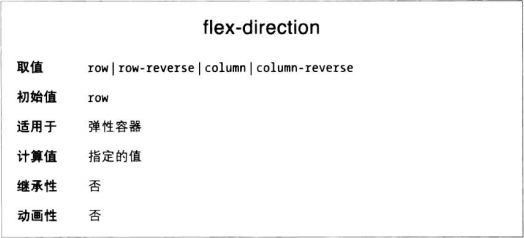
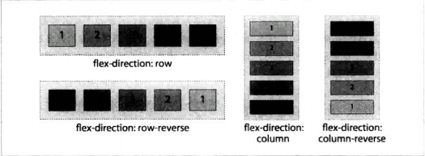
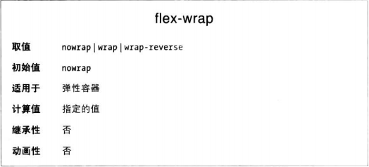
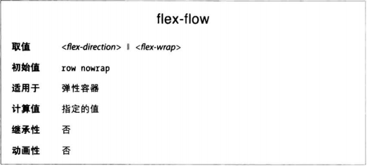

首先要完全理解的概念是弹性容器，容器框。display: flex 或 display: inline-flex 声明的目标元素变成弹性容器，为其子元素生成弹性格式化上下文。

这些元素无论是 DOM 节点、文本内容、还是生成的内容，都称为弹性元素。弹性容器中的绝对定位子元素也是弹性元素，只不过确定其尺寸和位置时，将其视作弹性容器中唯一的弹性元素。

### flex-direction 属性

使用 flex-direction 属性控制排布弹性元素的主轴。

### 换行

如果弹性元素在弹性容器的主轴上放不下，默认不会换行，也不会自行调整尺寸，而是溢出。

可有设置在容器上设置 flex-wrap 属性，允许弹性元素换行、变成多行或多列。

flex-wrap 属性的作用是限制弹性容器只能显示一行，或允许在必要时显示多行。允许换行时，wrap 和 wrap-reverse 决定多出的行显示在第一行之前还是之后。

### 定义弹性流

flex-flow 属性用于定义主轴和垂轴的方向，以及是否允许弹性元素换行，是 flex-direction 和 flex-wrap 两个属性的简写形式，**规范强烈推荐**。

把 display 属性声明 flex 或 inline-flex 后，省略 flex-direction、flex-wrap 和 flex-flow，得到的弹性容器的主轴是横向的，而且不换行。

**深入理解各种轴**
首先，弹性元素沿主轴排布，各行元素沿垂轴方向添加。

* 主轴：元素流动的方向
* 主轴尺寸：主轴方向上内容的总长度
* 主轴起边：主轴上内容开始流动的那一端。
* 主轴终边：主轴上内容流向的那一端，与主轴起边相对
* 垂轴：防止新元素行的方向
* 垂轴尺寸：垂轴方向上内容的总长度
* 垂轴起边：垂轴上块级元素开始堆叠的那一边
* 垂轴终边：垂轴上与起边相对的那一边

