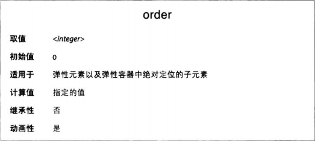

默认情况下，弹性元素的显示和拍不顺序与在源码中顺序一样，但有时可能需要更细致的重排方式。
order 属性用于修改单个弹性元素的显示顺序。

默认情况下，所有弹性元素的顺序都是 0。
若想修改弹性元素的视觉顺序，把 order 属性设为一个非零整数。

order 属性值指定一个排序组。绘制弹性元素时，会按 order 值从小到大的顺序沿着主轴排列。order 属性值一样的弹性元素按源码中的顺序显示。
