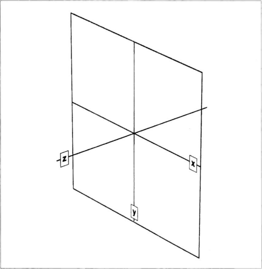
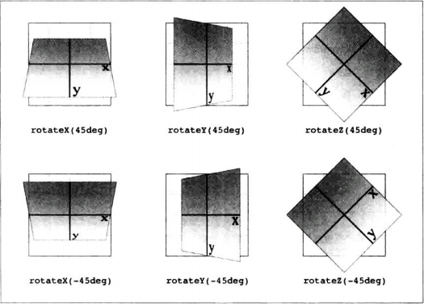

# 坐标系

## 笛卡尔坐标系

首先是笛卡尔坐标系，也就是通常说的 x\y\x 坐标系。在 CSS 中，这个坐标系使用三个周表示：x 轴（横轴），y 轴（纵轴）和 z 轴（深度轴）。

2D 变形只需关注 x 轴和 y 轴。按约定，x 轴上正值在右，负值在左。类似的，y 轴上的正值沿纵轴向下，负值沿纵轴向上。

真正需要注意的是，每个元素都有自己的参照系，各轴都相对自身而动。也就是说，如果旋转了元素，轴哦也随之旋转。旋转之后再变形，是相对旋转后的轴计算。

## 球坐标系

提到旋转，就引出了 CSS 变形功能使用的另一个坐标系--球坐标系，用于描述 3D 空间中的角度。

在 2D 变形中只需关注全周 360 度极坐标系，即由 x 轴和 y 轴构成的平面。对旋转来说，2D 旋转其实是绕 z 轴旋转。

