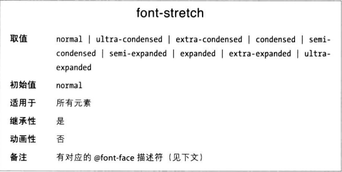

# 字体拉伸

有些字体族中的变体可能具有有较宽或较窄的字母型式，这种变体存在的目的是在同一个字体族中提供瘦体和胖体。CSS 提供了一个属性用来选择这样的变体，如此无需在 font-family 声明单独的字体族。

这个属性的作用其实非常像 foont-szie 属性的绝对大小关键字（例如 xx-large），让创作人员在一些绝对值中选择一个，调整字体宽度。
仅当字体族中有宽体时，font-stretch: extra-expanded 才生效。

与 font-weight 描述符类似，font-stretch 描述符的作用是把不同宽度的字型分配给 font-stretch 属性允许取的不同宽度值。
