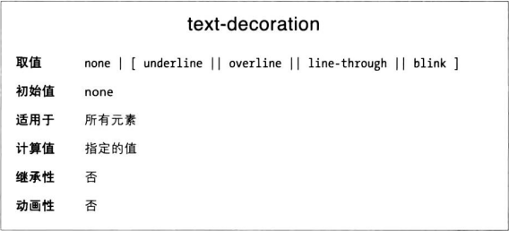

underline 为元素添加下划线，overline 则是上划线。line-through 绘制一条贯穿文本中部的线，也叫删除线。blink 让文本一闪一闪。
none 值把应用到元素上的装饰效果去掉。例如链接默认带下划线，如果想去掉，可以：

```CSS
a {text-decoration: none}
```

一个规则可以使用多个装饰效果，用空格隔开

```CSS
a:link {text-decoration: underline overline}
```

不过要注意，如果在同一个元素上有多条规则应用多个装饰效果，胜出的那个会完全覆盖其他的。

```CSS
h2.stricken {text-decoration: line-through}
h2 {text-decoration: underline overline}
```

此时，类为 stricken 的 h2 元素只有贯穿线。因为最终只会应用胜出的规则自己声明的属性，而不会累加上其他的。

### 怪异的装饰

text-decoration 不会被继承，任何装饰线的颜色都与父元素的文本颜色一样，即使可能渲染出来的文本并不是那个颜色

```CSS
p {text-decoration: underline; color: black}
p > span {color: grey}
```

这里 span 元素也有下划线，但那其实是 p 元素的。而 span 的文本是灰色，下划线却是黑色，因为 p 元素的 color 声明的是黑色。
