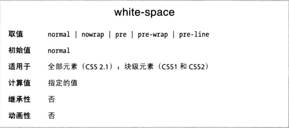
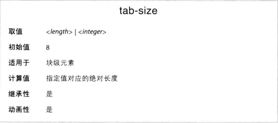

# 处理空白

white-space 属性，影响用户代理对文档源码中的空格、换行符和制表符对处理方式。

## white-space

这个属性影响浏览器对待单词之间及文本行之间空白的方式。默认是把空白压缩成一个空格，换行符也变成空白。这种默认行为可以用 normal 显式声明。
如果设置为 pre，空白不会被压缩，而是直接显示。
与之相反的 nowarp，禁止元素中的文本换行，除非使用 br。

CSS2.1 引入了 pre-wrap 和 pre-line 两个值，可以更好的控制空白的处理方式。
设为 pre-wrap 时，文本中的空白序列得以保留，但是文本将正常换行。pre-line 的作用和 pre-warp 相反，空白序列会被折叠，但是保留换行。

**设定制表符的宽度**
既然 white-space 取某些值时空白会保留，那么制表符也会显示成制表符了。tab-size 属性控制制表符等于多少个空格。

默认情况下，一个制表符相当于八个连续空格。tab-size: 4 把一个制表符渲染成四个连续空格。
如果提供指定长度，那么制表符将渲染成指定长度。

注意，如果 white-space 的值导致空白被折叠，那么 tab-size 就不再起作用了。
