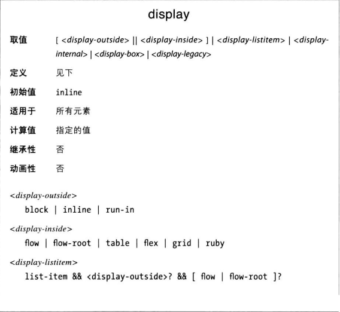
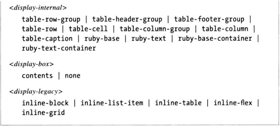
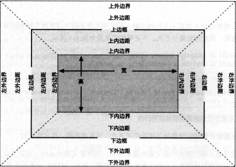
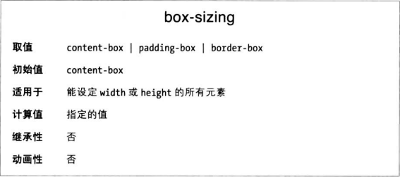

为 display 属性设值可以影响用户代理显示元素的方式。

### 改变显示方式

装饰文档时，若能改变元素生成的框体类型显然更方便。
假设 nav 元素中有一系列链接，想纵向布局，显示为侧边栏。可以把每个链接都变成块级元素。

```CSS
nav a {
    display: block
}
```

整个元素框都变成链接了，用户吧鼠标指针悬停在元素框上任何位置都能单击链接。

要注意，我们改变的是元素的显示方式，而恶不是元素的本性。把段落生成的框体变成行内框并不会把段落变成行内元素。

行内元素可以作为块级元素的后代，但是反过来一般不行。

```HTML
<span style="display: block">
    <p style="display: inline">
        this is wrong
    </p>
</span>
```

这段标记是不对的，p 不能嵌套在 span 内。虽然改变了显示方式，但不能改变元素种类。

### 块级框



默认情况下，块级框的 width 和 height 表示的是内容区的尺寸。

这些属性的处理方式可以使用 box-sizing 属性调整。


这个属性用于改变 width 和 height 值的具体意义。如果不声明。默认 content-box，width 和 height 描述内容区的尺寸。声明为 border-box，width 和 height 描述的是内容区+padding 区的尺寸。

这些宽度、高度、以及内边距和外边距在一起，决定着文档的布局方式。多数情况下，文档的高度和宽度由浏览器自动确定。通过 CSS，可以直接控制元素的尺寸和显示方式。

### 横向格式化

在 content-box 和 border-box 两种情况下，常规流动方式下块级框各组成部分的横向尺寸（包括 margin）始终等于容纳块的宽度（也就是撑满父元素的宽度）。

### 横向格式化属性

横向格式化属性有七个，分别是 margin、border 和 padding 各自的 left 和 right，加一个 width。

这七个属性的值加在一起等于元素容纳块的快读，通常为父元素的 width 值。

这七个属性中，只有三个能设置为 auto：width，和两个 margin。剩下几个属性要么设为具体的值，要么用默认（0）。

### 使用 auto

在 width、margin-left 和 margin-right 中，如果把其中一个设为 auto，另两个设为固定值，那么设为 auto 的属性的具体长度要能满足元素框占满父元素的宽度。
某种意义上说，auto 可以用于补全总和所缺失的尺寸

```CSS
div {width: 500px}
div > p { margin-left: auto; margin-right: 100px; width: 100px }
/* auto 最终计算结果为 300px */
```

如果把这三个属性都设为 auto 之外的值，那用 CSS 术语来说就是过约束了，那么 margin-right 会被强制设为 auto，以匹配父元素的宽度。

### 多个 auto

如果两个外边距都设为 auto，那么会相等，元素在父元素中居中显示。
如果把某一边的外边距和 width 设为 auto，设为 auto 的外边距会是 0，width 被设为填满容纳块所需的值。

最后，如果三个属性都设为 auto，两侧外边距都是 0，width 直接占满宽度。

### 负外边距

七个横向属性之和始终等于父元素的 width。只要这几个属性值都大雨或等于 0，元素就不可能比父元素的内容区宽。但是把外边距设为负值情况就不一样。

```CSS
div {width: 500px}
div > p {
    margin-left: 10px;
    width: auto;
    margin-right: -50px
}
```

用算式计算：10 + width + -50 = 500， width = 540px

反过来，设为 auto 的右外边距也有可能为负值。比如其他属性设为特定的值时，为了满足元素不能比容纳块宽的要求，右外边距就有可能为负值。

```CSS
div {width: 500px}

div > p {
    margin-left: 10px;
    width: 600px;
    margin-right: auto
}
```

此时，margin-right 是 -110px。倘若元素的尺寸出现过约束，右外边距要被重置为满足算式所需的任何值。

注意，七个属性中只有两个外边距可以是负值。

### 百分数

宽度、内边距和外边距设为百分数时，基本的规则依旧适用。百分数根据父元素的内容区宽度计算。

假设我们想把元素内容区宽度设为容纳块三分之一，左右内边距各为 5%，左外边距 5%，余下空间都给右外边距：

```CSS
p {
    width: 67%;
    padding-right: 5%;
    padding-left: 5%;
    margin-left: 5%;
    margin-right: auto
}
```

如果把百分比和长度单位混用，会有一些不容易理清的地方。

```CSS
p {
    width: 67%;
    margin-left: 30px
}
```

根据算式：67% + 30px = 容纳块宽度，也就是说父元素内容区宽度是 90 的时候，元素的右外边距才是 0，如果大于 90 就是正值，小于 90 会是负值。

### 置换元素

块级置换元素的处理方式要简单些，前面针对非置换块级框的规则都成立。不过有一个例外：width 为 auto 时，等于内容（比如图片）自身的高度。

注意，如果置换元素的 width 与自身宽度不同，height 也会按比例变化除非明确设定。反之亦然，如果设定了 height，把 width 设为 auto，width 也会按比例变化。

### 纵向格式化

元素的内容决定元素的默认高度。内容的宽度对高度也有影响，例如段落越窄，为了包含全部内容，高度就越高。

通过 CSS 可以为任何块级元素设定具体的高度。假如设定的高度大于显示内容所需的高度，多出的高度看起来像是内边距。再假设指定的高度小于显示内容所需的高度，那用户代理的具体行为取决于 overflow 属性。

与 width 一样，height 默认定义内容区的高度，而不是元素框可见区域的高度（content-box）。

### 纵向格式化属性

纵向格式化也涉及七个属性：margin-top、border-top、padding-top、padding-bottom、border-bottom 和 margin-bottom。七个属性值加在一起必须等于块级框的容纳块高度。通常这是块级框父元素的 heigh 值。

七个属性中只有三个可以设为 auto，height 和两个 margin，其他必须设为具体的值否则默认取 0。

奇怪的是，在常规流动模式下，如果把 margin-top 和 margin-bottom 设为 auto，两者都自动计算为 0。如此看来，常规流动模式下元素无法情欲在容纳块中纵向剧中。

### 百分数高度

在常规流动模式下，如果把块级框的高度设为百分比，百分比数是相对容纳块的高度而言的。
然而，如果未明确声明容纳块的高度，那么百分比数高度将被重置为 auto。

```CSS
div {height: auto}
div > p {height: 50%}
/* 此时 p 的高度将与 div 一样 */
```

### 自动调整高度

在常规流动模式下，声明 height： auto 的块级框是最简单的，此时框体高度恰好能放得下里面的内容。常规流动模式下的块级框如果高度时自动调整的，而且子代都是块级元素，那么默认高度时从最上边那个块级子代元素的上边框外侧到最下边那个块级子代元素的下边框外侧之间的距离（就像行框的高度包裹行内框）。因此，子元素的外边距“游离”在所属元素的外部。

然而如果块级元素有上内边距或下内边距(经测试，border 和 padding 都会)，则会包裹子元素的 margin（有 border-top 或者 padding-top 久包裹最高的子元素的 margin-top；有 border-bottom 或者 padding-bottom 就包裹最低的子元素的 margin-bottom）。

### 折叠纵向外边距

纵向格式化的另一个重要特性是，相邻的纵向外边距会折叠，较小的外边距被较大的外边距消去了。只有外边距会被折叠。
