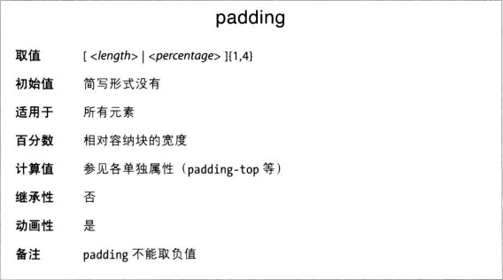
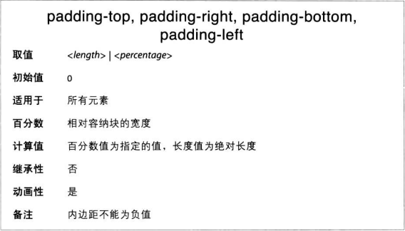

紧邻元素内容区的是内边距（padding），位于内容和边框之间，设定内边距最简单的方法是使用 padding 属性。



这个属性可以是任何长度值或百分数值。
如果背景是透明的，相当于在元素的内容四周添加一些空白。但是，只要背景可见，就会延伸到内边距区域。

元素默认没有内边距。如果没有内边距，元素的边框将紧贴内容。因此，如果元素添加了边框，最好再加一些内边距。

padding 属性的值可以是任何长度值。设定边距最简单的方式是只提供一个值，将应用到四个边上。
然而有时你想为各内边距设定不同的值，可以 padding: top right bottom left（从上边开始顺时针转动）。

### 复值

有是，你提供的值有些重复

```CSS
p {
    padding: 1px 2px 1px 2px
}
```

遇到这样重复的值无需重复输入，可以写成：

```CSS
p {padding: 1px 0.25px}
```

CSS 考虑到了少于四个值的情况，为此定义了几个规则：

* 如果没有针对左边的值，使用针对右边的值
* 如果没有针对底边的值，使用针对顶边的值
* 如果没有针对右边的值，使用针对顶边的值

### 单边内边距



### 内边距的百分数值

元素的内边距可以用百分数值设定，相对父元素内容区的宽度计算（上下内边距也是）。因此，如果父元素宽度变了，内边距也会跟着变。
