元素的内边距之外是边框。边框是元素的内容和内边距周围的一到多条险段。默认情况下，元素的背景在边框的外边界处终止。边框在外边距内侧。

边框有三个要素：宽度、样式、颜色。边框默认样式为 none，即不存在。默认宽度是 medium，通常为 2px。颜色默认与元素中的文本颜色相，如果元素中没有文本，将与父与阿奴的文本颜色相同。

### 边框的样式

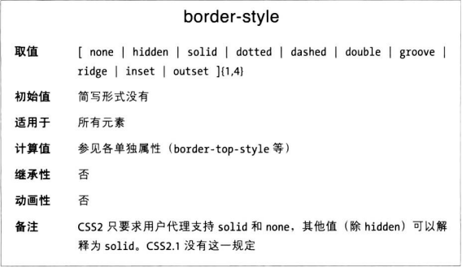
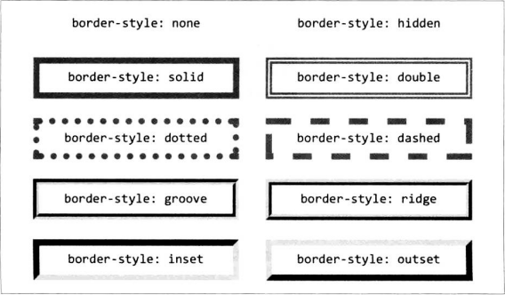

一个边框可以有多个样式：

```CSS
p {border-style: solid dashed dotted solid}
```

与 padding 一样，值的顺序为上右下左。值少于四个时的复制规则也与 padding 属性一样。

**单边样式**
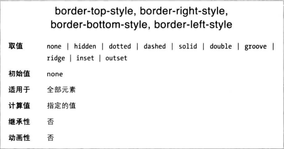

border 经常与单边属性结合使用。假如想去掉左边框：

```CSS
h1 {
    border-style: solid solid solid none
}

/* 上下两个规则是等效的 */

h1 {
    border-style: solid;
    border-left-style: none
}
```

### 边框宽度

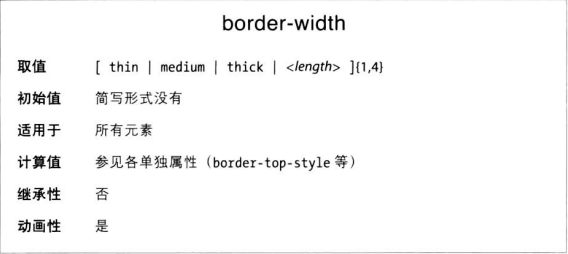
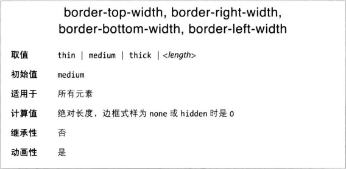

设定边框宽度可以直接提供长度值，也可以使用三个关键字中的一个。这三个关键字不对应具体的宽度。根据规范，thick 始终比 medium 宽，而 medium 又比 thin 宽。具体多宽取决于用户代理。

**完全没有边框**
如果 border-style 设为 none，无论边框是多宽什么颜色都不显示。

### 边框颜色

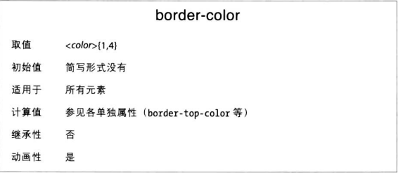

如果颜色少于四个，和之前的复制方式一样。

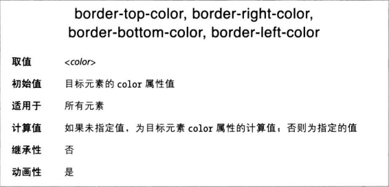

**透明边框**
有时你会想创建有宽度但不可见的边框。此时要把边框颜色设为 transparent。

### 简写边框属性

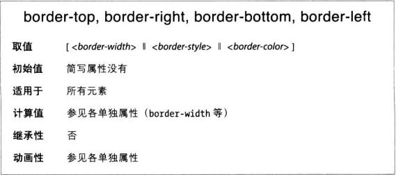

可以在一条声明里同时设定 color、style 和 width

```CSS
h1 {border-bottom: 3px solid gray}
h1 {border-bottom: gray solid 3px}
/* 顺序不重要，两条一样的效果 */
```

如果采用默认值，可以忽略。

### 整个边框

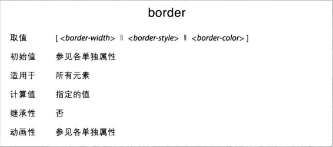
border 属性的缺点是，定义的样式、宽度和颜色只能同时应用到四个边上。如果想改变元素的某一边，要利用层叠机制

```CSS
h1 {
    border: thick goldenrod solid;
    border-left: 20px
}
```

### 圆角边框

元素边框的角是直的，可以使用 border-radius 属性定义一个（或两个）圆角半径，把边角变得圆滑一些。

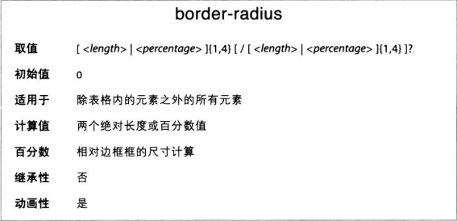

圆角的半径是一个圆或椭圆的半径，圆或椭圆的四分之一用作边框的圆角。

如果想为元素添加比较明显的圆角，可以：

```CSS
#example {border-radius: 2em}
```

如果提供单个百分比数，得到的结果更接近椭圆

```CSS
#example {border-radius: 33%}
```

为 border-radius 属性提供一个值，每个圆角形状相同。与 padding 和其他简写属性一样，最多可以为 border-radius 提供四个值。四个值按顺时针排序，从左上到右下。

如果缺少某个值，填充方式与 padding 等属性一样。如果有三个值，第四个值复制第二个；如果有两个值，第三个复制第一个（复制对角线）。

### 单独的圆角属性

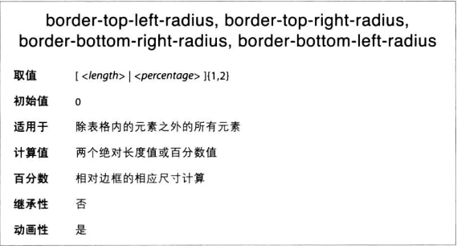
