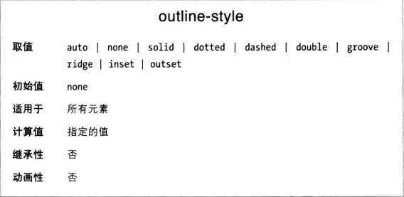
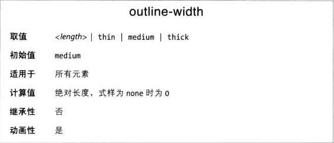
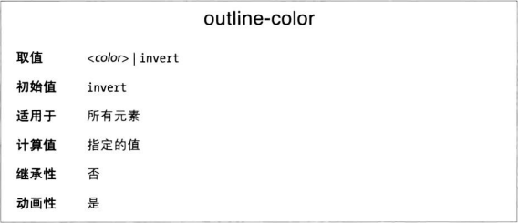
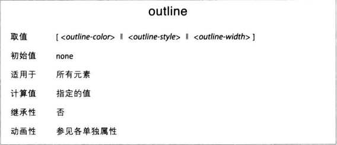

# 轮廓

CSS 定义了一种特殊的装饰方式，名为轮廓 outline，一般直接绘制在边框外侧，与边框的区别主要体现在三个方面

1. 轮廓不占空间
2. 轮廓可以不是矩形
3. 通常在元素处于::focus 时渲染轮廓
4. 无法单独为一边设置独特的轮廓

## 轮廓样式

与边框最大的不同是，轮廓没有 hidden 样式，但多了个 auto 样式，让用户代理自定义。

## 轮廓宽度

跟边框宽度规则一模一样。

## 轮廓颜色

和 border-color 基本一样，最大区别是默认值 invert，作用是对轮廓可见部分中的所有像素进行“颜色转换”，使得不管背景是什么颜色都能清楚地看到轮廓。

## 唯一轮廓简写属性

## 轮廓与边框的区别

轮廓与边框之间的第一个重要区别是，轮廓对布局完全没有任何影响，只是视觉上的效果。
