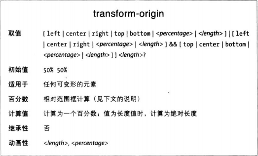
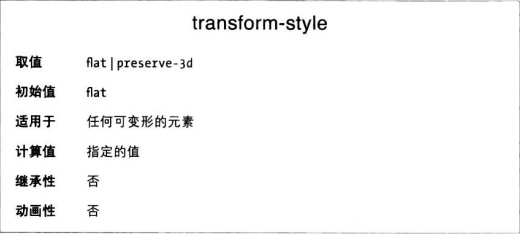
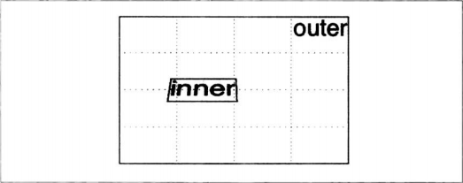
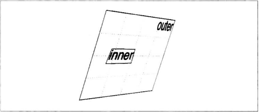
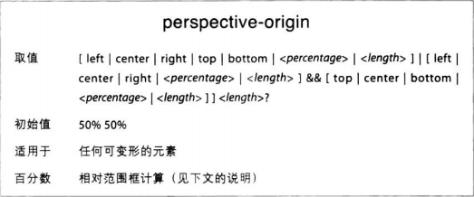

# 其他变形属性

## 移动原点
米前所见的变形有一个共同点，都是以元素的绝对中心为变形的原点。这是默认行为，不过可以使用transform-origin属性修改。

transform-origin属性的值为两个或三个关键字，用于定义相对哪个点变形：第一个值针对横向，第二个值针对纵向，可选的第三个值是z轴上的长度。横轴和纵轴可以使用英语关键字，比如top和right，也可以使用百分数、长度、或者不同类型的关键字搭配。z轴不能使用英语关键字或百分数。

长度值设定的是距元素左上角的距离。百分数相对对应的轴和元素的尺寸计算，设定的是距元素左上角的偏移量。

## 选择3D变形方式

默认情况下，不管怎样变形，得到的结果都是扁平的。幸好，这个行为可以使用transform-style属性修改。

加入现在有父子两个元素，给子元素rotateX()后效果如下

此时若是旋转父元素会发现子元素并没有真正的按3D显示

然而，把外层元素transform-style值改成preserve-3D之后，结果就截然不同了。内层div将会支撑一个3D对象。

注意，transform-style设定的变形方式可能会被其他属性强制重置为flat。那些属性的某些值要求元素及其子元素必须以扁平的方式呈现才能起作用。

为了避免被覆盖，以下属性要设为给出的值，其实也
都是属性各自的默认值：
* overflow: visible
* filter: none
* clip: auto
* clip-path: none
* mask-image: none
* mask-border-source: none
* mix-blend-mode: normal

## 修改视域 
视域其实由两个属性：一个定语视觉域距离，相当于前面讨论过的perspoective()函数，另一个定义视域的原点。

### 定义色域
先将perspective属性。这个属性值是一个长度，定义视域锥体的深度。与前面讨论的perspective()函数功能类似，但是两者之间有重要区别。

perspective()函数只为目标元素定义视域，只有应用这个规则的元素才使用设定的视域。
而perspective属性定义的视域深度应用到目标元素的所有子元素上。注意，设定 transform-style: preserve-3d 才能看到图中的效果。

第二排中每个图像想我们旋转了50弧度，不过每个图的视域是独立的。
第三排中，各个图像都没有视域，一排中的图像都在为div容器设定的视域中绘制。

这就是perspective属性与perspective()函数之间的重要区别，前者创建的3D空间为所有子元素共有，而后者汁对目标元素有效果。

### 移动视域的原点
视域也有原点，也称消隐点，这个点的位置剋使用perspective-origin属性修改。

perspective-origin与transform-origin虽然值表述是一样的，但是效果截然不同。transform-origin定义的事围绕哪个点变形，而perspective-origin定义的是视线汇聚于哪一点。

## 处理背面
在3D变形过程中，有朝一日完全有可能看到元素的背面。这样的情况如何处理由backface-visibility属性决定。

它的作用只有一个，决定元素背面朝向我们时是否渲染。
注意，只有 transform-style: preserve-3d 的时候才能起作用。