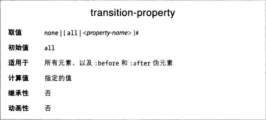
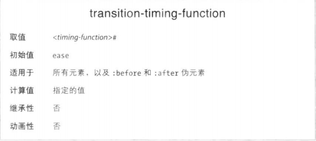
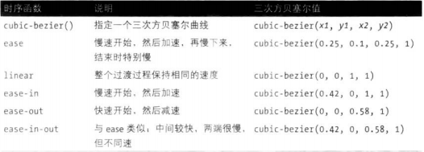

# 定义过渡的属性
在CSS中，过渡使用四个属性定义：transition-property、transition-duration、transition-timing-function 和 transition-delay。此外还有个简写属性 transition，可一次声明全部四个属性。

## 应用过渡属性
过渡就在应用到元素上的常规样式中声明。当目标属性的值发生变化时，如果为目标属性设置了过渡效果，浏览器将应用过渡效果，逐渐由旧值变成新值。

过渡是从“始态”切换到“终态”。“始态”指的是页面加载时元素所处的状态，而一开始未触发的:hover等ui状态伪类的状态就不是始态，称为“终态”，即过渡之后的状态。但是如果一开始就触发了（比如默认focus的input框一开始就触发了:focus），那ui状态伪类的状态也可以是始态。

如果想在始到终和终回始的过程中都应用过渡效果，那应该把过渡属性直接应用到元素上；而如果只想在始到终的过程中过渡，终回始时候不过渡而是秒换，那应该把过渡属性应用到终态上比如ui状态伪类选择器内。原因也很简单，始到终的过程中元素处于终态，而终回始的过程中已经不处于了。

始态和终态可以应用不同的过渡值，但是进入某一状态时一定会使用当前状态定义的值。

## 限制受过渡影响的属性
transition-property属性指定想应用过渡效果的CSS属性名称。这样便可以限定只在特定的属性上应用过渡效果，而其他属性值还是秒换。



属性值是以都好分隔的属性列表，或者是none，表示不过渡任何属性，还可以是all，过渡所有支持动画的属性。

如果transition-property属性值只有all，或者是都好分隔的一组值中的最后一个，那么所有支持动画的属性将一起过渡。

如果绝大部分属性持续的时间相同，而且延迟和步调也一致，只有少数属性例外，可以先试用all，再为例外的属性单独定义时间、速度或步调。此时要把all放在首位。
```CSS
div {
    ...
    transition-property: all, border-radius, opacity;
    transition-duration: 1s, 2s, 3s
}
```

**禁用过渡效果**
如果设置了过渡，而后又想在特定情况下撤销过渡效果，可以使用transition-property: none 覆盖整个过渡声明。none关键字只能作为该属性的唯一一个值，不能放在以都好分隔的一组值中。如果向撤销部分属性的过渡效果，只能重新列出仍想过渡的属性。transition-property属性不能排除不想过渡的属性，只能涵盖想过渡的属性。（另一种方法是把延迟和持续时间都设为0s，这样等于秒变。）

## 设置过渡持续时间
transition-duration属性的值现在是以逗号分隔的时间长度列表，单位为s或ms。这些值指定从一个状态过渡要另一个状态历时多久。


如果在两个状态之间来回过渡，而两个状态声明的transition-duration值不一样，过渡的持续时间为目标状态声明的transition-duration值。

transition-duration值必须带时间单位，0也得写成0s。而且不能为负，如果值列表中吧有一个是负值，整个属性值都将失效。

如果声明的属性熟练于持续时间数量不一致时，如果持续时间的数量比属性多则忽略多余时间，如果比属性少那就重复使用前面的持续时间。在下面示例中，color、border-radius、opacity和width的持续时间为100毫秒，border、transform、box-shadow和padding的持续时间是200毫秒
```CSS
div {
    ...
    transition-property: color, border, border-radius, transform, opacity, box-shadow, width, padding;
    transition-duration: 100ms, 200ms
}
```
跳着来，很tm抽象，所以直接一个属性一个时间最好。

## 调整过渡的内部时序
transition-timing-function属性用于控制过渡的步调。


可以取的值友ease、linear、ease-in、ease-out、ease-in-oout、step-start、step-end、steps(n, start)（n是步进次数）、steps(n, end)和cubic=bezier(x1, y1, x1, y2)（这些也是animation-timing-function属性的有效值）

除步进关键字之外，其他关键字定义的事渐进时序函数，是描述平滑曲线的三次方贝塞尔函数的别名。




**步进时序**


使用步进函数时，从初始值到最终值的变化过程分为多步，而不是平滑过渡。


步进函数把过渡分成等距的几个步骤。定义步进时，要为函数提供的步进次数和方向。方向有两个，strat和end。使用start时，第一步在动画的开头；使用end时，最后一步在动画的末尾。

## 延迟过渡
transition-delay属性在元素上发生触发过渡的变化与开始过渡之间引入一定的延迟。


如果transition-delay的值不是0s，定义的事从属性的值开始变化那一刻到动画开始之间的时间间隔。


**负的延迟值**

如果transition-delay的值为负数，而且绝对值比trnasition-duration值小，会从动画中间某个位置直接开始过渡。比如动画是从左往右移动2米，持续2秒，delay -1s会直接跳到1m的位置然后开始往右移，一秒内移一米结束。

如果delay为负且大于duraion，那就是秒换，和没有过渡一样。

## transition简写属性
transition简写属性把目前介绍的四个属性合而为一。


transition的值可以是none，或者任意个以都好分隔的单词过渡。单词过渡包含：应用过渡效果的一个属性或者all，过渡的持续时间、时序函数、以及延迟。

如果属性中的单次过渡没有声明要过渡的属性，那么默认all。如果有一组以逗号分隔的过渡，而且值中有none，那么整个过渡声明都将失效。

单次过渡中，持续时间和延迟值的顺序很重要：解析为时间的第一个值是持续时间。如果在都好之前或语句末尾还有时间值，那就是延迟。

