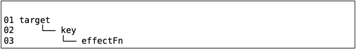
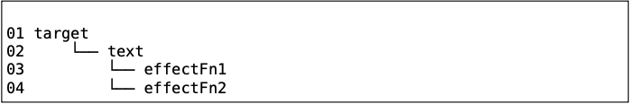
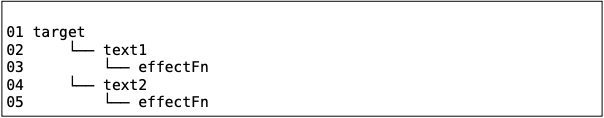
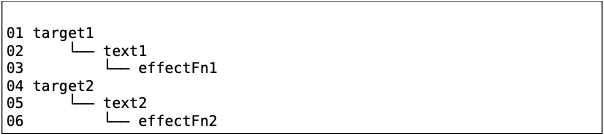
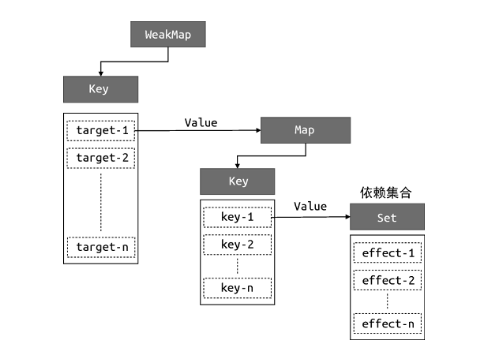

# 建立副作用函数与被操作字段之间的联系
现在我们的响应式系统还没有在副作用函数与被操作的目标字段之间建立明确联系。

解决这个问题需要重新设计“桶”的数据结构，而不能简单地使用一个 Set 了。

## 思路
观察下面代码
```javascript
effect(function effectFn() {
    document.body.innerText = obj.text
})
```
这段代码存在三个角色：
* 被操作 (读取) 的代理对象 obj；
* 被操作 (读取) 的字段名 text；
* 使用 effect 函数注册的副作用函数 effectFn。

如果用 target 表示被代理对象代理的原始对象，key 表示 被操作的字段名，effectFn 表示被注册的副用函数，可以为三个角色建立如下关系：



如果有两个副作用函数同时读取同一个对象的同一个属性值：



如果一个副作用函数读取了一个对象的两个不同属性值：



再如果两个副作用函数读取了两个不同对象中的属性值：



## 代码
```javascript{11,19-40}
// 用一个全局变量存储被注册的副作用函数
let activeEffect
// effect 函数用于注册副作用函数
function effect(fn) {
    // 当调用 effect 注册副作用函数时，将副作用函数 fn 赋值给 activeEffect
    activeEffect = fn
    fn()
}

// 存储副作用函数的桶
const bucket = new WeakMap()

// 原始数据
const data = { text: 'hellow world' }
// 对原始数据的代理
const obj = new Proxy(data, {
    // 拦截读取操作
    get(target, key) {
        // 没有 activeEffect 直接 return
        if (!activeEffect) return terget[key]

        // 根据 target 从“桶”中取得 depsMap，也是Map类型：key --> effects
        let depsMap = bucket.get(target)
        // 如果不存在 depsMap，就新建一个 Map 并与 target 关联
        if (!depsMap) {
            depsMap = new Map()
            bucket.set(target, depsMap)
        }

        // 再根据 key 从 depsMap 中取得 deps。
        // deps是一个 Set 类型，储存所有与当前 key 相关联的副作用函数
        let deps = depsMap.get(key)
        // 如果 deps 不存在，同样新建一个 Set 并与 key 关联
        if (!deps) {
            deps = new Set()
            depsMap.set(key, deps)
        }

        // 最后将当前激活的副作用函数添加到“桶”里
        deps.add(activeEffect)

        // 返回属性值
        retrun target[key]
    },
    // 拦截设置操作
    set(target, key newVal) {
        // 设置属性值
        target[key] = newVal
        // 把副作用函数从桶里取出并执行
        bucket.forEach(fn => fn())
        // 返回 true 代表设置操作成功
        return true
    }
})
```

## 已实现
我们分别使用了 WeakMap，Map 和 Set
* WeakMap 由 target --> Map 构成，键是原始对象 target，值是一个 Map；
* Map 由 key --> Set 构成，键是原始对象 target 的 key，值是储存副作用函数的 Set。



## 缺陷/待实现
get 函数中代码逻辑很复杂，可以把依赖收集的逻辑单独封装一个 track 函数；set 中依赖触发的逻辑也可以单独封装一个 trigger 函数。