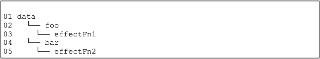

# 嵌套的 effect 与 effect 栈
在上一节中，我们解决了分支切换时可能产生遗留副作用函数的问题。
这一节我们将让我们的响应式系统支持 effect 的嵌套调用。

## 思路
### 嵌套的 effect
实际上 Vue.js 的渲染函数就是在一个 effect 中执行。而当组件发生嵌套时，例如 Foo 组件渲染了 Bar 组件：
```js
const Bar = {
    render() { /* ... */ }
}

const Foo = {
    render() {
        return <Bar />
    }
}
```

此时就发生了 effect 嵌套：
```js
effect(() => {
    Foo.render()
    effect(() => {
        Bar.render()
    })
})
```

### 目前实现为何不支持
```js
const data = { foo: true, bar: true }

const obj = new Proxy(data, { /* ... */ })

let temp1, temp2

effect(function effectFn1() {
    console.log('effectFn1 执行')

    effect(function effectFn2() {
        console.log('effectFn2 执行')
        temp2 = obj.bar
    })

    temp1 = obj.foo
})
```

上述代码中， effectFn1 内部嵌套了 effectFn2。在 effectFn2 中读取了字段 obj.bar，之后在 effectFn1 中读取了字段 obj.foo。

理想情况下，副作用函数与对象属性之间的关系为：


我们希望的是，当修改 obj.foo 时，触发 effectFn1 执行，进而触发嵌套的 effectFn2 也执行；而当修改 obj.bar 时，只触发 effectFn2 执行，不触发 effectFn1 执行。

然而，当我们尝试修改 obj.foo 的值时，会发现 effectFn2 重新执行了，effectFn1 反而没执行。

实际上，此时的真实情况是：effectFn2 被收集进了 obj.foo 和 obj.bar 两个字段的副作用函数集合，而 effectFn1 没有被任何依赖收集到。

### 解释
其实问题就出在我们实现的 effect 函数和 activeEffect 上。

我们通过全局变量 activeEffect 来存储当前激活的（要进行依赖收集的）副作用函数，意味着同一时刻激活的副作用函数只有一个。

当副作用函数发生嵌套，注册内层副作用函数会覆盖原有 activeEffect 也就是外层的副作用函数并且永远不会恢复，因此后续如果再有依赖被访问，收集进集合的永远是内层副作用函数，哪怕这个访问操作是在外层副作用函数内执行的。

### 如何解决
解决这个问题，我们需要一个副作用函数栈 effectStack。

在副作用函数执行时，将它压入栈中，执行完毕弹出，而 activeEffect 始终指向栈顶。

这样就能做到一个响应式数据只会手机直接读取其值的副作用函数。内层副作用函数执行完之后，外层的副作用函数还能继续进行依赖收集。

## 代码
```js{4-5,17-18,23-26}
// 用一个全局变量存储被注册的副作用函数
let activeEffect

// 新增 effect 栈
const effectStack = []

// effect 函数用于注册副作用函数
function effect(fn) {
    // 包装真实副作用函数的函数，包含清除和再收集逻辑
    const effectFn = () => {
        // 调用 cleanup 完成清除工作
        cleanup(effectFn)
        
        // effectFn 每次执行都会重新进行一次依赖收集，并且被收集的副作用函数就是它自己
        activeEffect = effectFn

        // 调用真实副作用函数之前，先将当前 effect 压入栈中
        effectStack.push(effectFn)

        // 在 fn 这次执行中，effectFn 会作为副作用函数被收集到 fn 读取了的依赖的集合中
        fn()

        // 当前副作用函数执行完毕之后，弹出栈
        effectStack.pop()
        // 并把 activeEffect 还原为之前的值
        activeEffect = effectStack[effectStack.length - 1]
    }

    // effctFn.deps 数组用来储存该副作用函数的所有依赖集合
    effectFn.deps = []
    // 执行副作用函数
    effectFn()
}

function cleanup(effectFn) {
    // 遍历 deps 数组
    effectFn.deps.forEach( deps => {
        // 把副作用函数从集合中删除
        deps.delete(effectFn)
    })

    // 重置副作用函数的依赖集合，因为之后要再重新收集一次的
    effectFn.deps.length = 0
}

// 存储副作用函数的桶
const bucket = new WeakMap()

// 原始数据
const data = { text: 'hellow world' }
// 对原始数据的代理
const obj = new Proxy(data, {
    // 拦截读取操作
    get(target, key) {
        // 把副作用函数收集到桶中
        track(target, key)
        // 返回属性值
        return target[key]
    },
    // 拦截设置操作
    set(target, key, newVal) {
        // 设置属性值
        target[key] = newVal
        // 把副作用函数从桶里取出并执行
        trigger(target, key)
        // 返回 true 代表设置操作成功
        return true
    }
})

// track 函数 在 get 拦截函数中被调用，用来追踪副作用函数
function track(target, key) {
    // 没有 activeEffect 直接 return
    if (!activeEffect) return terget[key]

    // 根据 target 从“桶”中取得 depsMap，也是Map类型：key --> effects
    let depsMap = bucket.get(target)
    // 如果不存在 depsMap，就新建一个 Map 并与 target 关联
    if (!depsMap) {
        depsMap = new Map()
        bucket.set(target, depsMap)
    }

    // 再根据 key 从 depsMap 中取得 deps。
    // deps是一个 Set 类型，储存所有与当前 key 相关联的副作用函数
    let deps = depsMap.get(key)
    // 如果 deps 不存在，同样新建一个 Set 并与 key 关联
    if (!deps) {
        deps = new Set()
        depsMap.set(key, deps)
    }

    // 最后将当前激活的副作用函数添加到“桶”里
    deps.add(activeEffect)

    // 也将这个集合添加到副作用函数的 deps 数组中
    activeEffect.deps.push(deps)
}

// trigger 函数 在 set 拦截函数中被调用，用来触发更新
function trigger(target, key) {
    const depsMap = bucket.get(target)
    // 如果这个对象没有被追踪的依赖，没有需要重新运行的副作用函数，直接 return
    if (!depsMap) return

    const effects = depsMap.get(key)
    // 如果这个对象的这个key没有被追踪的依赖，没有需要重新运行的副作用函数，啥也不干
    // 否则就把 effects 中的函数依次执行
    const effectsToRun = new Set(effects)
    // 为了避免无限循环
    effectsToRun.forEach(effectFn => effectFn())

    // 使用 ?. 可选链操作符，也可以写成这样
    // bucket.get(target)?.get(key)?.forEach(effect => effect())
}
```

## 已实现
我们通过新增一个 effectStack，在副作用函数执行前将它压入栈中，执行且依赖收集结束后弹出，且activeEffect 始终指向栈顶，解决了 effect 嵌套调用时依赖收集混乱的问题。

## 缺陷/待实现
当一个副作用函数先读又写了某个依赖字段，会产生无限递归循环，导致栈溢出。