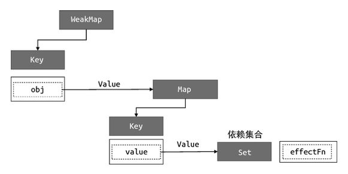

# 计算属性的 track 和 trigger

目前我们的实现中，计算属性只是一个有缓存功能的 getter，无法像普通响应式数据一样自身值变化时重新执行所有读取了它的副作用函数。

## 思路

当我们在另一个 effect 中读取计算属性的值时：

```js
const sum = computed(() => obj.foo + obj.bar)

effect(() => {
    // 读取计算属性的值
    console.log(sum.value)
})

// 修改 obj.foo 的值
obj.foo ++
```

如上述代码所示，sum 是一个计算属性，在另一个副作用函数中被读取。如果此时修改 obj.foo 的值，我们期望副作用函数重新执行。就像我们在 Vue.js 中的模版中读取计算属性值时，一旦计算属性值发生变化，就会触发重新渲染。然而实际现在上并不会。

### 手动依赖收集和触发更新

解决方法很简单，像普通的响应式数据一样，在读取计算属性值时调用 track 函数进行依赖收集，计算属性值有变化时调用 trigger 函数触发更新。

什么时候依赖收集？读取计算属性的返回值 obj 的 value 属性的时候。

什么时候触发更新？当计算属性的依赖有更新时会执行计算属性内传给 effect 函数的 options 参数的 sechduler 函数，把 dirty 置为 true，此时应触发更新。

## 代码

```js{10-11,22-23}
function computed(getter) {
    let value
    let dirty = true

    const effectFn = effect(getter, {
        lazy: true,
        scheduler() {
            dirty = true

            // 当计算属性依赖的响应式数据变化时，手动调用 trigger 触发更新
            trigger(obj, 'value')
        }
    })

    const obj = {
        get value() {
            if (dirty) {
                value = effectFn()
                dirty = false
            }

            // 读取计算属性的值时，手动调用 track 函数进行依赖收集
            track(obj, 'value')
            return value
        }
    }
}
```

## 已实现

当读取一个计算属性时，我们手动调用 track 函数，把计算属性返回的对象 obj 作为 target，'value' 为 key。

当计算属性的响应式依赖有变化时，会执行调度器函数，因此在调度器函数内手动调用 trigger 函数触发更新。

对于如下代码来说：

```js
effect(function effectFn() {
    console.log(sum.value)
})
```

它会建立这样的联系：


## 缺陷/待实现

现在我们已经实现了完整的计算属性的功能，下一节开始我们将讨论如何实现 watch。
