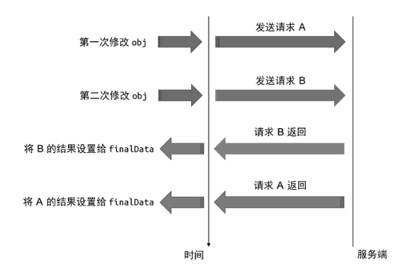

# 过期的副作用
上一节中我们继续实现了 watch 的两个特性。这一节中我们将为 watch 实现清理过期副作用的功能，以此来解决竞态问题。

## 思路
### 竞态问题
举个例子：
```js
let finalData

watch（obj, async () => {
    // 发送并等待网络请求
    const res = await fetch('/path/to/request')
    // 将请求结果赋值给 finalData
    finalData = res
}
```
上述代码中，我们使用 watch 监听 obj 对象的变化，每次 obj 发生变化后都会发送网络请求，并将结果赋值给 finalData。

假设我们第一次修改 obj 对象，导致回调函数执行，同时发送了第一次请求 A。在请求 A 结果返回之前，我们又对 obj 进行了修改，这会导致发送第二次请求 B。

按常理来说，我们会希望 finalData 最终存储的是请求 B 的结果，因为请求 B 是后发送的，它的结果才是最新的。然而我们无法确定请求 A 和 B 谁先完成。如果 B 先返回而 A 后返回，那么最终 finalData 就会存储请求 A 的结果。这就引发了竞态问题。


### 过期的副作用
我们可以对这个问题做进一步总结。所谓过期的副作用，其实就是说，当下一次副作用函数执行时，上一次的执行产生的副作用就视为已经过期了。

请求 A 是副作用函数第一次执行产生的副作用，请求 B 是副作用函数第二次执行产生的副作用。由于请求 B 后发生，所以请求 B 的结果被视为最新的，而请求 A 已经过期了，其产生的结果视为无效。归根结底，我们需要的就是一个清理过期副作用的手段。

在 Vue.js 中，watch 函数的回调函数接收第三个参数 onInvalidate，它是一个函数，类似于事件监听器，我们可以使用它注册一个回调，在当前副作用函数过期时执行。
```js
watch(obj, saync (newValue, oldValue, onInvalidate) => {
    // 定义一个标志，代表当前副作用函数是否过期
    let expired = false
    // 调用 onValiate 函数楚策一个回调
    onValidate(() => {
        // 当过期时，将 expired 置为 true
        expired = true
    })

    // 发送网络请求
    const res = await fetch('/path/to/request')
    
    // 只有当该副作用函数没有过期时，才会执行后续操作
    if (!expired) {
        // 将请求结果赋值给 finalData
        finalData = res
    }
})
```

### 代码实现思路
那么这一功能是如何实现的呢？

其实非常简单，在 watch 内部每次检测到变更需要执行回调时，先调用通过 onInvalidate 注册的过期回调，仅此而已。

说白了就是，执行下一次副作用函数前，调用上一次执行时传给 onInvalidate 的回调，清理上一次执行产生的、已过期的副作用。

## 代码
```js{11-17,22-29}
function watch(source, cb, options = {}) {
    let getter
    if (typeof source === 'function') {
        getter = source
    } else {
        getter = () => traverse(source)
    }

    let oldValue, newValue

    // cleanup 用来存储用户注册的过期回调
    let cleanup
    // 定义 onInvalidate 函数
    function onInvalidate(fn) {
        // 将回调存储到 cleanup 中
        cleanup = fn
    }

    // 提取 scheduler 为一个独立的 job 函数
    const job = () => {
        newValue = effectFn()
        // 调用回调前，先执行过期回调
        if (cleanup) {
            cleanup()
        }
        // 此处是否需要 cleanup = null 清除掉呢，毕竟执行一次之后就不用了

        // 将 onInvalidate 作为回调函数的第三个参数传入
        cb(newValue, oldValue, onInvalidate)
        oldValue = newValue
    }

    const effectFn = effect(
        () => getter(),
        {
            lazy: true,
            // 使用 job 作为调度器函数
            scheduler: () => {
                // 在调度函数中判断 flush 是否为 'post'
                if (options.flush === 'post') {
                    // 如果是，job 放到微任务队列中执行
                    const p = Promise.resolve()
                    p.then(job)
                } else {
                    job()
                }
            }
        }
    )

    if (options.immediate) { 
        // 当 immediate 为 true 时，立即执行一次 job，从而触发回调执行
        job()
    } else {
        oldValue = effectFn()
    }
}
```

## 已实现
我们的 watch 现在已经有清理过期副作用的功能，可以解决竞态问题了。

实现原理也不复杂。每次副作用函数执行时都可以注册一个回调用来清理自身产生的副作用。当新的副作用函数执行时，此时上一次执行产生的副作用已经过期了，因此调用上一次执行时注册的回调来清理过期的副作用。

我给你一把刀，当你不再需要我的时候，就用这把刀把我噶了。深明大义！！！

## 缺陷/待实现
什么缺陷？“响应式系统的作用与实现” 完结撒花🎉 下一章总结！