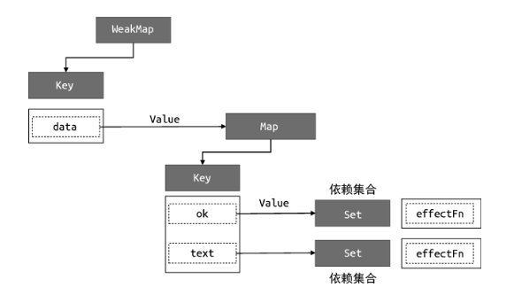
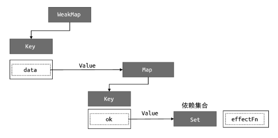
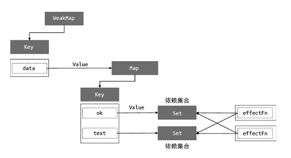

# 分支切换与 cleanup

上一节中我们把依赖收集和触发的逻辑分别封装到 track 和 trigger 函数中，提升可读性和灵活性。
这一节我们来解决分支切换可能会产生遗留副作用函数的问题。

## 思路

### 分支切换

```js
const data = { ok: true, text: 'hello world' }
const obj = new Proxy(data, { /* ... */})

effect(function effectFn() {
    document.body.innerText = obj.ok ? obj.text : 'not'
})
```

在 effectFn 函数内部存在一个三元表达式，根据字段 obj.ok 值的不同会执行不同的代码分支，这就是所谓的分支切换。

### 遗留的副作用函数

拿上面这段代码来说，obj.ok 初始值为 true 时， effectFn 函数会 读取 obj.ok 和 obj.text 两个值，此时 effectFn 与响应式数据之间建立的联系如下：


然而当 obj.ok 的值变为 false， effectFn 内发生分支切换，此时 effectFn 函数只会读取 obj.ok，理想情况下 effectFn 不该被 obj.text 字段所对应的依赖集合收集:


通俗一点解释就是，当 obj.ok 为 false 时，effectFn 已经不读取 obj.text 了, obj.text 怎么变都跟 effectFn 没关系。然而我们现在实现的响应式系统，副作用函数一旦被某个字段的依赖集合收集就没法删除，因此哪怕现在 effectFn 和 obj.text 已经没关系了，当 obj.text 的值变化时， effectFn 还是会重新运行一次，这显然没必要。

### cleanup

解决这个问题的思路很简单：每当副作用函数执行时，先把它从所有与之关联的依赖集合中删除，在执行的过程中重新进行一次依赖收集，把副作用函数重新添加到与之关联的依赖集合中。

#### 解释

副作用函数执行一次之后读取了哪些依赖，就是这个副作用函数当前状态（分支）下真正需要的依赖。

还是上面那个例子，当 obj.ok 从 true 切换为 false，会触发 effectFn 重新执行一次。此次执行过程中 effectFn 只读取了 obj.ok 而没有读取 obj.text，那就说明当前状态下的 effectFn 只依赖了 obj.ok，只有 obj.ok 变化时才需要重新执行，至于 obj.text 爱怎么变怎么变跟它没关系。

#### 代码实现层面需要解决的问题

1. 目前我们的响应式系统直接收集副作用函数本身，依赖触发也是直接执行副作用函数。而现在在依赖触发时，我们需要先把副作用函数从相关联的依赖集合中删除，然后再运行并进行一次依赖收集。因此收集到集合中的不能再是副作用函数本身，而是需要再包装一个函数，包含上述依赖删除和再收集的逻辑。
2. 副作用函数本身需要能知道哪些依赖集合收集了它，因此副作用函数也需要收集依赖集合。
   

## 代码

```js{5-22,25-34,86-87,99-101}
// 用一个全局变量存储被注册的副作用函数
let activeEffect
// effect 函数用于注册副作用函数
function effect(fn) {
    // 包装真实副作用函数的函数，包含清除和再收集逻辑
    const effectFn = () => {
        // 调用 cleanup 完成清除工作
        cleanup(effectFn)
        /*
        在 effectFn 里，activeEffect 被赋值为它自己。
        而 activeEffect 只要不为空，就会执行依赖收集（见 track 函数第一句 if）。
        因此 effectFn 每次执行都会重新进行一次依赖收集，并且被收集的副作用函数就是它自己
        */
        activeEffect = effectFn
        // 在 fn 这次执行中，effectFn 会作为副作用函数被收集到 fn 读取了的依赖的集合中
        fn()
    }

    // effctFn.deps 数组用来储存该副作用函数的所有依赖集合
    effectFn.deps = []
    // 执行副作用函数
    effectFn()
}

function cleanup(effectFn) {
    // 遍历 deps 数组
    effectFn.deps.forEach( deps => {
        // 把副作用函数从集合中删除
        deps.delete(effectFn)
    })

    // 重置副作用函数的依赖集合，因为之后要再重新收集一次的
    effectFn.deps.length = 0
}

// 存储副作用函数的桶
const bucket = new WeakMap()

// 原始数据
const data = { text: 'hellow world' }
// 对原始数据的代理
const obj = new Proxy(data, {
    // 拦截读取操作
    get(target, key) {
        // 把副作用函数收集到桶中
        track(traget, key)
        // 返回属性值
        return target[key]
    },
    // 拦截设置操作
    set(target, key, newVal) {
        // 设置属性值
        target[key] = newVal
        // 把副作用函数从桶里取出并执行
        trigger(target, key)
        // 返回 true 代表设置操作成功
        return true
    }
})

// track 函数 在 get 拦截函数中被调用，用来追踪副作用函数
function track(target, key) {
    // 没有 activeEffect 直接 return
    if (!activeEffect) return terget[key]

    // 根据 target 从“桶”中取得 depsMap，也是 Map 类型：key --> effects
    let depsMap = bucket.get(target)
    // 如果不存在 depsMap，就新建一个 Map 并与 target 关联
    if (!depsMap) {
        depsMap = new Map()
        bucket.set(target, depsMap)
    }

    // 再根据 key 从 depsMap 中取得 deps。
    // deps 是一个 Set 类型，储存所有与当前 key 相关联的副作用函数
    let deps = depsMap.get(key)
    // 如果 deps 不存在，同样新建一个 Set 并与 key 关联
    if (!deps) {
        deps = new Set()
        depsMap.set(key, deps)
    }

    // 最后将当前激活的副作用函数添加到“桶”里
    deps.add(activeEffect)

    // 也将这个集合添加到副作用函数的 deps 数组中
    activeEffect.deps.push(deps)
}

// trigger 函数 在 set 拦截函数中被调用，用来触发更新
function trigger(target, key) {
    const depsMap = bucket.get(target)
    // 如果这个对象没有被追踪的依赖，没有需要重新运行的副作用函数，直接 return
    if (!depsMap) return

    const effects = depsMap.get(key)
    // 如果这个对象的这个 key 没有被追踪的依赖，没有需要重新运行的副作用函数，啥也不干
    // 否则就把 effects 中的函数依次执行
    const effectsToRun = new Set(effects)
    // 为了避免无限循环
    effectsToRun.forEach(effectFn => effectFn())

    // 使用 ?. 可选链操作符，也可以写成这样
    // bucket.get(target)?.get(key)?.forEach(effect => effect())
}
```

## 已实现

通过副作用函数每次执行前先把它从所有与之关联的依赖集合中删除，然后在执行过程中重新进行一次依赖收集，我们解决了副作用函数内有代码分支时分支切换可能会产生遗留的副作用函数的问题。

## 缺陷/待实现

effect 是可能发生嵌套的，而我们现在的响应式系统还不支持这一点。
