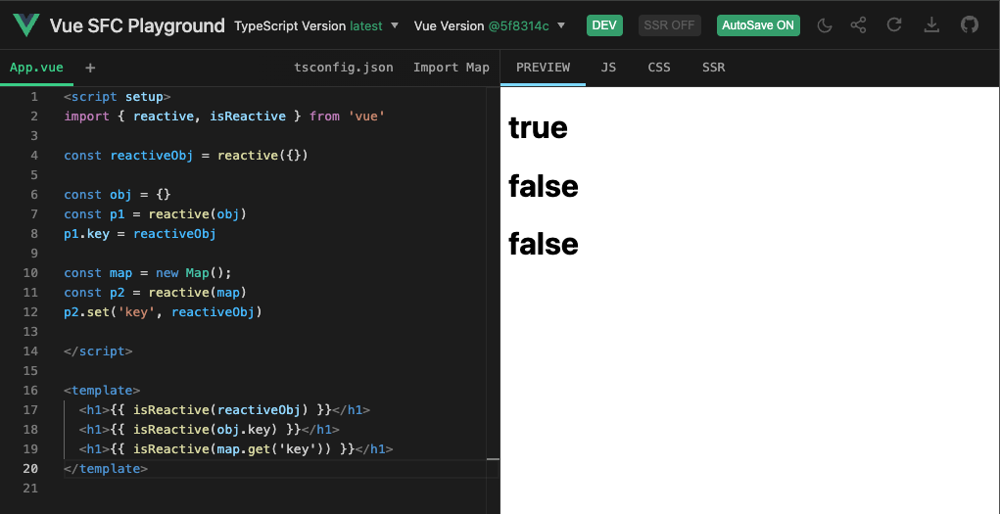

# 避免污染原始数据

上一节中我们实现了对 Set 类型数据的 size 属性、add 和 delete 方法的代理。

这一节我们将实现对 Map 类型数据 set 和 get 方法的代理，并以此来讲解什么是“避免污染原始数据”及其原因。

## 思路

Map 数据类型拥有 get 和 set 两个方法，当调用 get 方法读取数据时，需要调用 track 函数追踪依赖建立响应联系；当调用 set 方法设置数据时，需要调用 trigger 函数触发响应。

### get

基于我们已有的实现 add、delete 等方法的经验，下面是 get 方法的具体实现：

```js
const mutableInstrumentations = {
    get(key) {
        // 获取原始对象
        const target = this.raw
        // 判断读取的 key 是否存在
        const had = target.has(key)
        // 追踪依赖，建立响应联系
        track(target, key)
        // 如果存在，则返回结果
        if (had) {
            const res = target.get(key)
            // 如果得到的结果仍是可代理的数据，使用 reactive 包装后返回
            return typeof res === 'object' ? reactive(res) : res
        }
    }
}
```

### set

在 set 方法被调用时，需要调用 trigger 触发响应，只不过在触发时需要区分操作类型时 SET 还是 ADD。

```js
const mutableInstrumentations = {
    set(key, value) {
        const target = this.raw
        const had = target.has(key)
        // 获取旧值
        const oldValue = target.get(key)
        // 设置新值
        target.set(key, value)
        // 如果不存在，则是新增，操作类型是 ADD
        if (!had) {
            trigger(target, key, 'ADD')
        }
        else if (OldValue !== value || (oldValue === oldValue && value === value)) {
            // 如果存在，且值变了，则是 SET 类型
            trigger(target, key, 'SET')
        }
    }
}
```

### 污染原始数据

上面给出的 set 函数的实现能够正常工作，但是仍存在问题，即会污染原始数据。来看下面代码：

```js
// 原始 Map 对象 m
const m = new Map()
// p1 是 m 的代理对象
const p1 = reactive(m)
// p2 是 另一个代理对象
const p2 = reactive(new Map())
// 为 p1 添加一个键值对，值是 p2
p1.set('p2', p2)

effect(() => {
    // 注意，这里我们通过原始数据 m 访问 p2
    console.log(m.get('p2').size)
})

// 注意，这里我们通过原始数据 m 为 p2 设置一个键值对
m.get('p2').set('foo', 1)
```

在这段代码中，我们首先创建了一个原始 Map 对象 m，和 m 的代理对象 p1，以及另一个代理对象 p2。通过代理对象 p1 调用 set 方法设置键值对，值是 p2。在副作用函数中，我们通过原始数据 m 来读取数据值，然后又通过原始数据 m 设置数据值，此时发现触发了响应导致副作用函数重新执行。这不是我们所期望的，原始数据不应该具有响应式数据的能力。

这就是所谓的污染原始数据问题：**通过响应式数据设置属性值也为响应式数据时，真正设置到原对象上的属性值不应该还是响应式的。**

**不光 Map，普通对象也是一样的处理**

**把响应式对象的属性赋值为另一个响应式数据时，真正赋值到原对象属性上的会是 unref 过的非响应式数据。**

**因为有深响应，读取响应式对象的属性值时如果是对象也会包装成响应式的，因此真正设置到原对象的属性上时 unref 成非响应的也不会有影响。**

要解决数据污染也很简单，只需要在调用 target.set 函数往原数据上设置值之前对值进行检查，如果是响应式数据，那么就通过 raw 属性获取原始数据，再设置到 target 上：

```js
const mutableInstrumentations = {
    set(key, value) {
        const target = this.raw
        const had = target.has(key)
        const oldValue = target.get(key)

        // 获取原始数据，如果不存在则说明不是响应式的，可以直接使用
        const rawValue = value.raw || value
        target.set(key, rawValue)

        if (!had) {
            trigger(target, key, 'ADD')
        } else if (oldValue !== value || (oldValue === oldValue && value === value)) {
            trigger(target, key, 'SET')
        }

    }
}
```

## 已实现

本节我们重写了 Map 类型的 get 和 set 方法，在 get 时追踪依赖，在 set 时触发响应，实现了对这两个方法的代理。

同时还讲解了什么是污染原始数据问题以及如何解决，具体做法就是设置响应式数据的属性值也为响应式数据时，真正设置到原始对象上的应该是原始值。

## 缺陷/待实现

下一节中我们将介绍如何代理集合类型的 forEach 方法。
