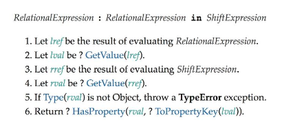
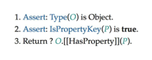

# 代理对 Object 的“读”操作
从本节开始，我们将着手实现响应式数据。

目前我们使用 get 陷阱函数来拦截对属性的读取操作，但在响应式系统中，“读取”是一个狠宽泛的概念。

下面列出对一个普通对象所有可能的读取操作：
* 访问属性：obj.foo。
* 判断对象或原型上是否存在给定的 key: key in obj。
* 使用 for...in 循环遍历对象：for (const key in obj) {}。

我们逐步讨论如何拦截这些读取操作。

## 思路

### reactive
开始之前，为了后续讲解方便，我们需要封装一个reactive 函数。

reactive 函数接收一个对象作为参数，返回为其创建的响应式数据：
```js
function reactive(obj) {
    return new Proxy(obj, {
        /* ... */
    })
}
```

### 拦截读取属性
对于属性的读取，我们知道可以通过 get 陷阱函数拦截。
```js
function reactive(obj) {
    return new Proxy(obj, {
        get (target, key, receiver) {
            // 依赖收集
            track(target, key)
            // 返回属性值
            return Reflect.get(target, key, receiver)
        }
    })
}
```

### 拦截 in 操作符
在 ECMA-262 规范的 13.10.1 节中，明确定义了 in 操作符的运行时逻辑：



关键点在第六步，可以发现 in 操作符的运算结果是通过调用一个叫做 HasProperty 的抽象方法得到的。

关于 HasProperty 抽象方法，可以在 ECMA-262 规范的 7.3.11 节中找到，它的逻辑如图所示：



从第三步中可以看到 HasProperty 抽象方法的返回值是通过调用对象内部的基本方法 [[HasProperty]] 得到的。

而 [[HasProperty]] 方法对应的陷阱函数叫 has，因此我们可以通过 has 陷阱函数实现对 in 操作符的拦截：
```js{10-13}
function reactive(obj) {
    return new Proxy(obj, {
        get (target, key, receiver) {
            // 依赖收集
            track(target, key)
            // 返回属性值
            return Reflect.get(target, key, receiver)
        },

        has (target, key, receiver) {
            track(target, key)
            return Reflect.has(target, key, receiver)
        }
    })
}
```

### 拦截 for...in 循环
在 ECMA-262 规范的 14.7.5.6中定义了 for...in 循环的执行规则，太长了就不放了。

其中关键点在于 EnumerateObjectProperties 这个抽象方法，代码太长了也不放了。

其中关键点在于这个方法内部使用了 Reflect.ownKeys(obj) 来获取只属于对象自身拥有的键。

因此我们可以使用 ownKeys 这个陷阱函数拦截 for...in 循环：
```js{15-18}
function reactive(obj) {
    return new Proxy(obj, {
        get (target, key, receiver) {
            // 依赖收集
            track(target, key)
            // 返回属性值
            return Reflect.get(target, key, receiver)
        },

        has (target, key, receiver) {
            track(target, key)
            return Reflect.has(target, key, receiver)
        },

        ownKeys (target) {
            track(target, ITERATE_KEY)
            return Reflect.ownKeys(target)
        }
    })
}
```
拦截 ownKeys 操作即可间接拦截 for...in 循环。

为什么我们要使用 ITERATE_KEY 作为追踪的key，因为在 ownKeys 中无法获取到具体操作的 key。ownKeys 用来获取一个对象的所有属于自己的键，这个操作明显不与任何具体的键绑定，因此我们只能用 Symbol 构造一个唯一 key 作为标识。

## 已实现
我们分别通过 get、has、ownKeys 三个陷阱函数拦截了对一个 Object 所有可能的读取操作。

## 缺陷/待实现
下一节我们将讨论如何拦截对一个 Object 的所有可能的修改操作。