# 元素面板
**元素**面板提供了一个可用于检查和操控 DOM 的强大界面。你可以使用 DOM 树选择特定 DOM 节点，并使用其他工具进行修改。

## 查看 DOM
### Inspect 模式查看 DOM 节点
除了右键元素选择**检查**之外，还可以点击开发者工具左上角的 **Inspect** 图标，然后点击页面上的元素。DOM 树中将突出显示该元素。

### 使用键盘浏览 DOM 树
- **上下箭头**：在 DOM 树中上下移动。
- **左右箭头**：收起和展开节点。

### 显示标尺
在 DOM 树中将鼠标悬停在元素上，测量元素的宽度和高度。

### 搜索节点
将鼠标置于元素面板上，按 Command+F，搜索栏会在 DOM 树底部打开。

搜索栏支持文本，CSS选择器和 XPath。元素面板会选择 DOM 树中第一个匹配的结果，并将其滚动到视口中。
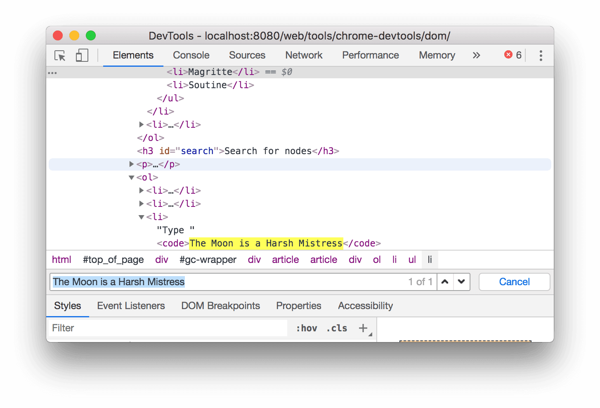

## 修改 DOM
### 修改内容
* 双击元素任意部分（包括标签名、属性或文本内容），然后输入新值，回车保存。

* 右键点击元素修改：
  * 点击标签名，可以选择 **添加属性** 来添加属性。
  * 点击属性名，可以选择 **添加属性** 来添加属性；也可以选择 **修改属性** 来修改属性。 
  * 点击文本内容，可以选择 **编辑文本** 来修改文本内容。

### 以 HTML 格式修改
右键点击元素，选择 **以 HTML 格式修改**，可以以 HTML 形式修改节点，好处是能使用语法高亮和自动补全功能。
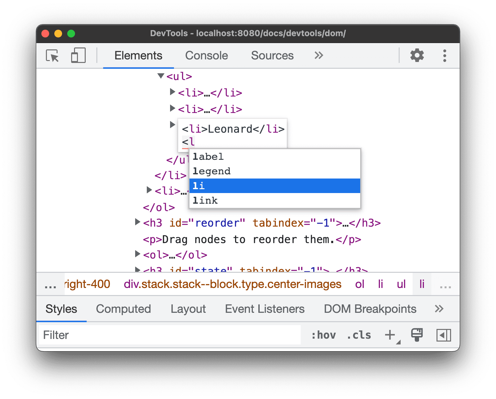

### 移动节点
鼠标悬停在元素上，长按拖动，即可重排 DOM 节点。

### 强制执行状态
右键元素，选择 **强制执行状态**，选择状态，可以强制节点保持 :active、:hover、:focus、:visited、:focus-within 或 :focus-visible 状态。

### 隐藏节点
右键元素，选择 **隐藏元素** 或者直接按 "H" 即可隐藏节点，再按 "H" 恢复。

### 删除节点
右键元素，选择 **删除节点** 或者直接按 "Delete" 即可删除节点。

## 控制台中访问节点
开发者工具提供了一些快捷方式，可用于从控制台中访问DOM 节点或获取对它们的 JavaScript 应用。

### 使用 $0 引用当前选定的节点
在 DOM 树中查看几点时，如果该节点旁边显示 == \$0， 表示可以在控制台中使用变量 \$0 引用该节点。
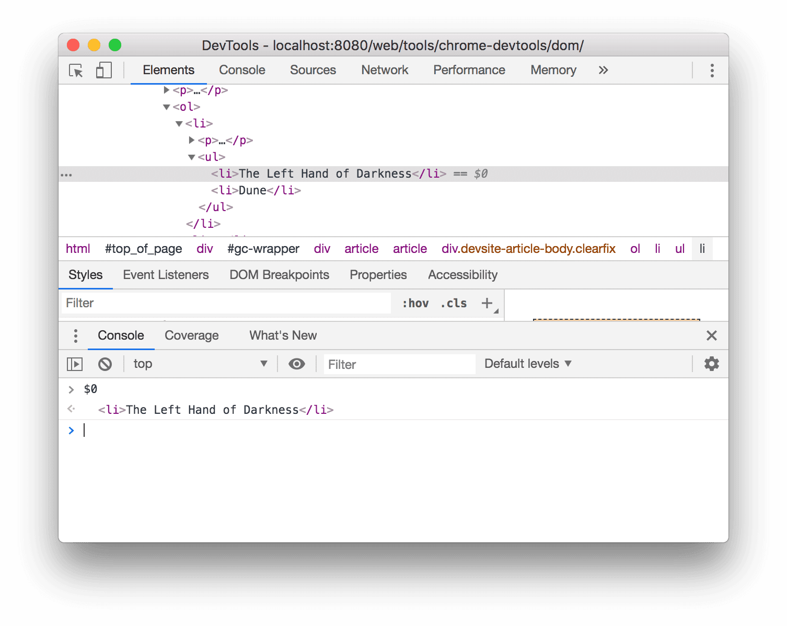

### 储存为全局变量
右键节点，选择 **储存为全局变量**，可以将节点储存为全局变量，以便在控制台中使用。

### 复制元素路径
右键节点，选择 **复制**，可以复制节点路径，包括 CSS 选择器， JS 路径（document.querySelector()） 和 XPath。

## 查看元素的 CSS
**元素**面板中的**样式**标签页列出了 DOM 树中所选元素的所有 CSS 规则。

**样式**标签页可以识别多种 CSS 问题，并以不同的方式显示这些问题。

### 匹配和不匹配的选择器
常规文本是匹配的选择器，浅色文本显示不匹配的选择器。

### 无效声明和值
* CSS 属性无效或未知时，整个声明被划掉并显示⚠️图标。
* CSS 属性有效但值无效时，值被划掉并显示⚠️图标。
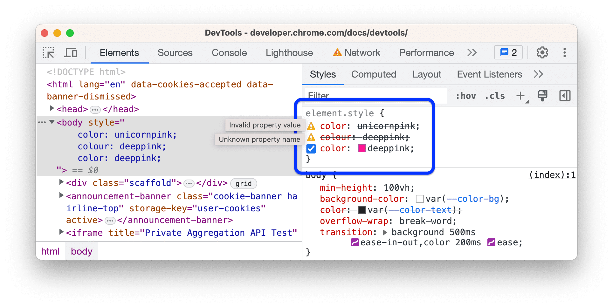

### 已替换
根据级联顺序被其他声明覆盖的声明会被划掉，但不显示⚠️图标。
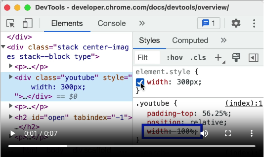

### 无效
有效但因其它属性而不起作用的属性以浅灰色文字显示，旁边有❕图标。
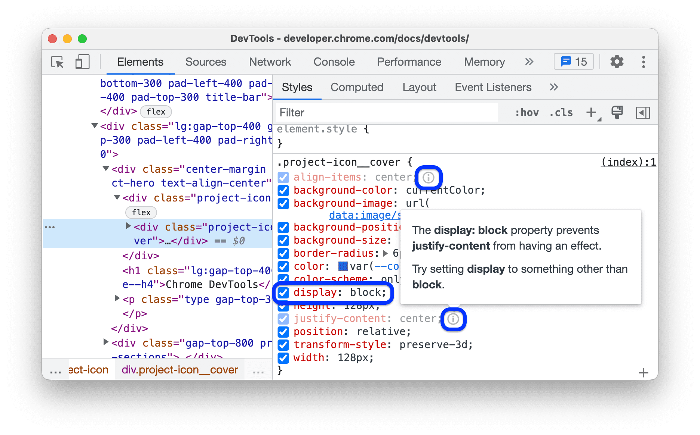

### 继承和非继承
**继承自**区域会根据属性的默认继承关系列出继承的属性：
* 默认情况下显示常规文本
* 未继承的属性显示浅色文本
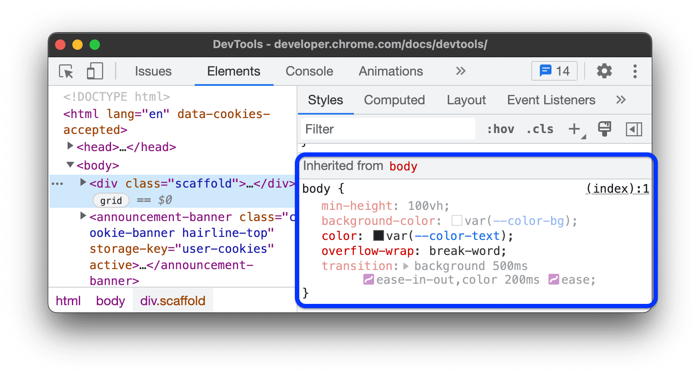

### 简写
简写属性会显示为 ⬇️下拉列表。

这个例子中，四个属性中的两个已被替换。

### 不可修改
无法修改的属性会以斜体展示：
* 用户代理样式表 - Chrome 的默认样式表
  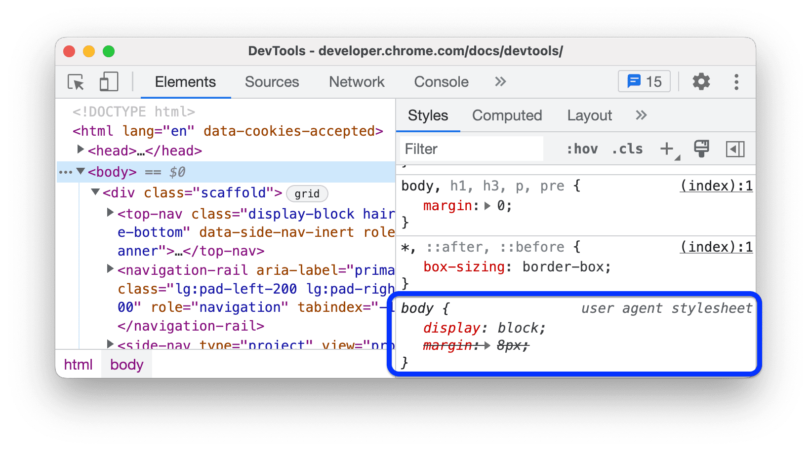
* 元素上与样式相关的 HTML 属性，例如 height、width和color等。在 DOM 树中修改这些属性会反映到**样式**标签页中，但在样式标签页中不可修改。
    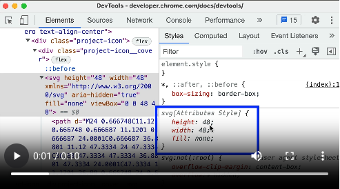

## “计算样式”标签页
**样式**标签页中显示的应用到元素的所有 CSS 声明，而**计算样式**标签页显示的是应用到元素的最终 CSS 属性。

### 声明和继承
**计算样式**标签页会列出所有正确应用到元素的 CSS 属性，包括元素自己的和继承的属性。点击属性旁边的▶️即可查看来源。

如果需要跳转到**样式**标签页查看声明，将鼠标悬停在展开的属性上，然后点击旁边的➡️按钮。
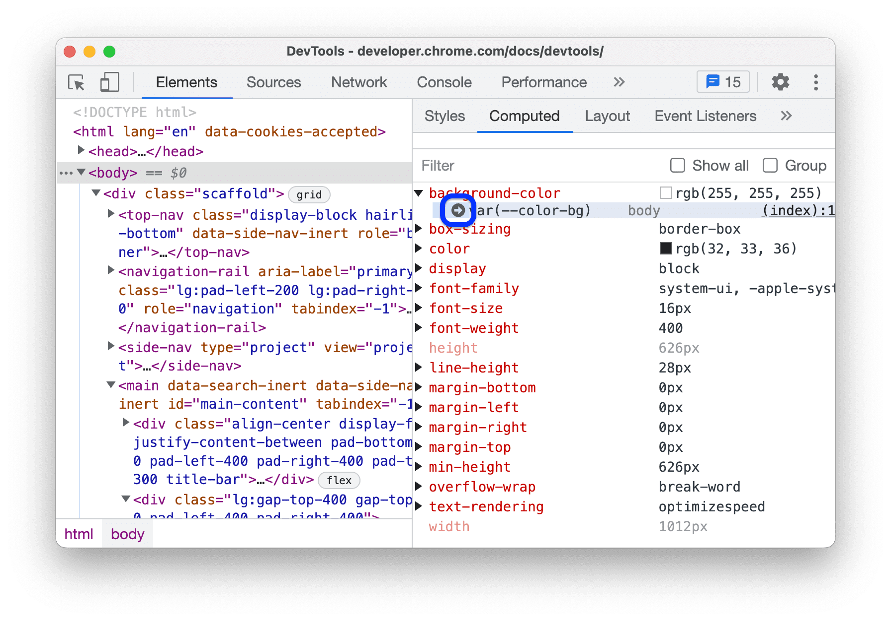
如果需要跳转到**源代码**面板中查看声明，点击指向源文件的链接
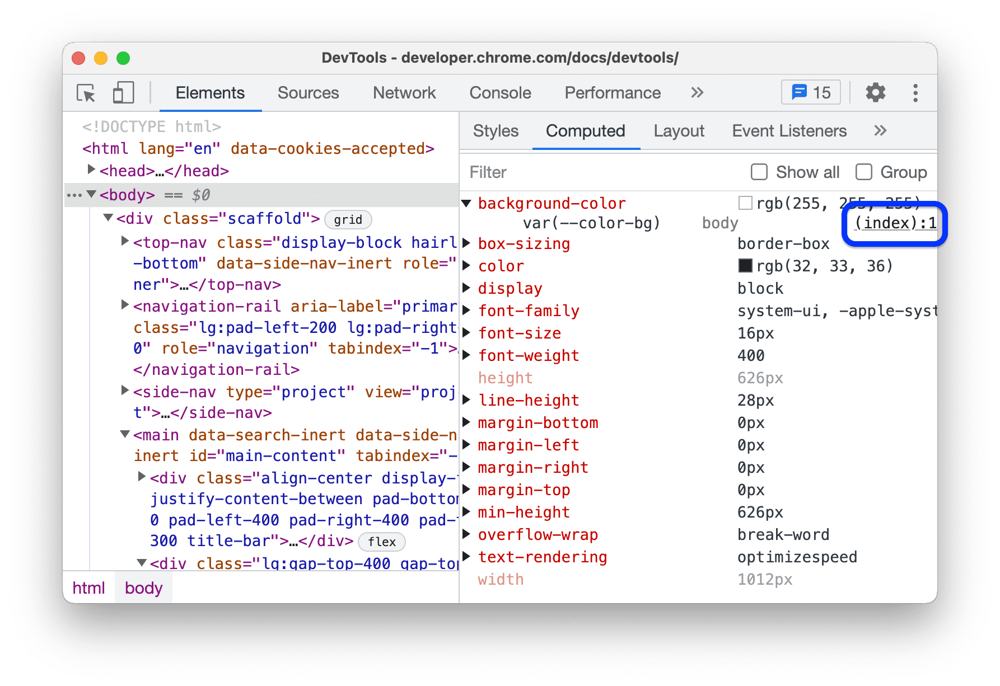

### 运行时
运行时计算的属性值以浅文本形式展示。
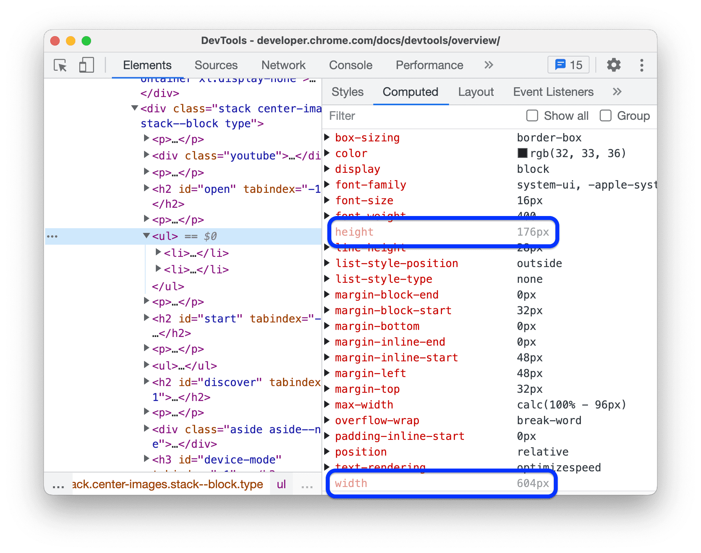

### 分组与筛选
如需显示所有属性及其值，勾选标签页右上角的 **显示所有**。
如需将这个大型列表分为多个类别，勾选右上角的 **分组**。

**样式**与**计算样式**标签页都有过滤栏，可以输入属性名或属性值来筛选属性。

## 修改元素的 CSS

### 向元素添加 CSS 声明 
在**样式**标签页中，点击顶部的 **element style**，可以直接向元素添加内联的 CSS 声明。

### 向元素添加 CSS 类
点击**样式**标签页右上角的.cls，会出现一个文本框，可以在其中为所选元素添加类。
也可以在下面的复选框中开启或关闭该元素上所有类。

### 更改元素的尺寸
使用**样式**标签页底部或**计算样式**标签页顶部的 **盒模型**交互式图标，更改元素的盒模型属性。
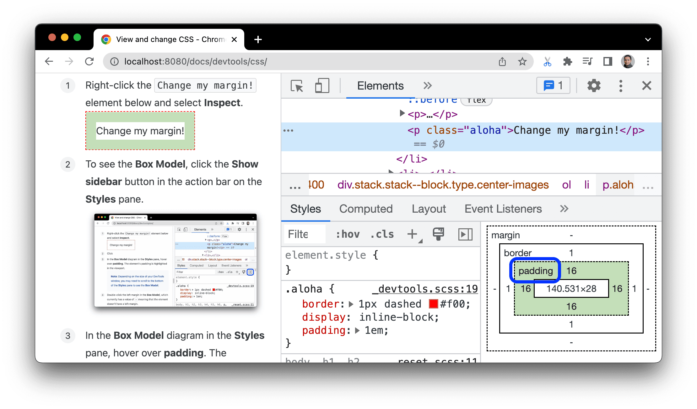

## 检查和调试 CSS Flexbox 布局
如果网页上某个元素应用了 Flexbox 布局，可以在**元素**面板中看到该元素旁边的 flex 标记。
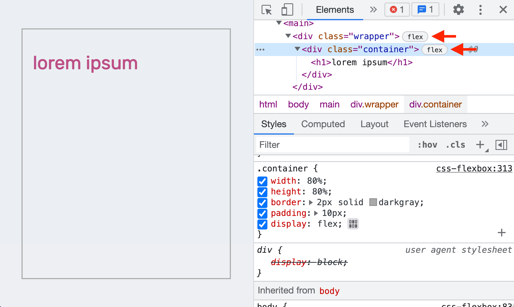

### 使用 Flexbox 编辑器修改布局
在**样式**标签页中，可以在 display: flex 声明旁边看到 **flexbox 编辑器**按钮。
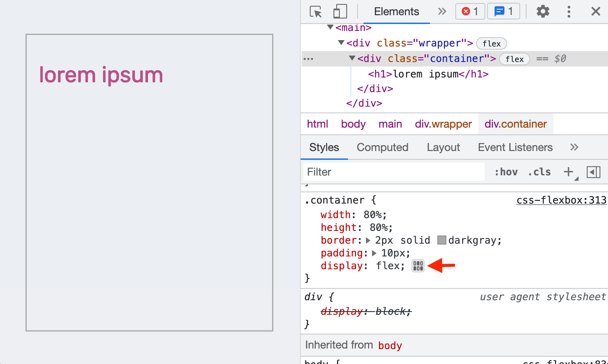

点击打开 flexbox 编辑器，会显示出 Flexbox 属性列表，每个属性值均以图标按钮的形式展示。
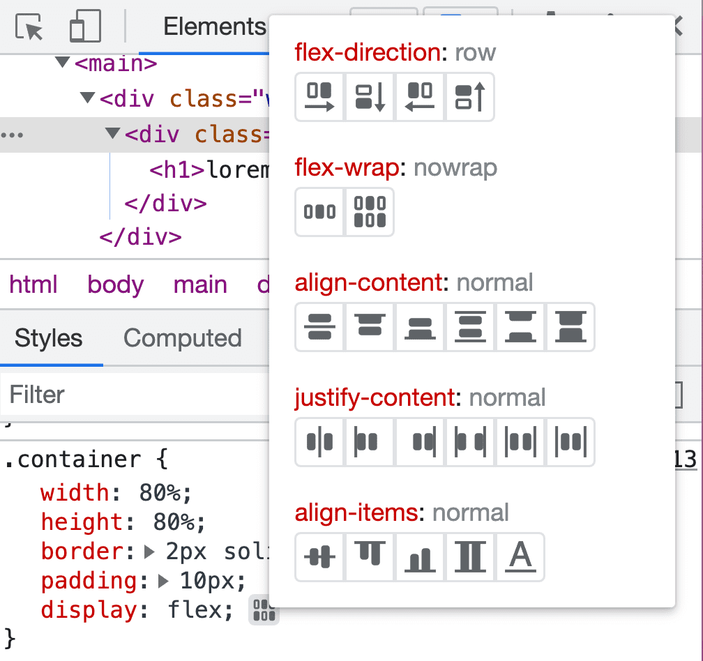

比如需要元素居中显示文本，可以点击 justify-content: center 和 align-items: center 按钮。
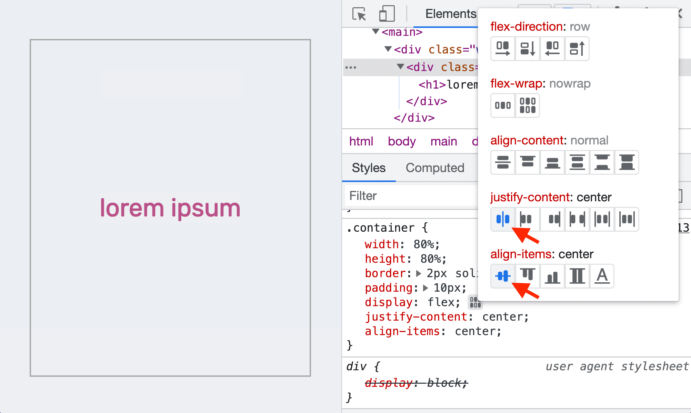

## 附录：快捷键速查表
### 元素面板

### 样式标签页

