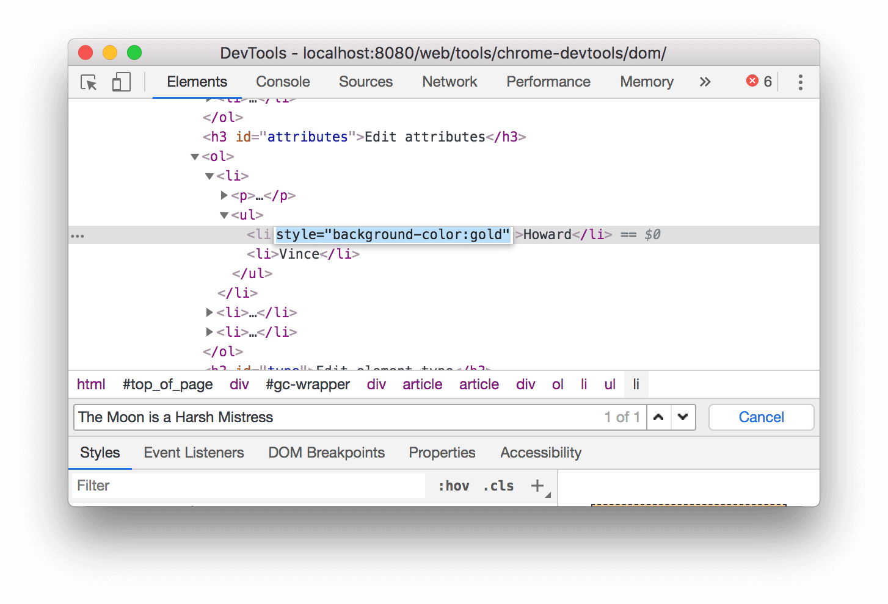
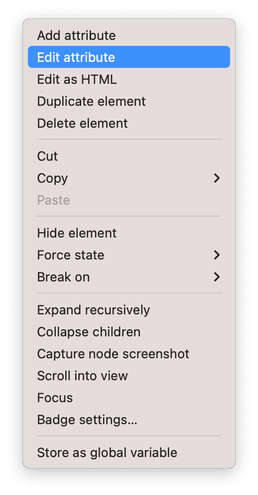
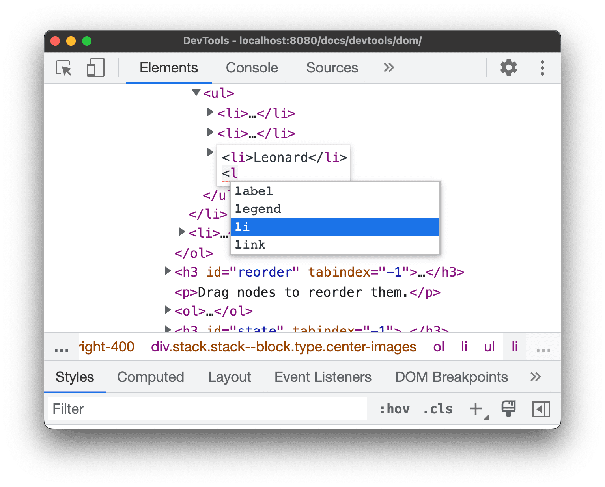

# 修改 DOM
## 修改内容
* 双击元素任意部分（包括标签名、属性或文本内容），然后输入新值，回车保存。
  

* 右键点击元素修改：
  * 点击标签名，可以选择 **添加属性** 来添加属性。
  * 点击属性名，可以选择 **添加属性** 来添加属性；也可以选择 **修改属性** 来修改属性。 
  * 点击文本内容，可以选择 **编辑文本** 来修改文本内容。
  

## 以 HTML 格式修改
右键点击元素，选择 **以 HTML 格式修改**，可以以 HTML 形式修改节点，好处是能使用语法高亮和自动补全功能。

## 移动节点
鼠标悬停在元素上，长按拖动，即可重排 DOM 节点。

## 强制执行状态
右键元素，选择 **强制执行状态**，选择状态，可以强制节点保持 :active、:hover、:focus、:visited、:focus-within 或 :focus-visible 状态。

## 隐藏节点
右键元素，选择 **隐藏元素** 或者直接按 "H" 即可隐藏节点，再按 "H" 恢复。

## 删除节点
右键元素，选择 **删除节点** 或者直接按 "Delete" 即可删除节点。