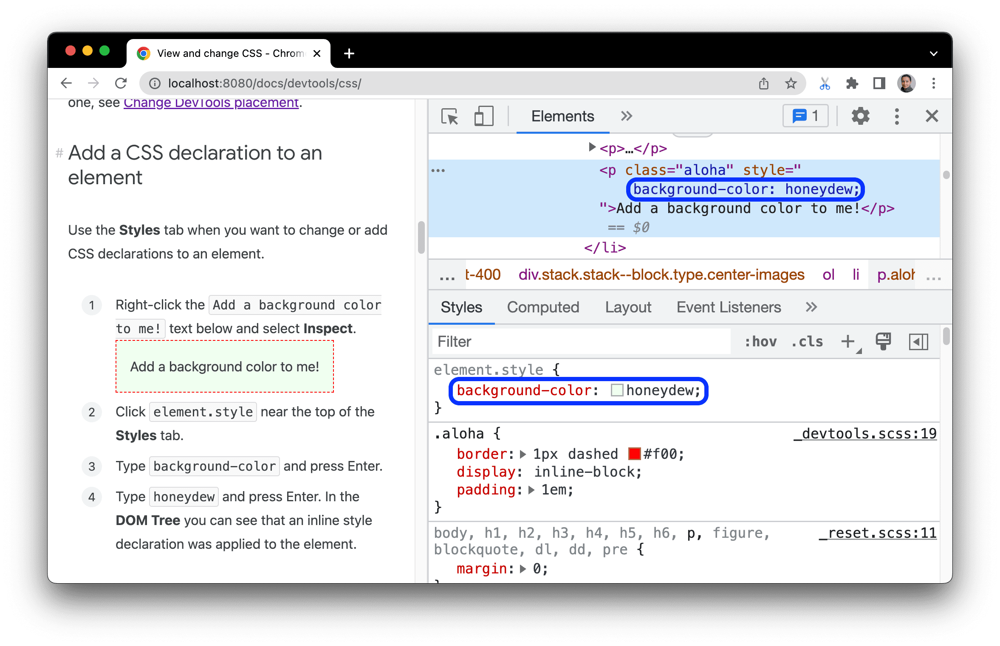
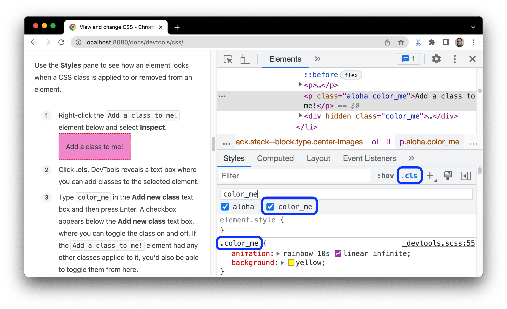
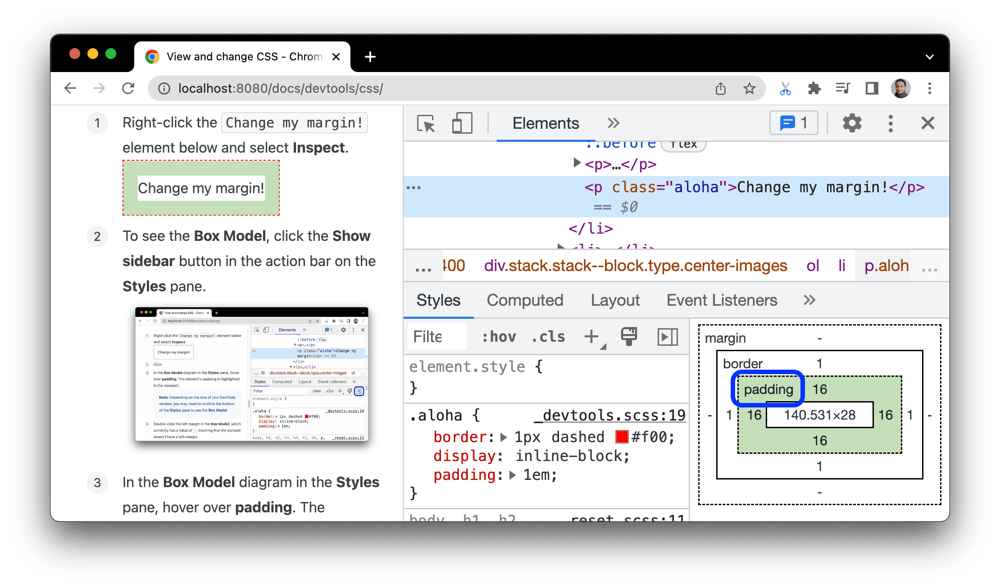

# 修改元素的 CSS

## 向元素添加 CSS 声明

在**样式**标签页中，点击顶部的 **element style**，可以直接向元素添加内联的 CSS 声明。

## 向元素添加 CSS 类

点击**样式**标签页右上角的.cls，会出现一个文本框，可以在其中为所选元素添加类。
也可以在下面的复选框中开启或关闭该元素上所有类。

## 更改元素的尺寸

使用**样式**标签页底部或**计算样式**标签页顶部的 **盒模型**交互式图标，更改元素的盒模型属性。

