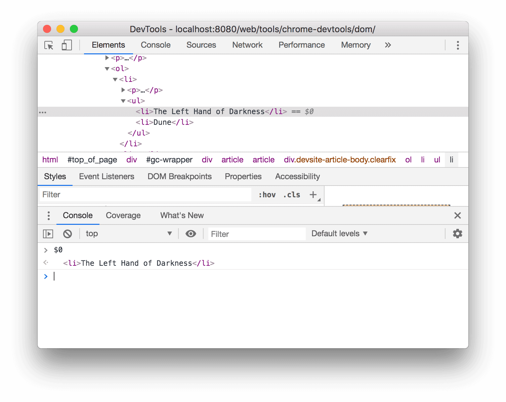
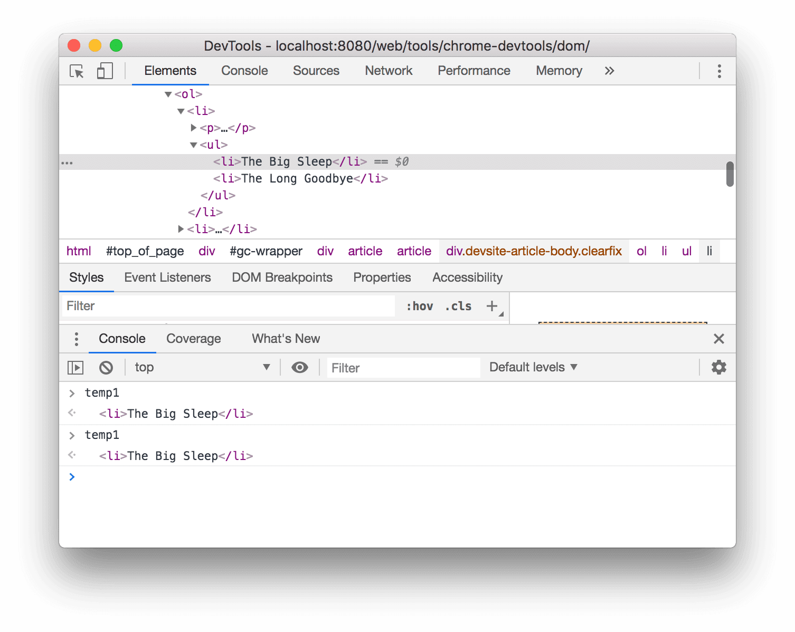
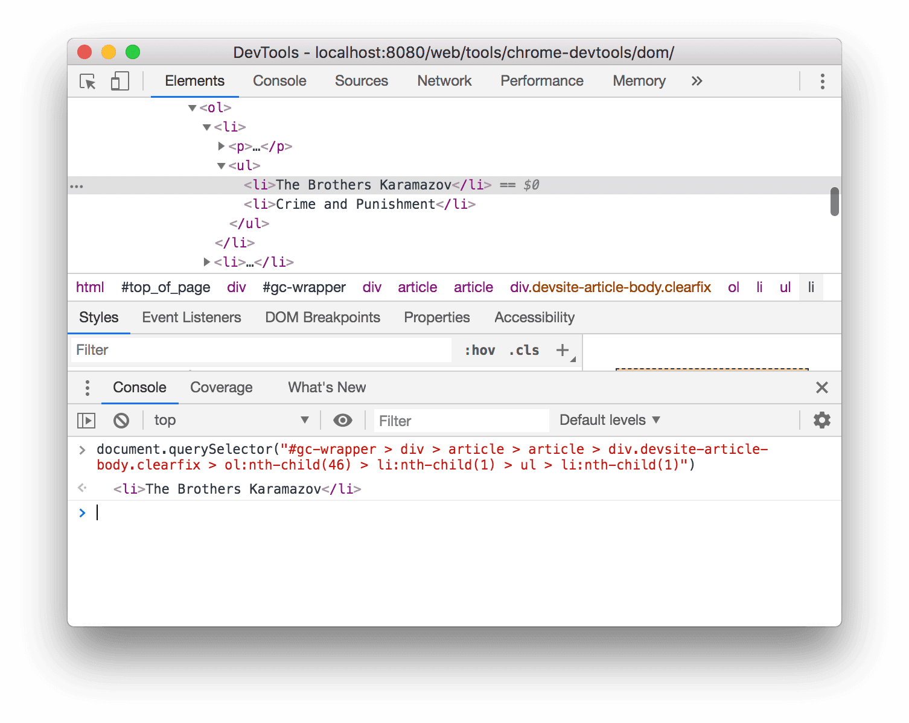

# 控制台中访问节点

开发者工具提供了一些快捷方式，可用于从控制台中访问 DOM 节点或获取对它们的 JavaScript 引用。

## 使用 $0 引用当前选定的节点

在 DOM 树中查看几点时，如果该节点旁边显示 == \$0， 表示可以在控制台中使用变量 \$0 引用该节点。

## 储存为全局变量

右键节点，选择 **储存为全局变量**，可以将节点储存为全局变量，以便在控制台中使用。

## 复制元素路径

右键节点，选择 **复制**，可以复制节点路径，包括 CSS 选择器， JS 路径（document.querySelector()） 和 XPath。

