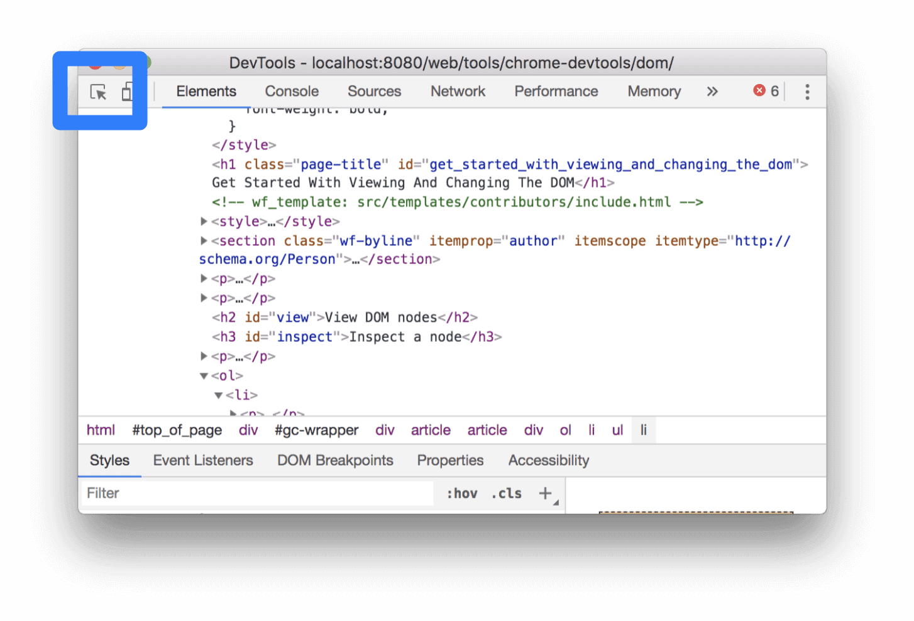
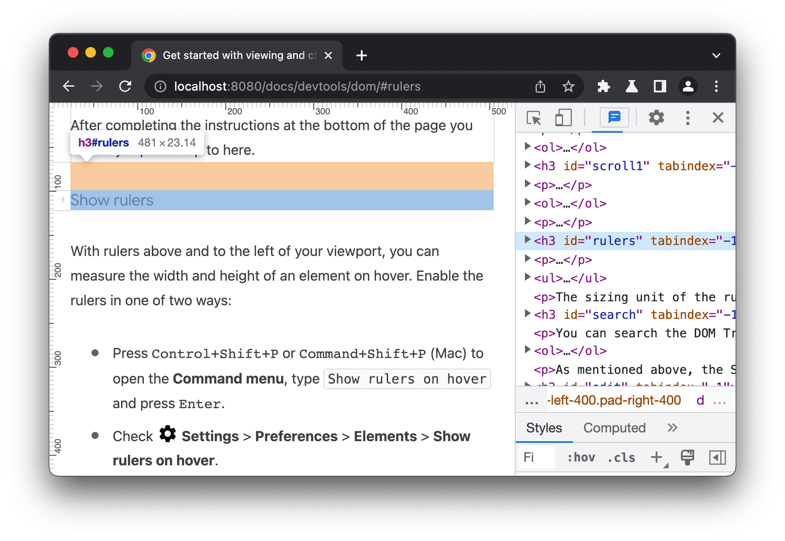

# 查看 DOM
## Inspect 模式查看 DOM 节点
除了右键元素选择**检查**之外，还可以点击开发者工具左上角的 **Inspect** 图标，然后点击页面上的元素。DOM 树中将突出显示该元素。

## 使用键盘浏览 DOM 树
- **上下箭头**：在 DOM 树中上下移动。
- **左右箭头**：收起和展开节点。

## 显示标尺
在 DOM 树中将鼠标悬停在元素上，测量元素的宽度和高度。

## 搜索节点
将鼠标置于元素面板上，按 Command+F，搜索栏会在 DOM 树底部打开。

搜索栏支持文本，CSS选择器和 XPath。元素面板会选择 DOM 树中第一个匹配的结果，并将其滚动到视口中。
