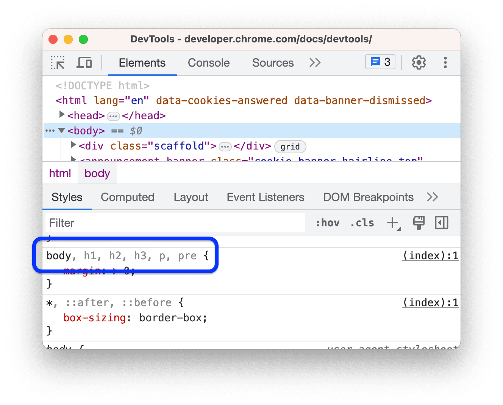
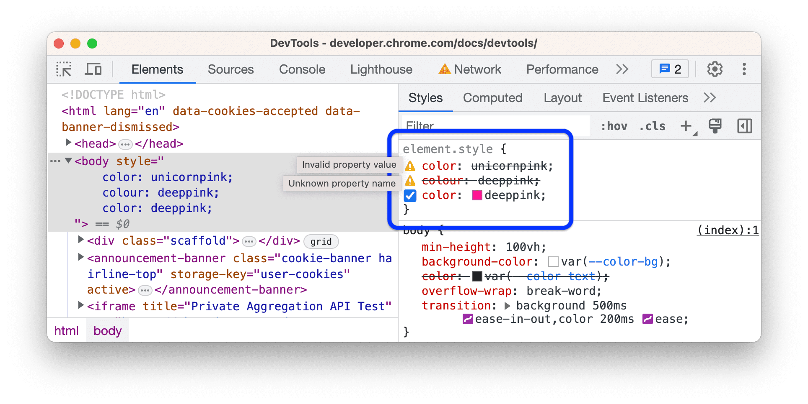
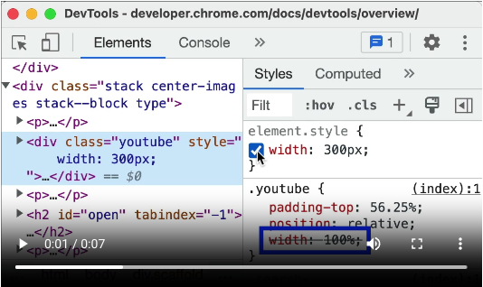
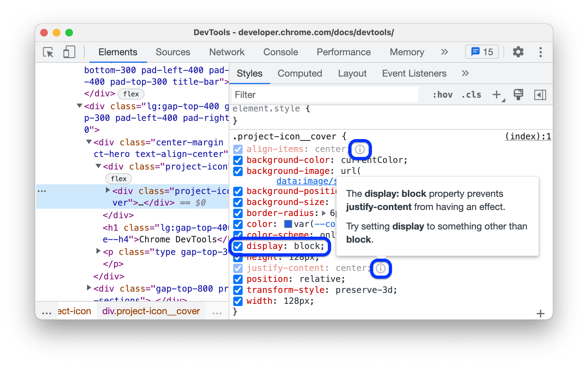
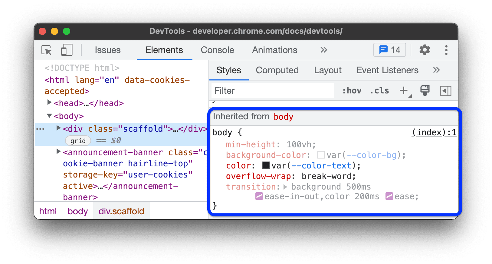
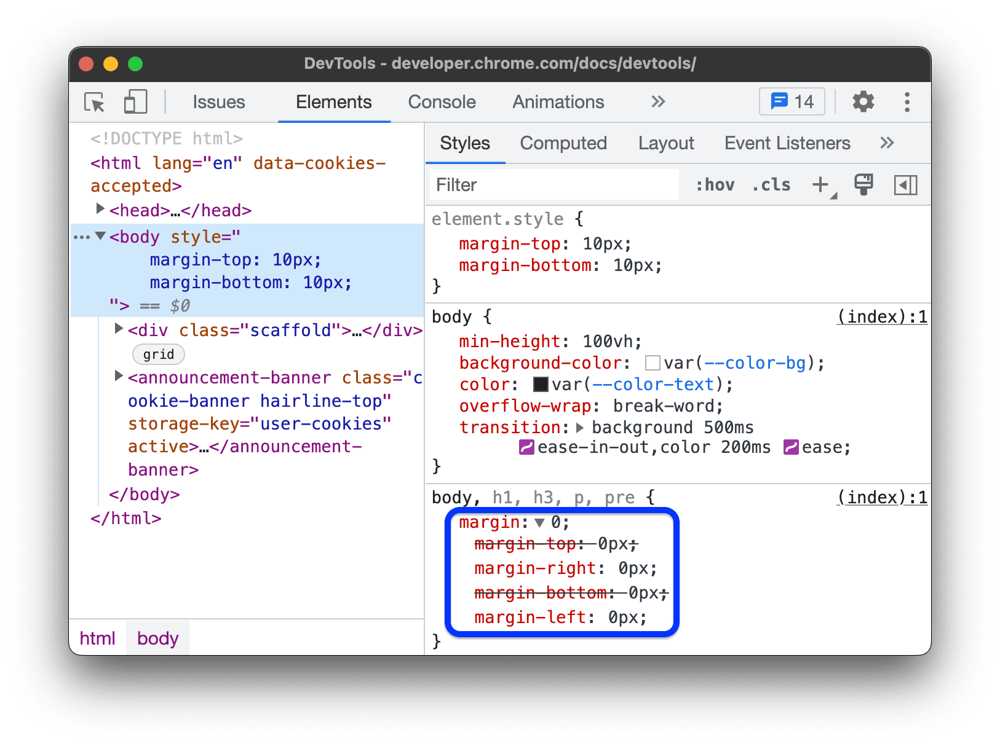
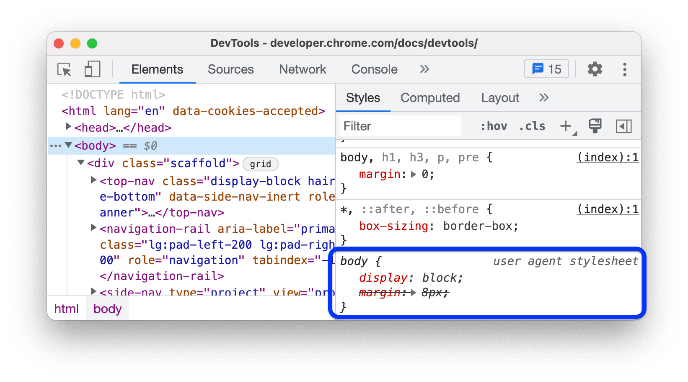
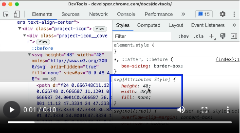

# 查看元素的 CSS

**元素**面板中的**样式**标签页列出了 DOM 树中所选元素的所有 CSS 规则。

**样式**标签页可以识别多种 CSS 问题，并以不同的方式显示这些问题。

## 匹配和不匹配的选择器

常规文本是匹配的选择器，浅色文本显示不匹配的选择器。

## 无效声明和值

* CSS 属性无效或未知时，整个声明被划掉并显示⚠️图标。
* CSS 属性有效但值无效时，值被划掉并显示⚠️图标。

## 已替换

根据级联顺序被其他声明覆盖的声明会被划掉，但不显示⚠️图标。

## 无效

有效但因其它属性而不起作用的属性以浅灰色文字显示，旁边有❕图标。

## 继承和非继承

**继承自**区域会根据属性的默认继承关系列出继承的属性：

* 默认情况下显示常规文本
* 未继承的属性显示浅色文本

## 简写

简写属性会显示为 ⬇️下拉列表。

这个例子中，四个属性中的两个已被替换。

## 不可修改

无法修改的属性会以斜体展示：

* 用户代理样式表 - Chrome 的默认样式表
  
* 元素上与样式相关的 HTML 属性，例如 height、width和color等。在 DOM 树中修改这些属性会反映到**样式**标签页中，但在样式标签页中不可修改。
    
