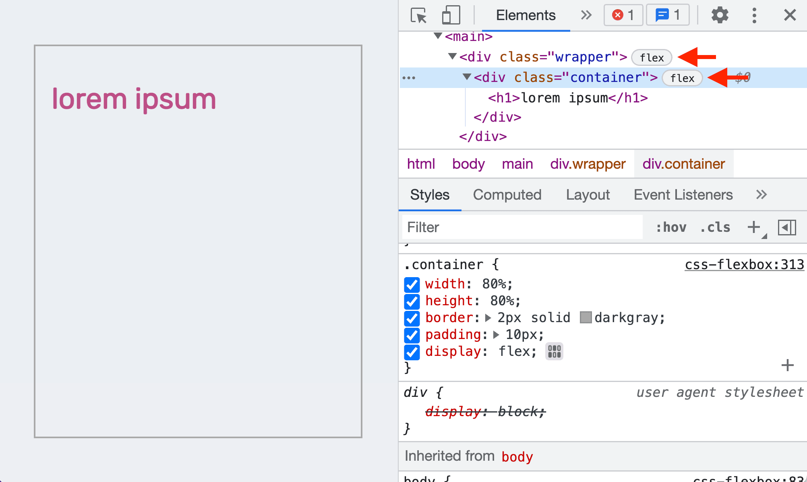
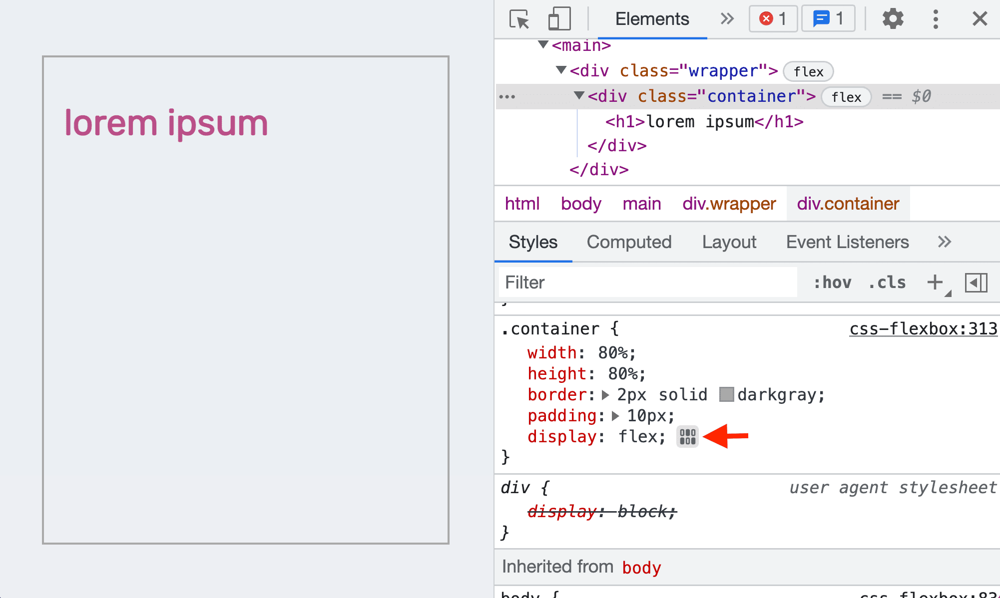
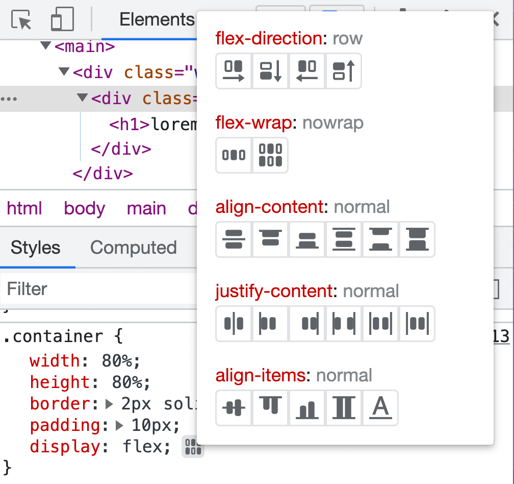
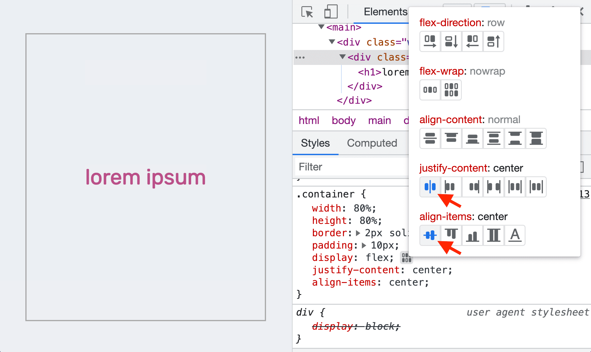

# 检查和调试 CSS Flexbox 布局

如果网页上某个元素应用了 Flexbox 布局，可以在**元素**面板中看到该元素旁边的 flex 标记。

## 使用 Flexbox 编辑器修改布局

在**样式**标签页中，可以在 display: flex 声明旁边看到 **flexbox 编辑器**按钮。

点击打开 flexbox 编辑器，会显示出 Flexbox 属性列表，每个属性值均以图标按钮的形式展示。

比如需要元素居中显示文本，可以点击 justify-content: center 和 align-items: center 按钮。

