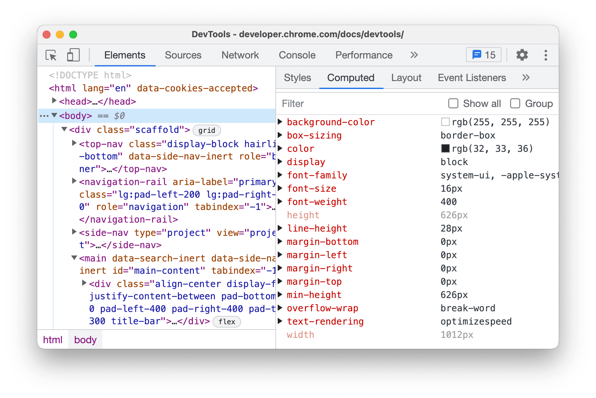
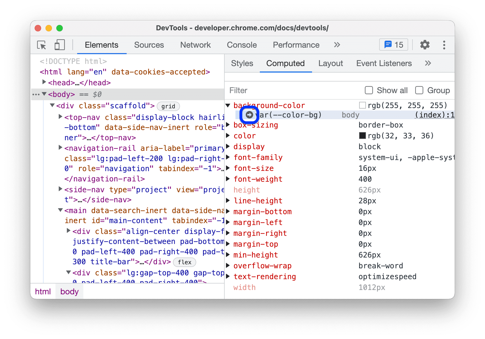
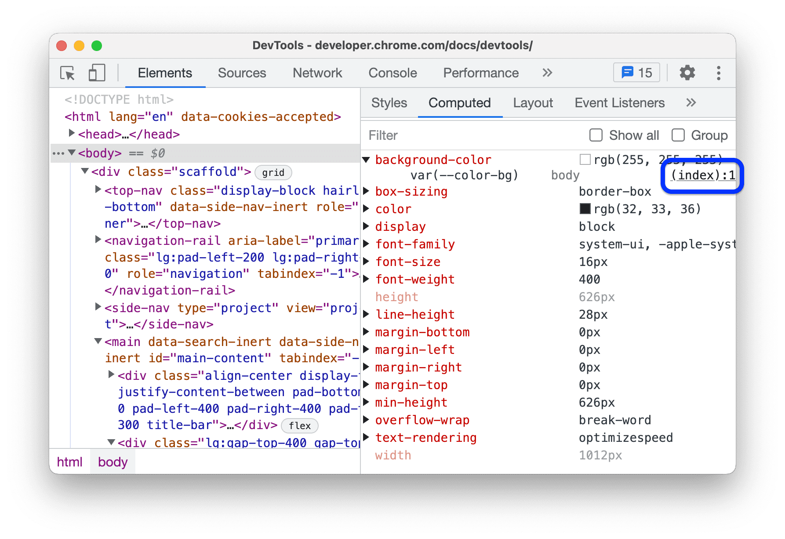
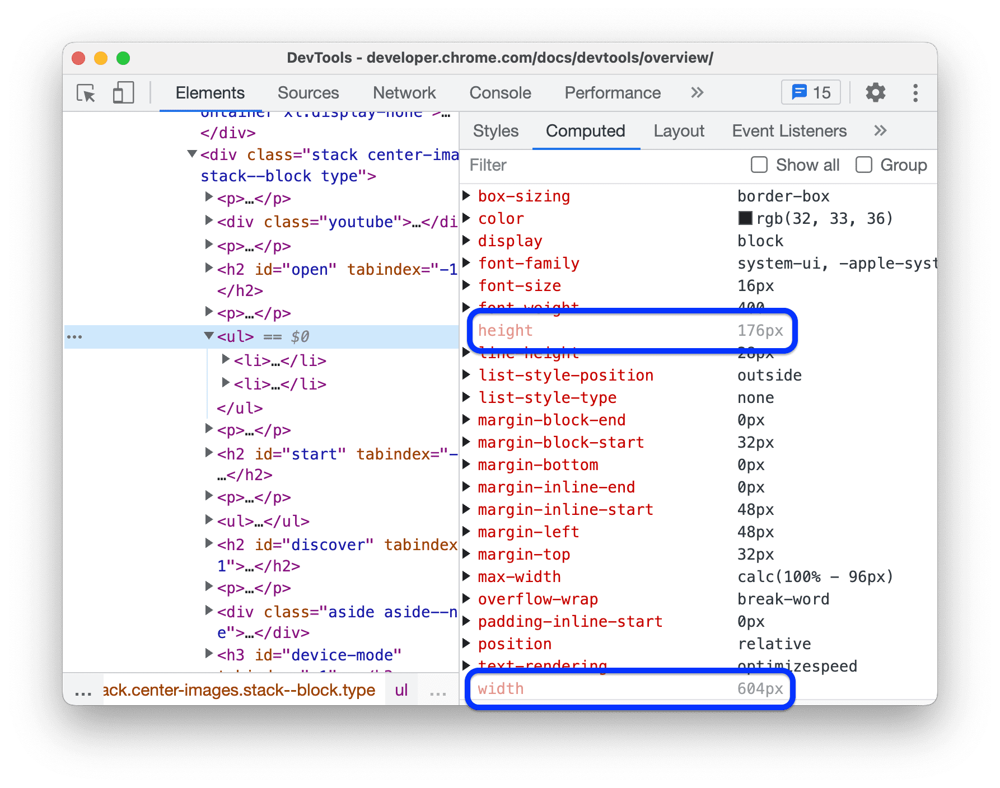
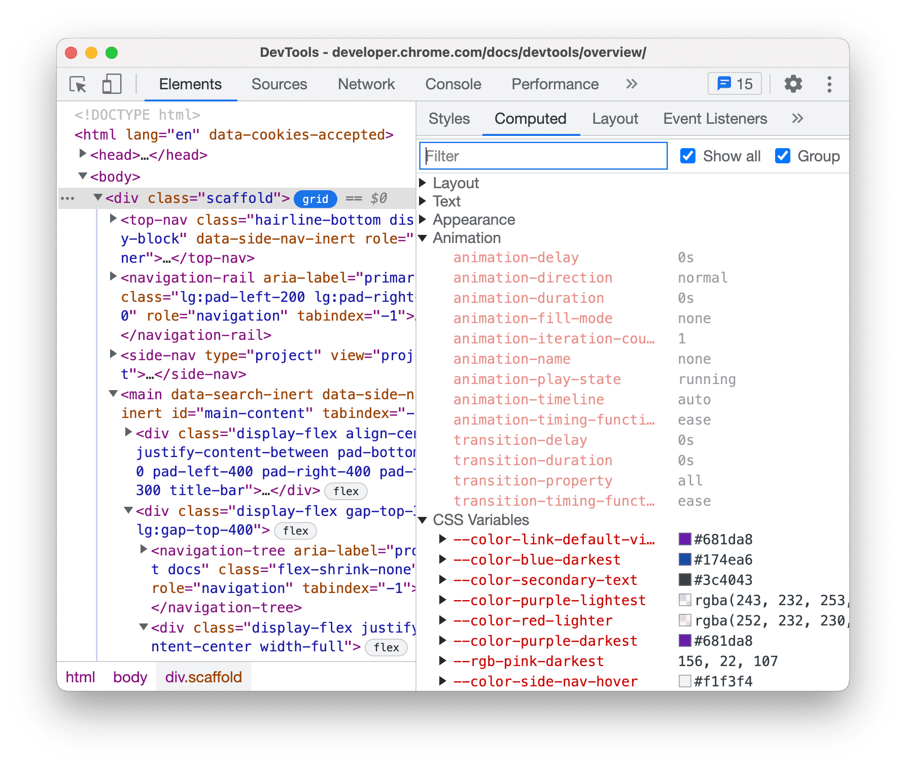
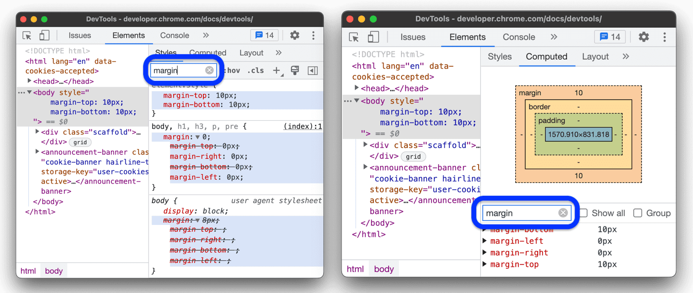

# 计算样式标签页
**样式**标签页中显示的应用到元素的所有 CSS 声明，而**计算样式**标签页显示的是应用到元素的最终 CSS 属性。

## 声明和继承
**计算样式**标签页会列出所有正确应用到元素的 CSS 属性，包括元素自己的和继承的属性。点击属性旁边的▶️即可查看来源。

如果需要跳转到**样式**标签页查看声明，将鼠标悬停在展开的属性上，然后点击旁边的➡️按钮。

如果需要跳转到**源代码**面板中查看声明，点击指向源文件的链接

## 运行时
运行时计算的属性值以浅文本形式展示。

## 分组与筛选
如需显示所有属性及其值，勾选标签页右上角的 **显示所有**。
如需将这个大型列表分为多个类别，勾选右上角的 **分组**。

**样式**与**计算样式**标签页都有过滤栏，可以输入属性名或属性值来筛选属性。
