# 使用 Animations 面板调试 CSS 动画
动画面板支持 CSS 动画、CSS 过渡、网络动画和 View Transitions API。

动画面板主要有两个用途：
- 检查动画： 慢放、重播或查看动画源代码。
- 修改动画：修改动画的时间、延迟、持续时间或关键帧偏移，但不支持编辑关键帧和贝塞尔曲线。

## 打开动画面板
- 依次选择 **Customize and control DevTools** > **More tools** > **Animations**。
   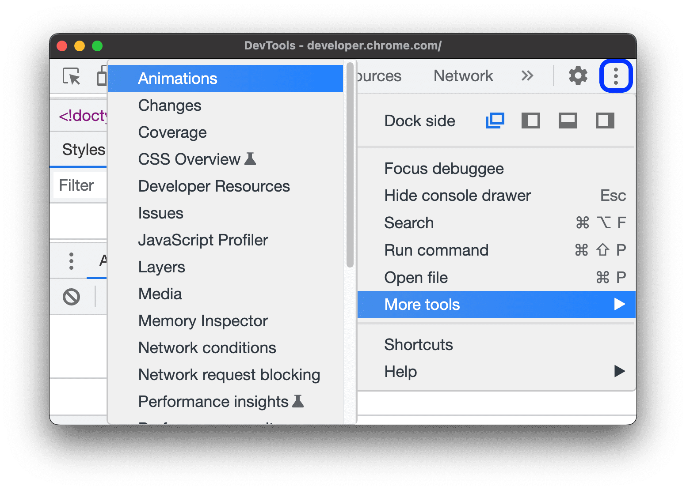

- 在命令菜单输入 **Show Animations** 并选择相应的抽屉式面板。
   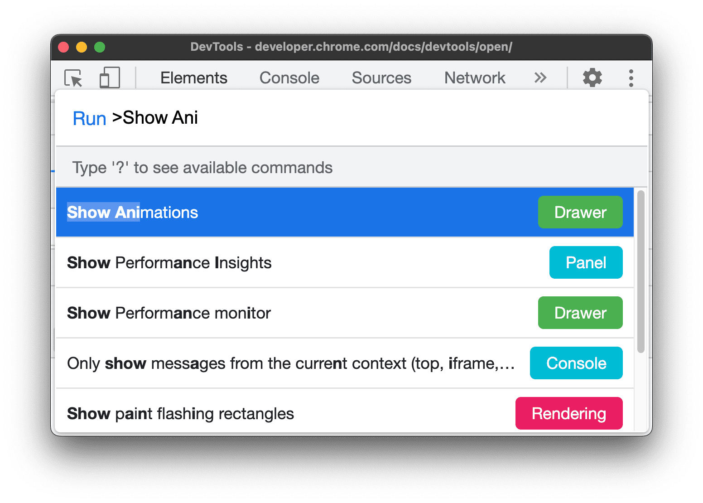

动画面板会在打开时自动捕获正在进行的动画。如果动画在页面加载时触发或已停止，请在面板打开的情况下重新加载页面再次触发。

## 动画面板界面
动画面板包含四个主要部分：
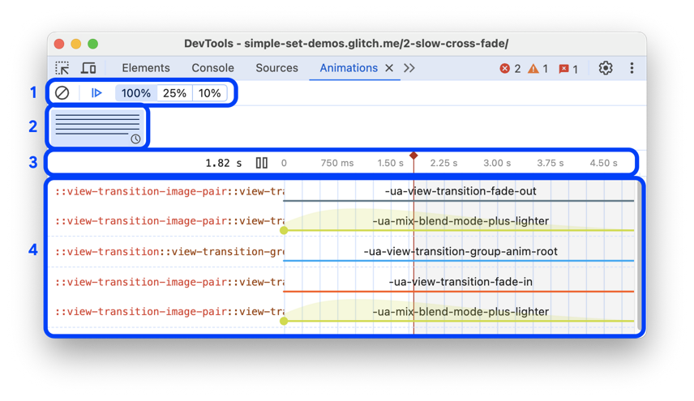

1. **控件**：在这里，你可以清除所捕获的动画，暂停或恢复动画，或更改所选动画的速度。
2. **概览**：显示两种类型的动画，鼠标滚动驱动型和基于时间型。在这里选择动画，然后在**详细**窗格中进行检查和修改。
3. **时间轴**：时间轴中可以重放、快进或跳转到特定节点。鼠标驱动的动画以像素为单位，基于时间的动画以毫秒为单位。
4. **详细信息**：检查和修改所选动画。

## 检查动画
捕获动画后，可以通过以下方式重播：
- 在**概览**窗格中将鼠标悬停于动画的缩略图。查看预览。
- 拖动进度条指针（红色垂直条），或点击**时间轴**上任意位置将动画进度条设置为特定点，如果动画已在播放，将从此处继续播放。
- 在**概览**窗格中选择动画，然后按**时间轴**中的🔂**重放**按钮，动画会在视口中重播。

点击**控件**中的 **｜100%｜25%｜10%｜** 按钮，可以更改所选动画的播放速度。

在样式中修改 @keyframes 后，可以立即在动画面板中看到效果。

### 查看单个动画
捕获动画后，在 **概览**窗格中点击该动画即可查看详细信息。在**详细信息**窗格中，每个动画会单独成行。
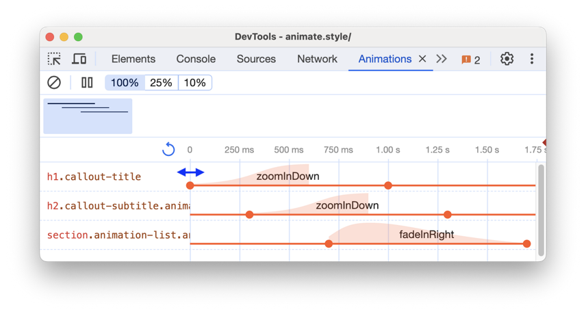

### 查看应用动画的元素
将鼠标悬停在动画上，即可在视口中突出显示应用该动画的元素，点击可在**元素**面板中选中。
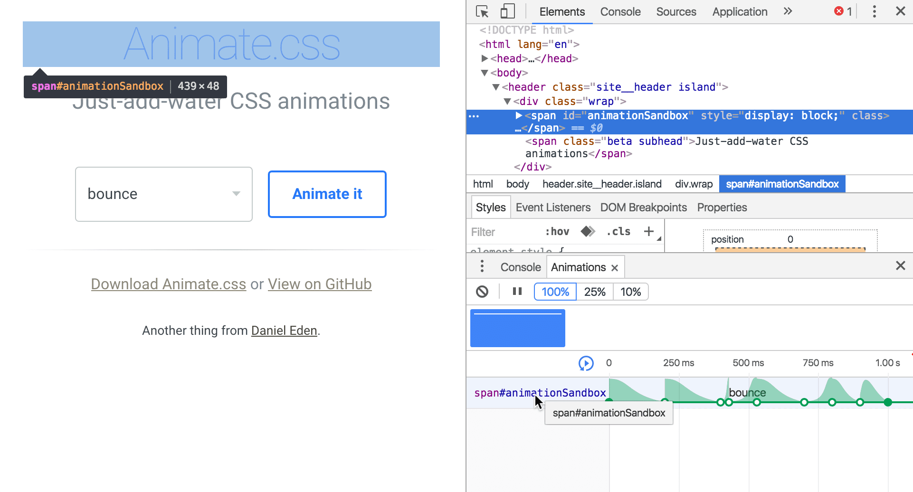

### 查看无限重复动画
如果某些动画的 animation-iteration-count 属性设为 infinite，会无限期重复，**详情**窗格会显示其定义和迭代。
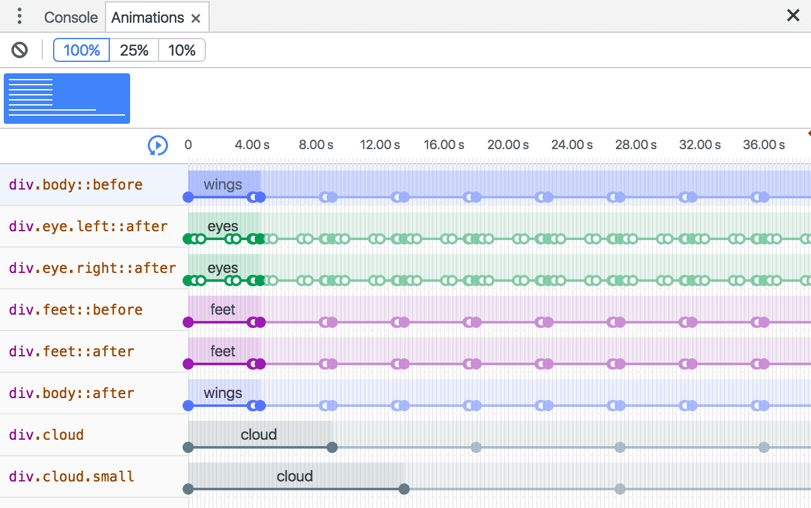

动画最左侧深色部分是其定义，右侧浅色部分表示重复。、
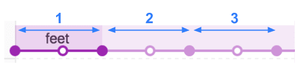

## 修改动画
假设下图代表原始动画：
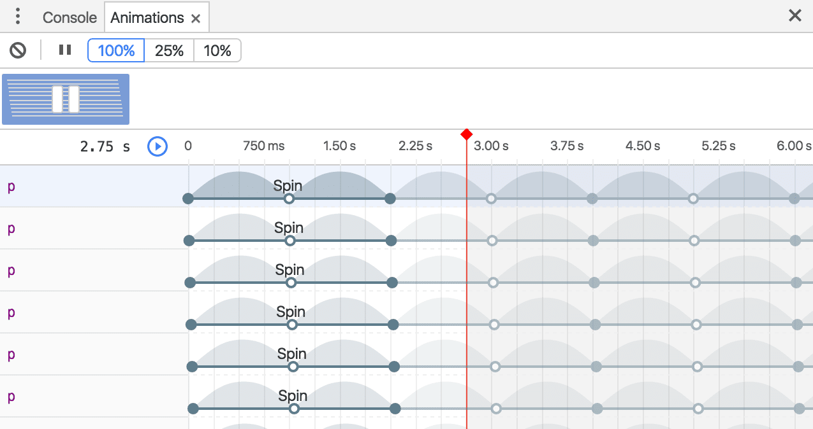

### 修改动画时长
如需修改动画时长，拖动第一个或最后一个圆圈：
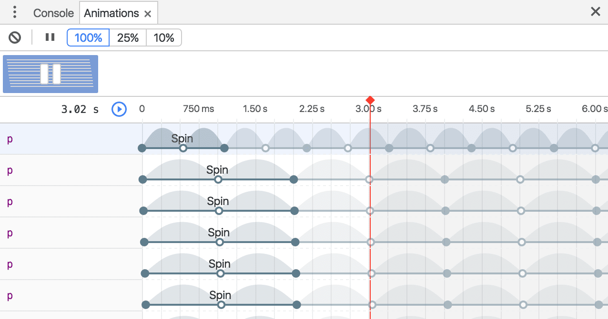

### 修改关键帧时间
如果动画定义了任何关键帧规则，那么这些将展示为内部白点。拖动白点更改关键帧时间：
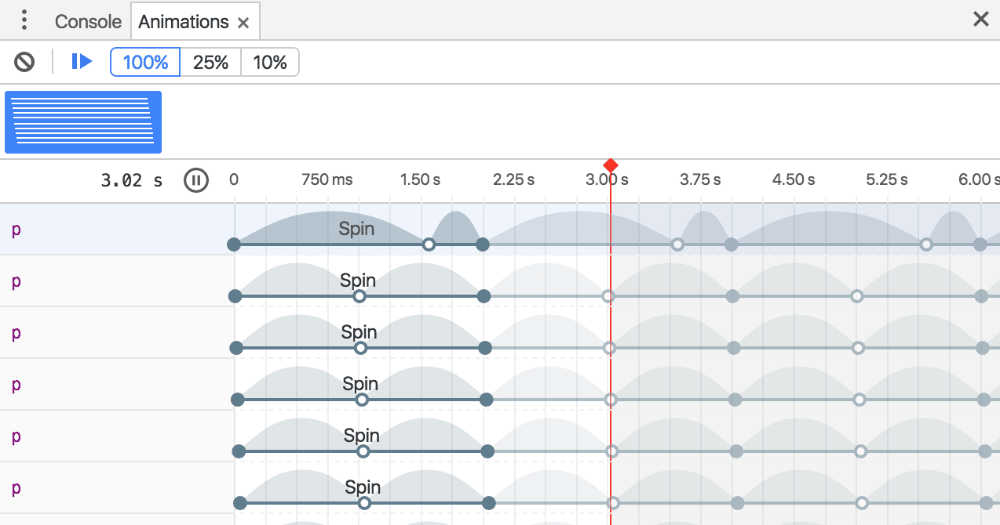

### 修改动画的开始时间延迟
如需修改动画的开始时间延迟，点击动画本身（而非圆点）。拖动到任意位置：
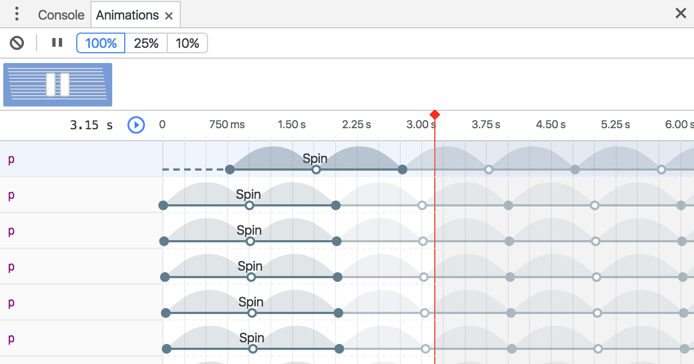
