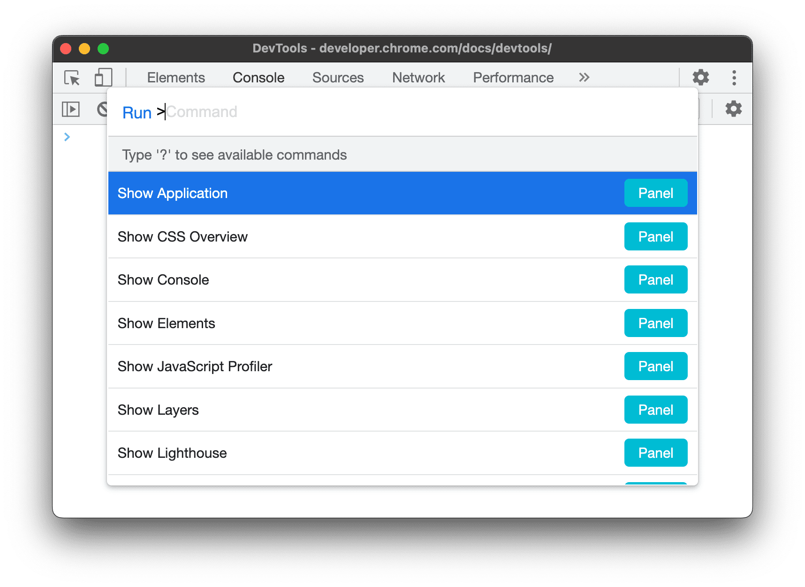
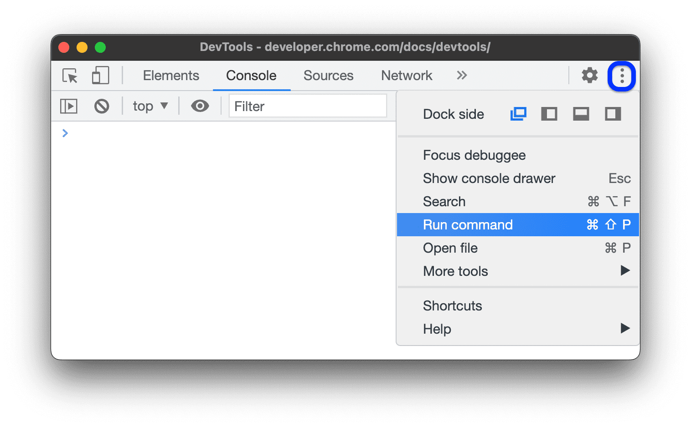
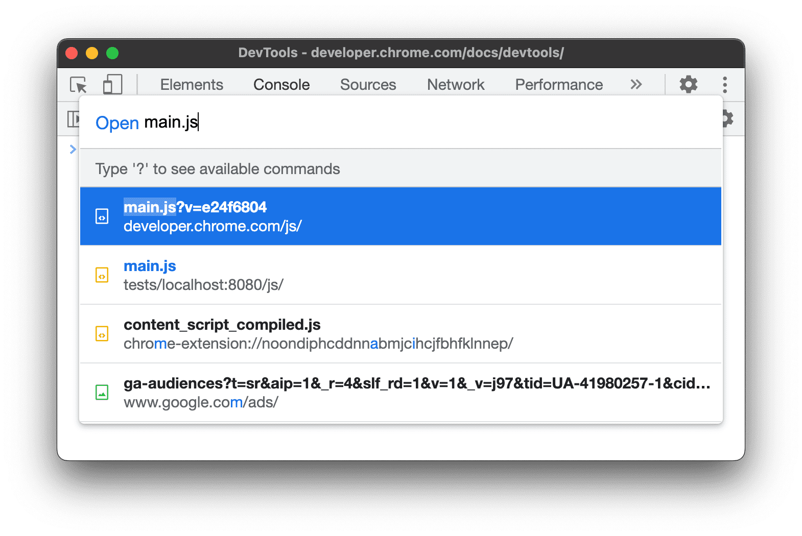
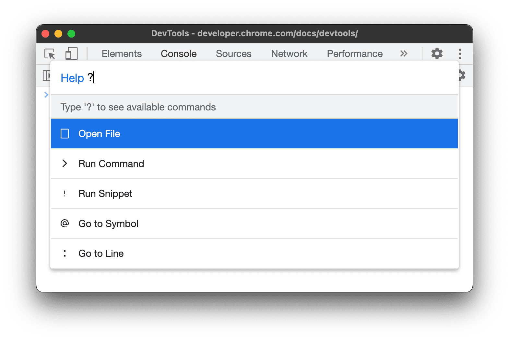

# 使用命令操作
通过**命令界面**， 可以快速浏览 DevTools 界面并完成常见任务。最初灵感来源于 VSCode 的命令面板。

## 打开命令菜单
- 在 DevTools 界面，按 Ctrl + Shift + P (Windows / Linux) 或 Command + Shift + P (Mac)。
- 点击 DevTools 右上角三个点按钮，选择**运行命令**。
  

## 打开文件
- 在 DevTools 界面，按 Ctrl + P (Windows / Linux) 或 Command + P (Mac)。
- 点击 DevTools 右上角三个点按钮，选择**打开文件**。
  

打开命令菜单后，删除 ">" 字符，此时菜单也会变为**打开文件**，可以输入文件名或内容搜索。

## 查看更多可执行操作
如需查看**命令菜单**中的更多操作，删除 ">" 字符并输入 "?"

