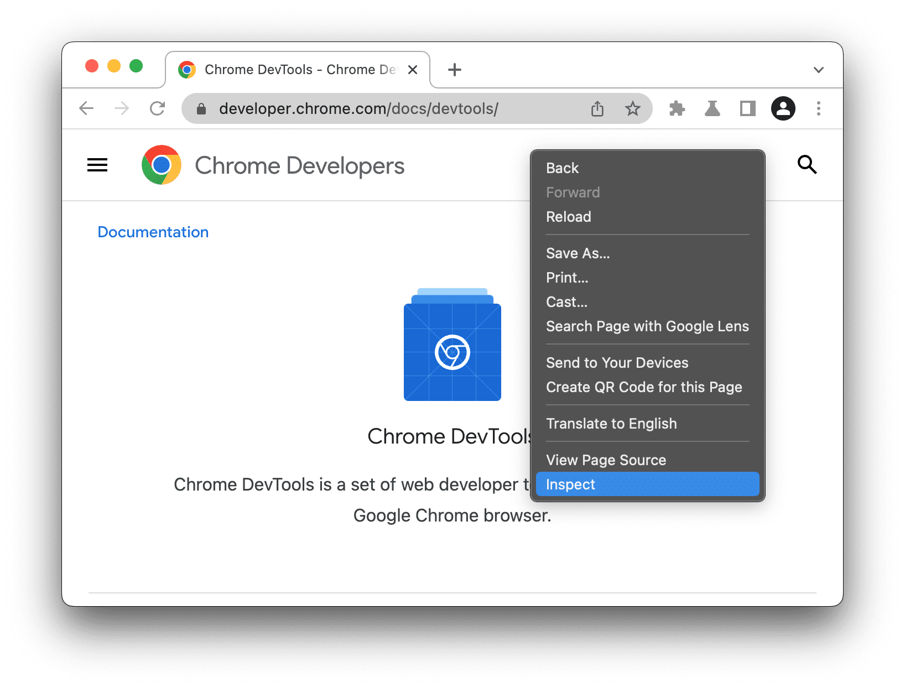
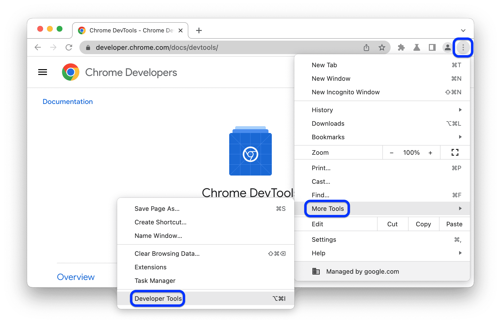
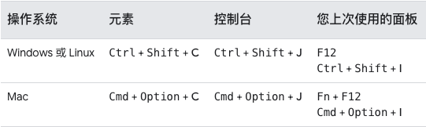

# 打开 DevTools

## 检查 DOM 或 CSS

右键点击网页上的元素，然后选择**检查**。DevTools 会打开**元素**面板，并在 DOM 树中选中相应元素。

## 打开上次使用的面板

点击浏览器右上角的 **三个点**按钮，然后选择 **更多工具** > **开发者工具**

## 使用快捷键打开

 
**快速记忆方法**：

* **C** 代表 CSS。
* **J** 代表 JavaScript。
* **I** 代表您上次的选项
