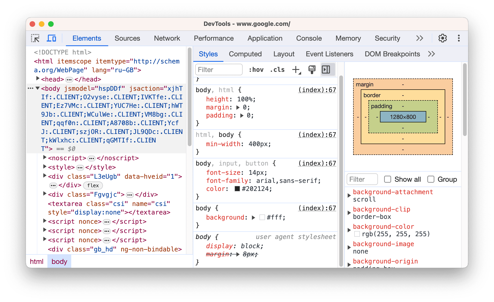
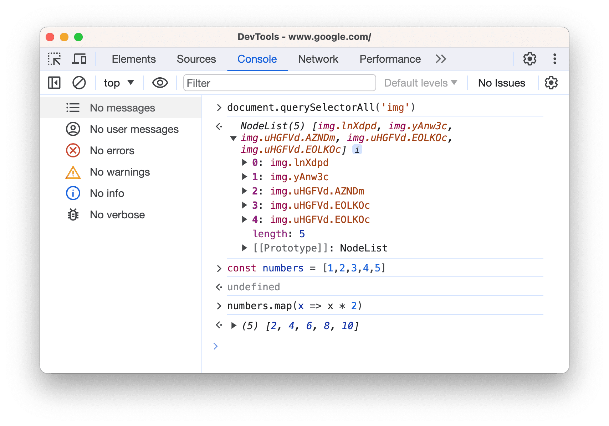
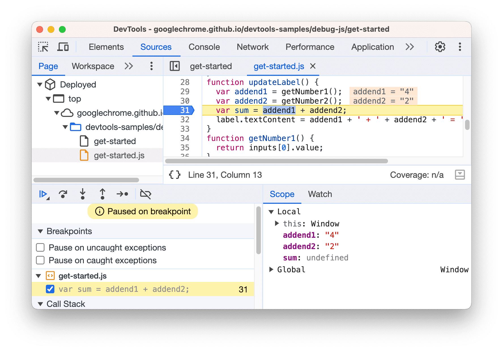
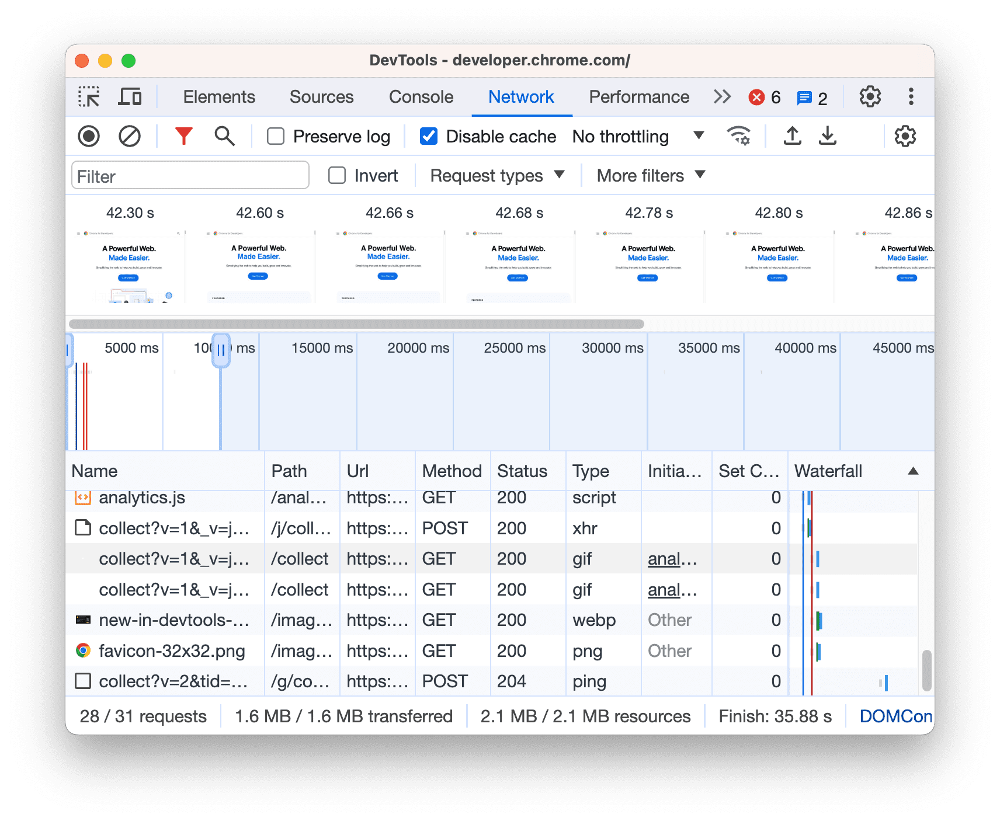
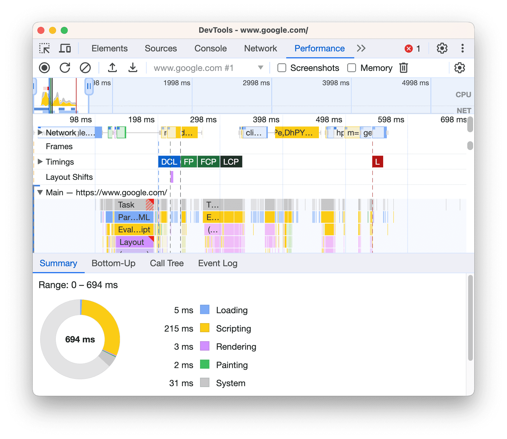
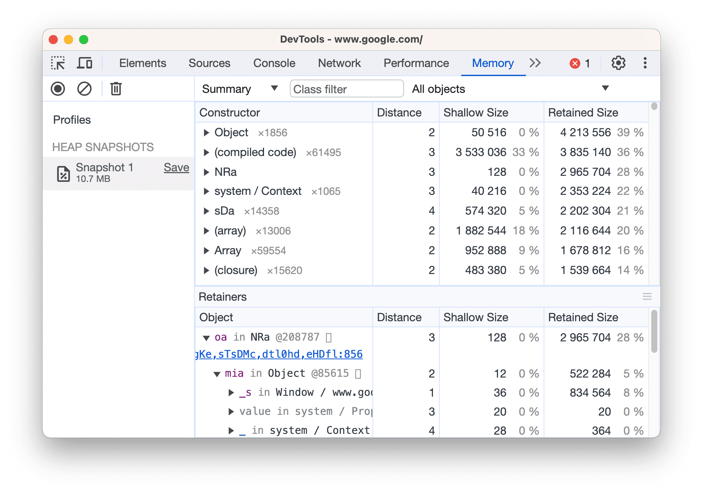
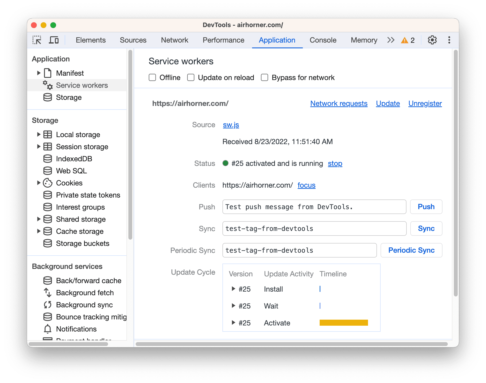
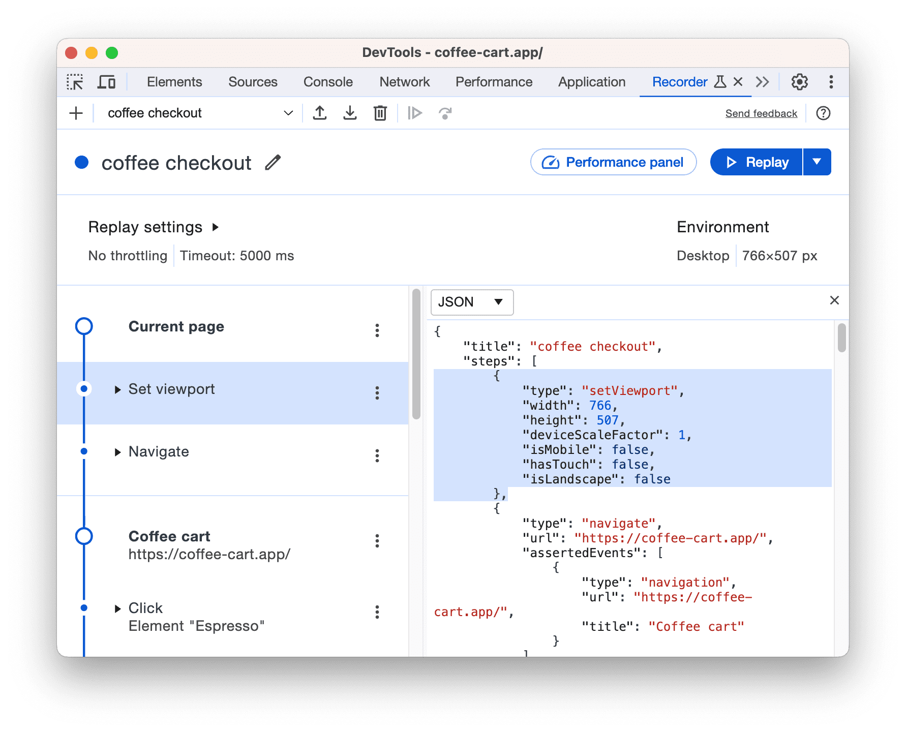

# 简介
Chrome DevTools 是一套 Web 开发者工具，直接内置于 Google Chrome 浏览器中，用于即时查看和修改页面，帮助开发者快速排查问题。

## DevTools 面板概览

* **元素**：**元素**面板提供了一个可用于检查和操控 DOM 的强大界面。你可以使用 DOM 树选择特定 DOM 节点，并使用其他工具进行修改。。
     
* **控制台**：通过控制台查看消息并运行 JavaScript。
    
* **源代码**：使用**源代码**面板查看和修改网站的资源，例如 CSS 文件、JavaScript 文件和图片。还可以调试 JavaScript，在页面重新加载时保留在开发者工具中所做的更改，保存和运行 JavaScript 代码段，并将在开发者工具中所做的更改保存到本地源代码中。
    
* **网络**：查看和调试网络活动。
    
* **性能**：查看页面的加载和运行时性能。
     
* **内存**：查找并修复页面的内存问题，例如内存泄漏。
    
* **应用**：检查已加载的所有资源，包括 IndexedDB 或 Web SQL 数据库、本地和会话存储、Cookie、应用缓存、图片、字体和样式表。
    
* **记录器**：录制、重放和衡量用户流。
    
