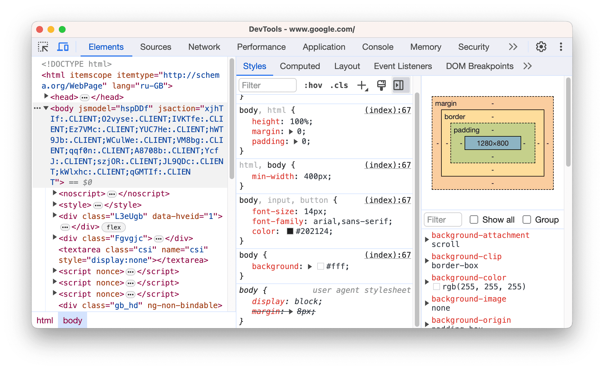
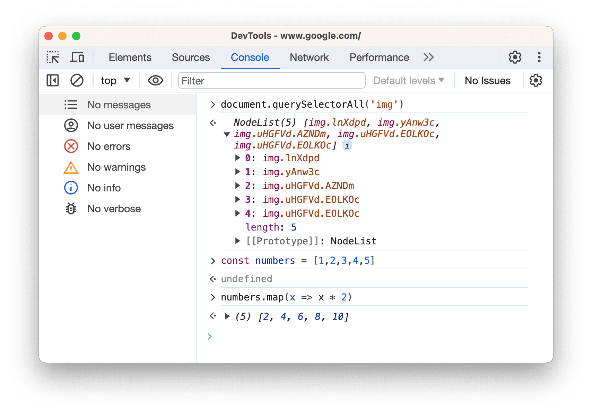
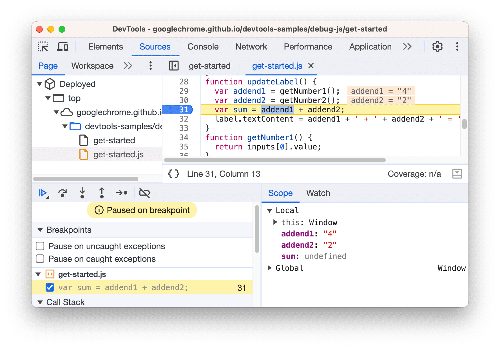
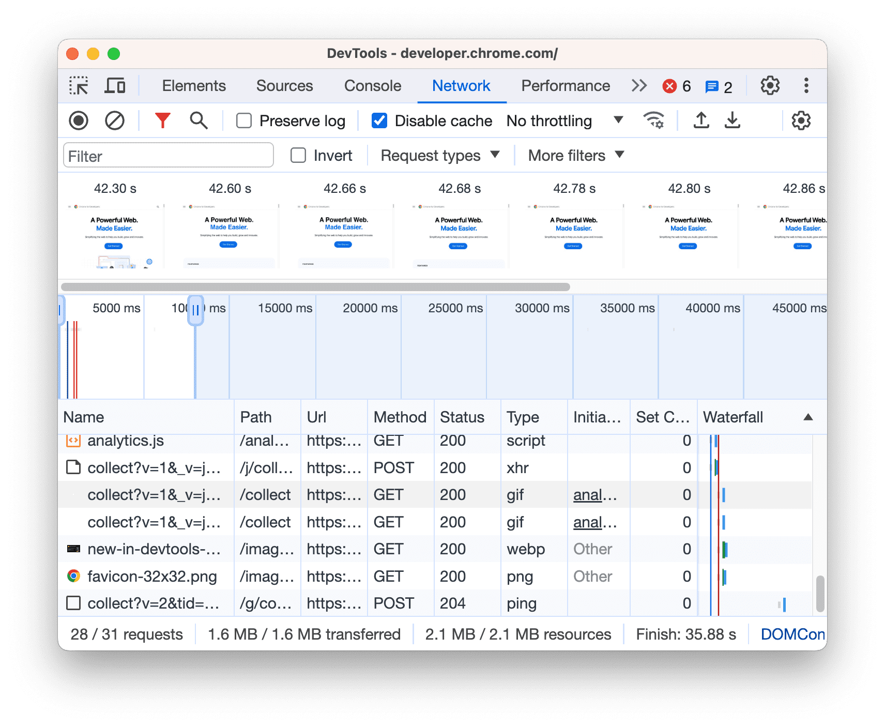
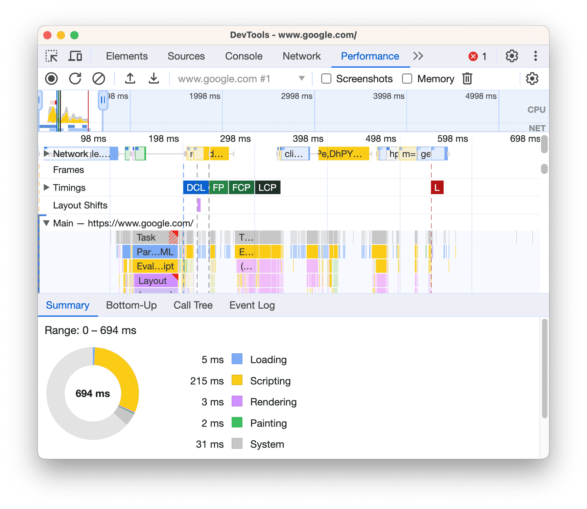
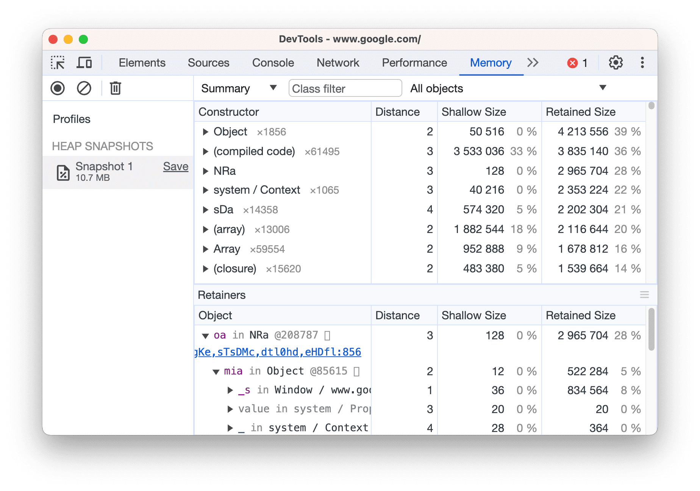
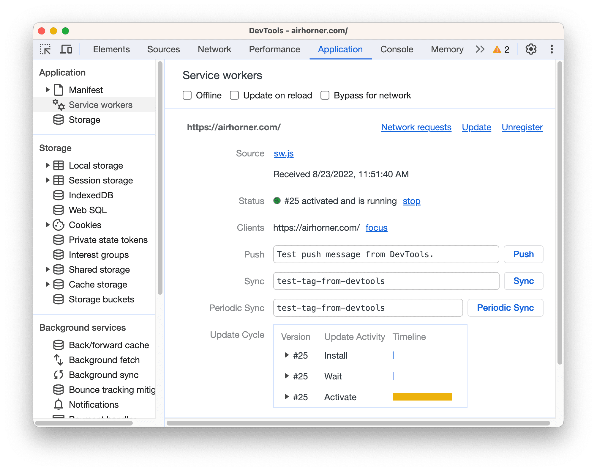
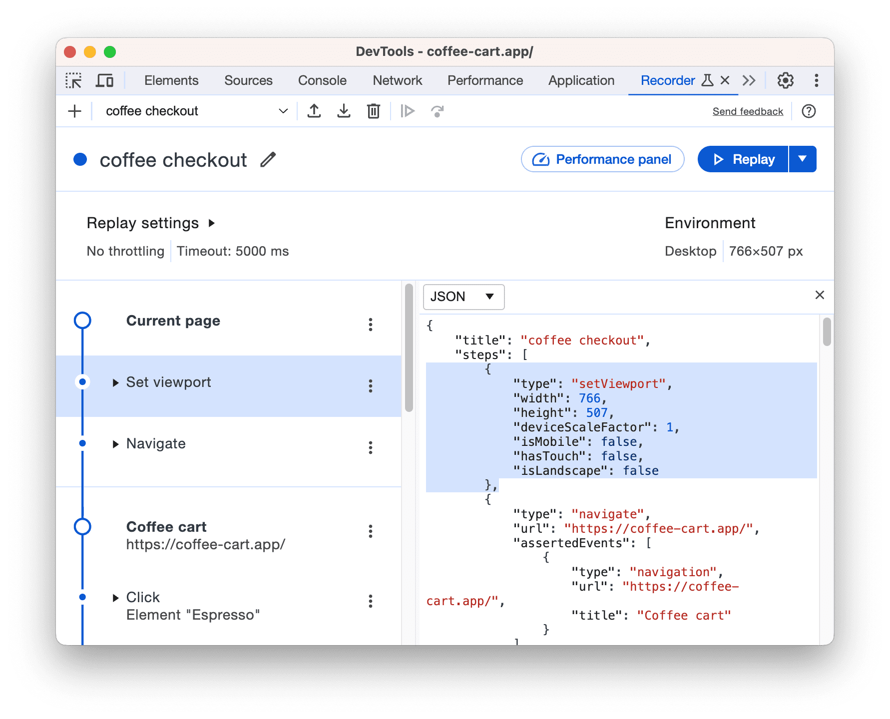
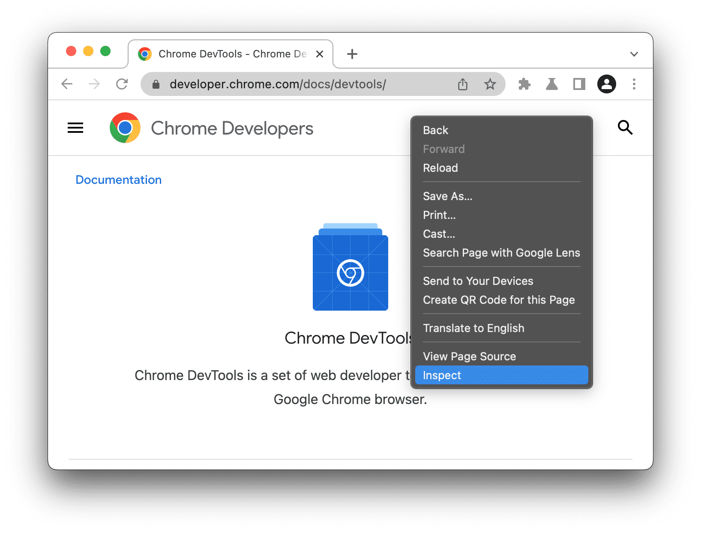
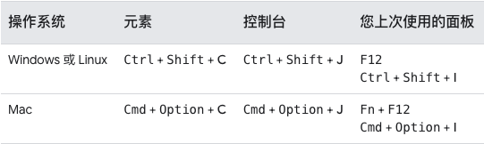

# 概览
Chrome DevTools 是一套 Web 开发者工具，直接内置于 Google Chrome 浏览器中，用于即时查看和修改页面，帮助开发者快速排查问题。

## DevTools 面板概览

* **元素**：查看和更改 DOM 和 CSS。
     
* **控制台**：通过控制台查看消息并运行 JavaScript。
    
* **源代码**：调试 JavaScript，在页面重新加载时保留在开发者工具中所做的更改，保存和运行 JavaScript 代码段，并将在开发者工具中所做的更改保存到本地源代码中。
    
* **网络**：查看和调试网络活动。
    
* **性能**：查看页面的加载和运行时性能。
     
* **内存**：查找并修复页面的内存问题，例如内存泄漏。
    
* **应用**：检查已加载的所有资源，包括 IndexedDB 或 Web SQL 数据库、本地和会话存储、Cookie、应用缓存、图片、字体和样式表。
    
* **记录器**：录制、重放和衡量用户流。
    

## 打开 Chrome DevTools

- **需要检查 DOM 或 CSS 时**：右键点击网页上的元素，然后选择**检查**。DevTools 会打开**元素**面板，并在 DOM 树中选中相应元素。
   
- **打开上次使用的面板**：点击浏览器右上角的 **三个点**按钮，然后选择 **更多工具** > **开发者工具**
    
- **使用快捷键打开**：
    
    **快速记忆方法**：
    * **C** 代表 CSS。
    * **J** 代表 JavaScript。
    * **I** 代表您上次的选项
