# 源代码面板
使用**源代码**面板查看和修改网站的资源，例如 CSS 文件、JavaScript 文件和图片。

## 查看文件
点击**网页**标签页，查看网页已加载的所有资源。


**网页**标签页的组织方式：
- 顶层（如上图中的 top）表示 HTML 帧。每个页面上都可以找到 top，表示主文档帧。
- 第二层（如上图中 developers.google.com）表示网页来源。主要关注与网页域名同名的文件夹（如上图中 developers.google.com）。
- 第三层、第四层等等，表示从该来源加载的目录和资源。

在**网页**标签页中点击文件，即可在**编辑器**标签页中查看内容。可以查看任何类型的文件，包括 CSS、JavaScript、HTML 和图片。


## 编辑 CSS 和 JavaScript
在**编辑器**标签页中，你可以编辑 CSS 和 JavaScript 文件。DevTools 会更新页面以运行你的新代码。

**编辑器**还可以帮助调试，它会在语法错误和其他问题旁边添加下划线，并显示内嵌错误提示。


编辑 CSS 文件会立即生效，而编辑 JavaScript 文件后必须保存才能生效。

注意，DevTools 不会重新运行脚本，因此只有在函数内的 JavaScript 更改才会生效。

重新加载页面后，DevTools 会清空你的 CSS 和 JavaScript 更改内容。

## 调试 JavaScript
**源代码**面板包含三个部分：
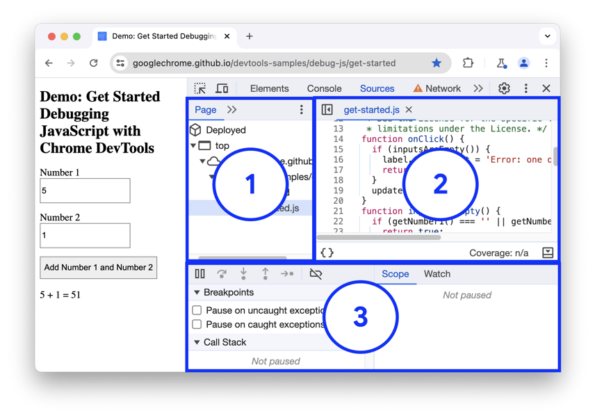
**3** 就是 **Debugger** 部分，包含检查页面 JavaScript 的各种工具。

### 使用断点暂停代码
**断点**可以让你在执行代码过程中暂停代码，并在此时检查所有代码运行相关信息。

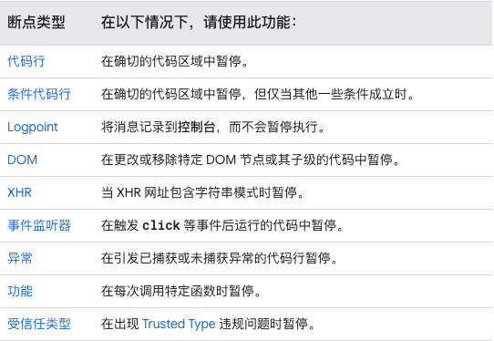

#### 代码行断点
在知道需要查看的确切代码区域时，可以使用代码行断点。DevTools 始终会在执行此行代码之前暂停。

1. **源代码**面板中打开想要中断的代码行所在文件
2. 单击行号左侧，添加断点
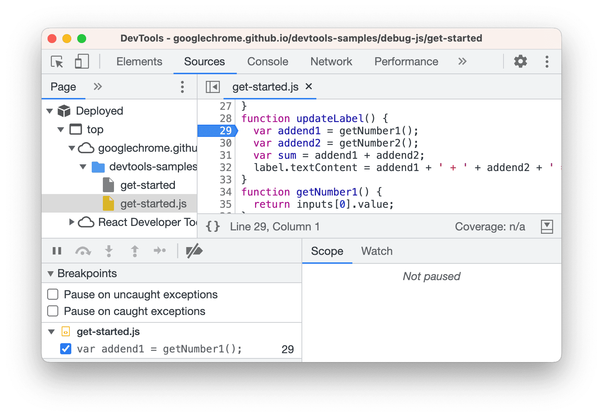

在代码中调用 debugger 语句，也可以在此处暂停代码，相当于使用代码行断点。

#### 条件代码行断点
如果只想在某个条件成立时停止执行，使用条件代码行断点。

1. **源代码**面板中打开想要中断的代码行所在文件
2. 右键行号，选择**添加条件断点**
3. 在输入框中输入条件，按 Enter 保存

激活条件断点后，行号顶部左侧会显示一个带问好的橙色图标。
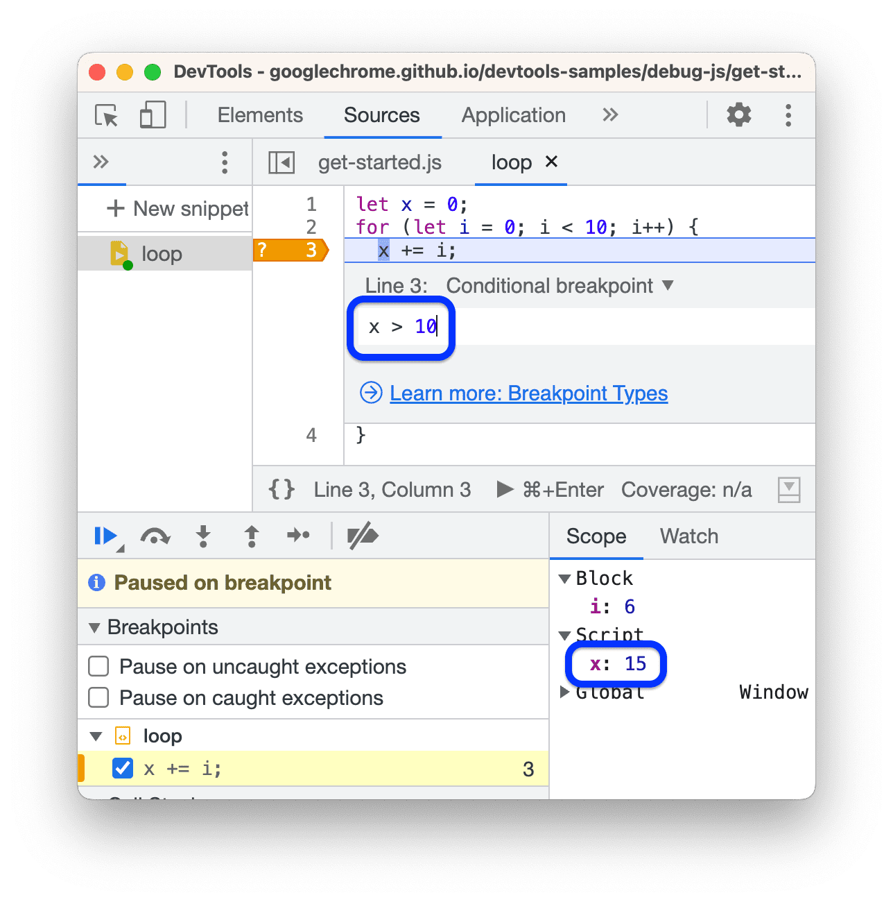

#### 日志代码行断点
使用日志代码行断点将消息记录到 **Console** 中，而不在此处暂停代码，完美替代 console.log。

1. **源代码**面板中打开想要中断的代码行所在文件
2. 右键行号，选择**添加日志断点**
3. 在输入框中输入消息，与 console.log 的参数相同的语法，按 Enter 保存
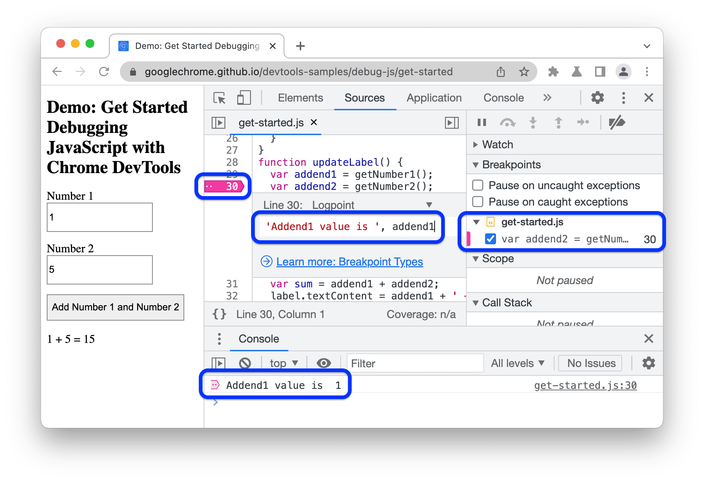

#### 修改断点
在**编辑器**中右键断点修改
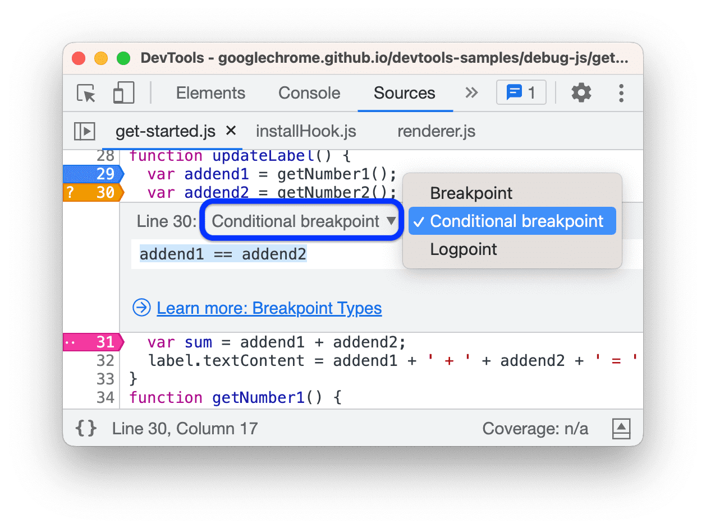

在左下方 **断点** 窗格中右键断点修改
- 显示位置。
- 修改条件或日志断点。
- 启用所有断点。
- 停用所有断点。
- 移除断点
- 移除其他所有断点
- 移除所有断点
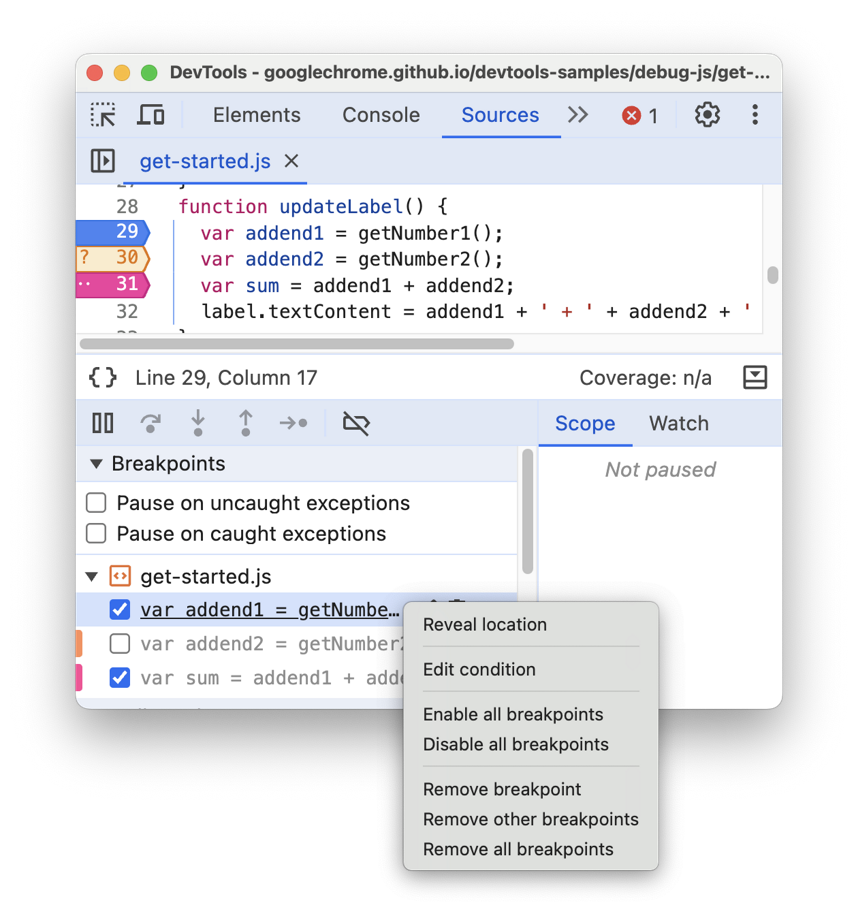

#### 分组修改断点
断点会按照文件分组，按行号和列号排序。

在**断点**窗格，右键某个组，你可以：
- 移除文件中所有断点。
- 停用文件中所有断点。
- 启用文件中所有断点。
- 移除所有短点。
- 移除其他组的断点。

#### DOM 更改断点
如果想要暂停更改 DOM 节点或其子节点的代码，可以使用 DOM 更改断点。

1. **元素**标签页中找到要设置断点的元素
2. 右键元素，选择**发生中断的条件**，选择中断条件：
   * 子树修改：在移除或添加当前所选节点的子级，或更改子级内容时触发。
   * 属性修改：在当前所选节点上添加或移除属性时，或属性值发生变化时触发。
   * 节点移除：在移除当前选定的节点时会触发。
  
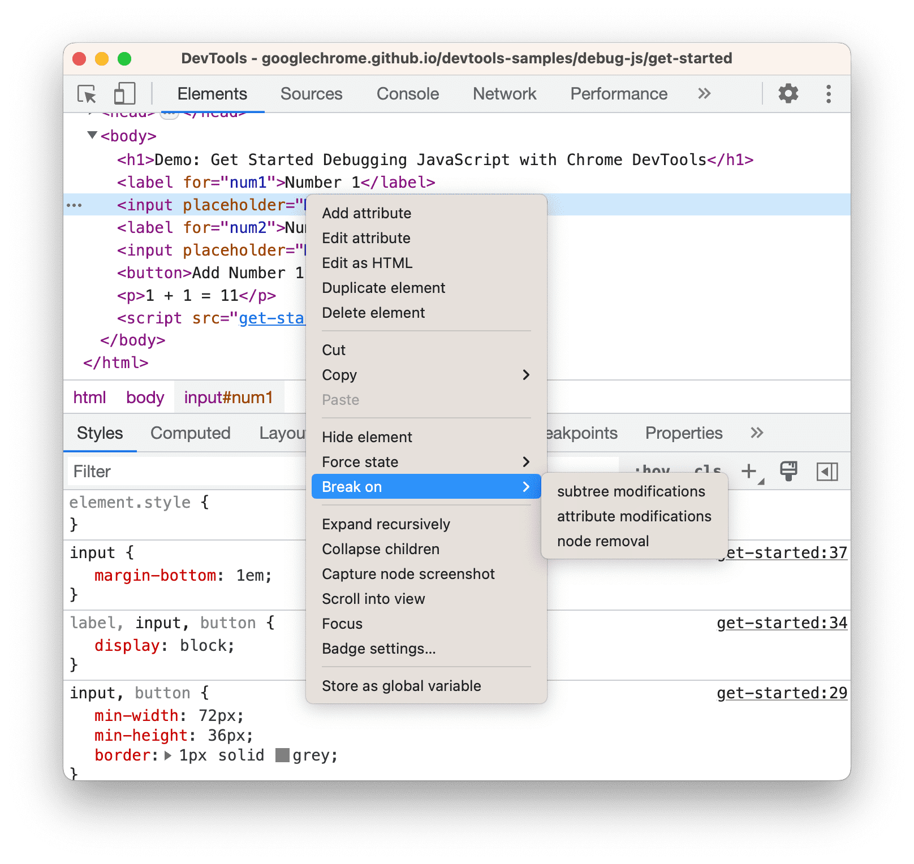

可以在 **元素**和**源代码**的 **DOM 断点** 区域找到 DOM更改断点列表。
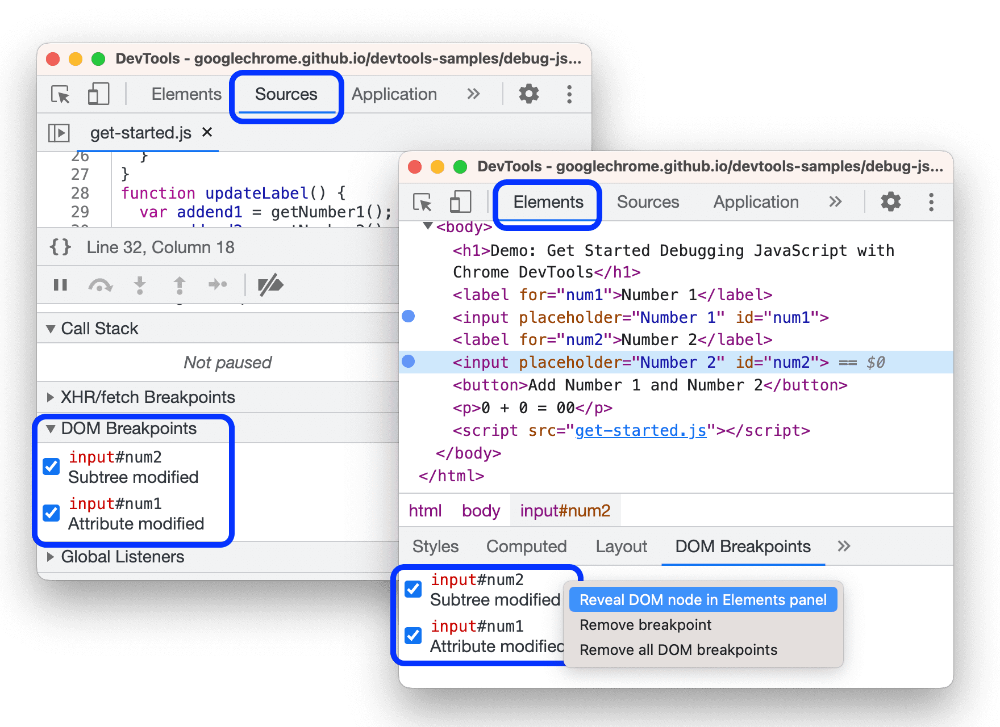

#### XHR/Fetch 断点
当发现页面请求错误的url，需要快找到发起错误请求的源代码时，这个断点很有用。

1. 点击**源代码**面板的***XHR/提取**断点
2. 点击➕添加断点，输入要对其设置断点的字符串，按 Enter 保存

DevTools会在请求url的url包含你输入的字符串时暂停代码。
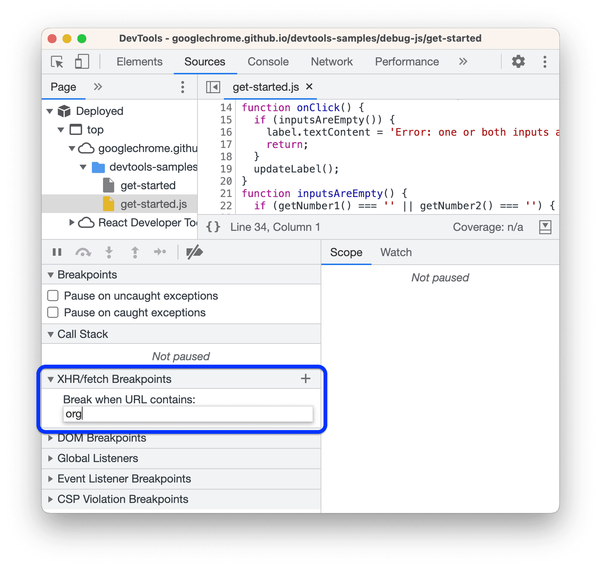


#### 事件监听器断点
当需要在事件监听器被触发时暂停代码，可以使用事件监听器断点。

1. 点击**源代码**面板的***事件监听器断点**窗格
2. 在事件类别列表中勾选要暂停的事件，或者展开类别勾选特定事件

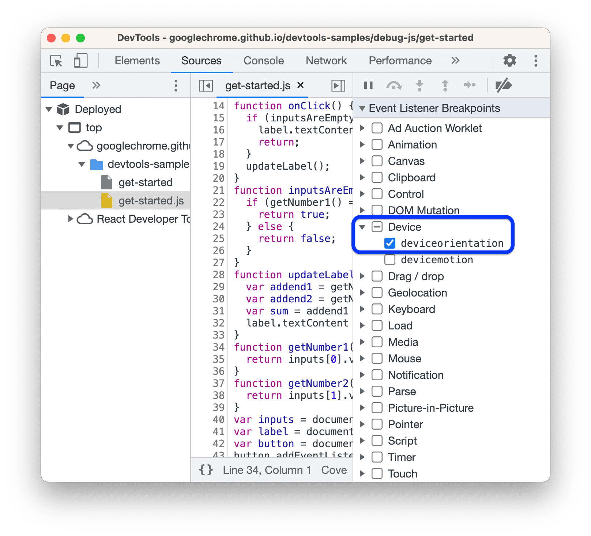

#### 异常断点
如果要在抛出异常时暂停代码，可以使用异常断点。

在**源代码**面板**断点**窗格中，勾选遇到捕获或未捕获的异常时暂停。

#### 函数断点
如果要在特定函数被调用时暂停代码，可以使用函数断点，其实就相当于在函数第一行设置代码行断点。

```javascript
function sum(a, b) {
  let result = a + b; // DevTools pauses on this line.
  return result;
}
debug(sum); // Pass the function object, not a string.
sum();
```


### 单步调试代码
通过单步调试代码，一次一行地检查代码执行情况，准确找到执行异常的地方。

#### 单步执行
如果代码在无关的函数调用的代码行上暂停，可以点击 **Step over** , 执行该函数而不是进去函数代码。

其实就是执行当前行，有函数也不进去。
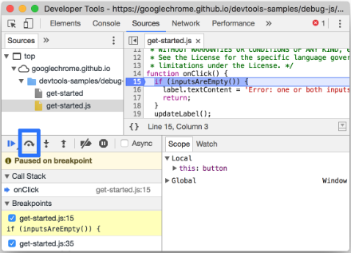

#### 单步进入
如果代码停在与问题有关的函数调用的代码行上，点击 **Step into**进入函数代码继续调试。
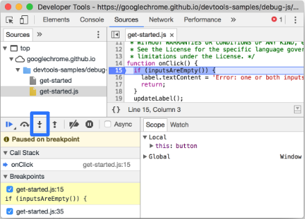

### 单步退出
如果代码停在不相关的函数内部，点击 **Step out** 执行并退出函数，继续执行函数调用后的代码。
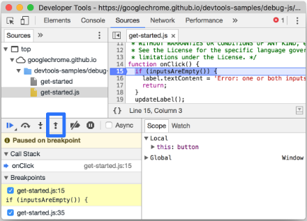  

#### 继续执行
如果需要继续执行脚本直到下一个断点（如果有），点击 **Resume script execution**。


如果要继续执行到某一行暂停，除了在该行打断点之外，还可以右键代码行，选择**继续到此处**。DevTools 会运行到该点之前的所有代码，然后在该行代码暂停。
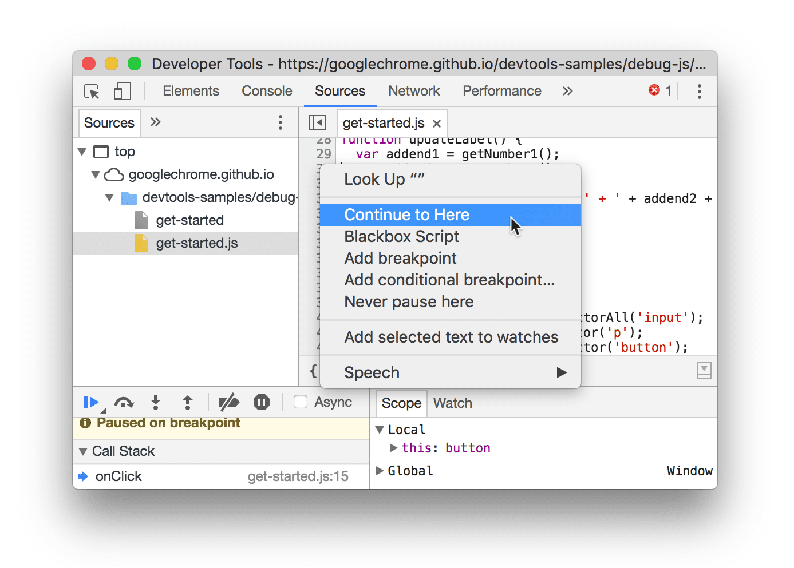

#### 强制执行
如果需要忽略所有断点并强制恢复脚本执行，点击右边一个斜线 / 划掉的图标。
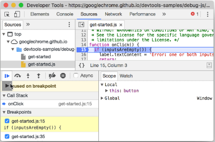


### 查看暂停时的代码运行情况

#### 检查变量值
DevTools 提供多种工具用于检查变量值
* **编辑器内嵌显示**：在执行暂停期间，调试程序会评估当前函数中到达断点前的所有变量，在相应声明旁内嵌显示当前值。
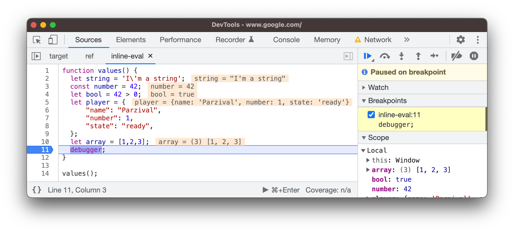

* **悬停预览**：在执行暂停期间，将鼠标悬停在类或函数名称上可预览其属性。
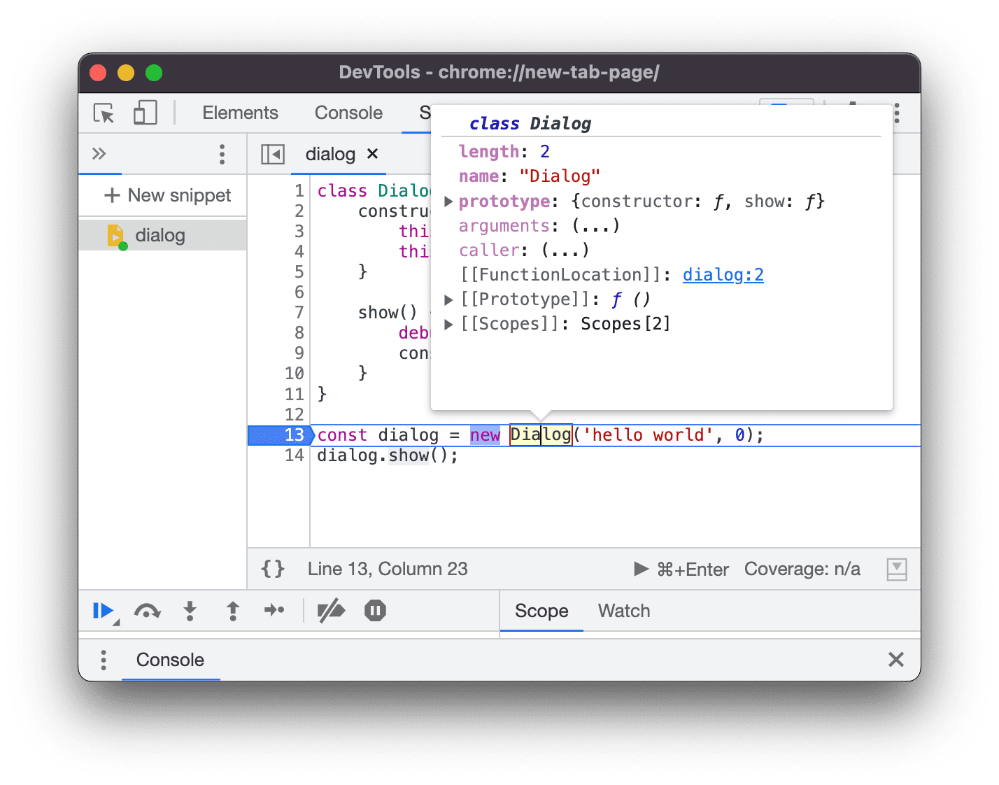

* **作用域**：**作用域**标签页会显示代码执行到此时此刻定义的全局和局部变量，以及各变量值，其中还会显示闭包变量（如果有）。双击变量值可以修改。
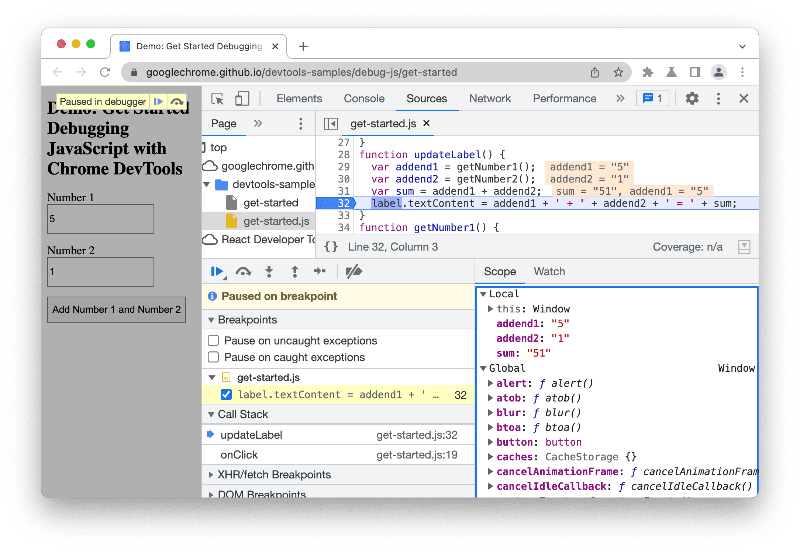

* **监视表达式**：**监视**标签页可以监视变量值随世家变化的情况。不仅限于变量，可以监视任何有效的 JavaScript 表达式。
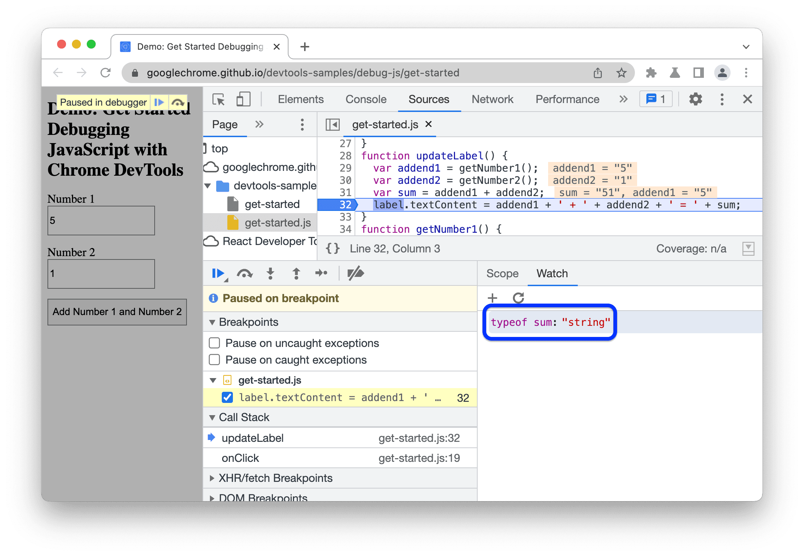
   
* **控制台**：可以使用控制台对任意 JavaScript 语句求值。
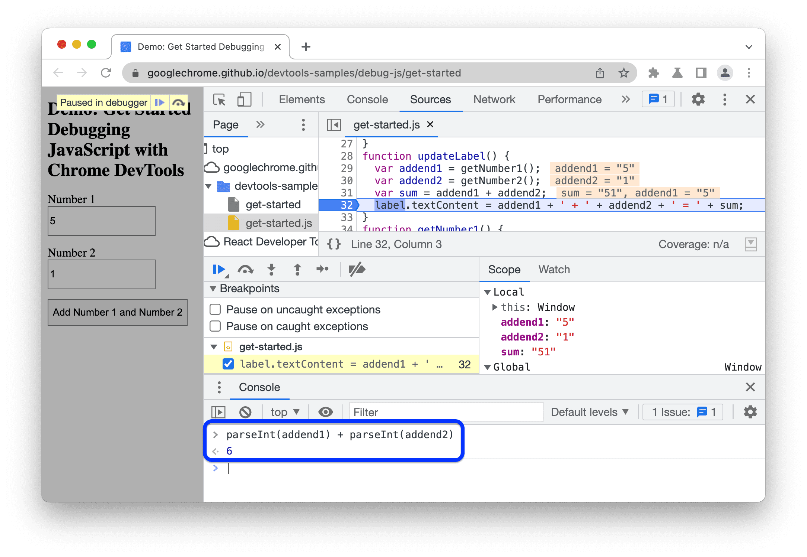


#### 查看当前调用栈
在某一行代码处暂停时，可以使用调用堆栈窗格查看将您带到此处的调用堆栈。

点击某个条目可跳转到调用该函数的代码行。蓝色箭头图标表示当前断点所在函数。

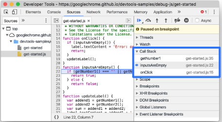


## 附录：快捷键速查表
### 源代码面板
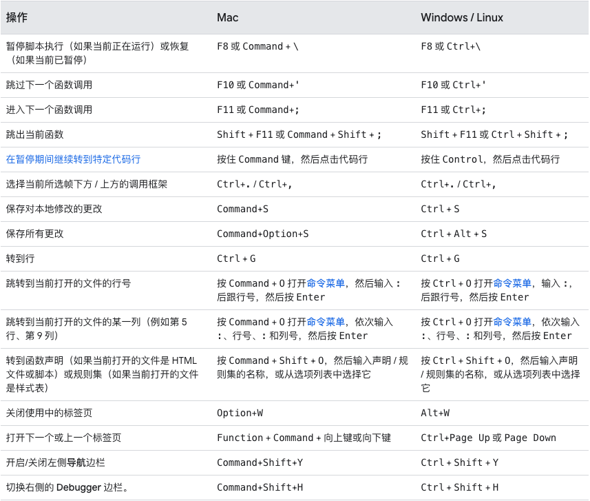
### 编辑器标签页
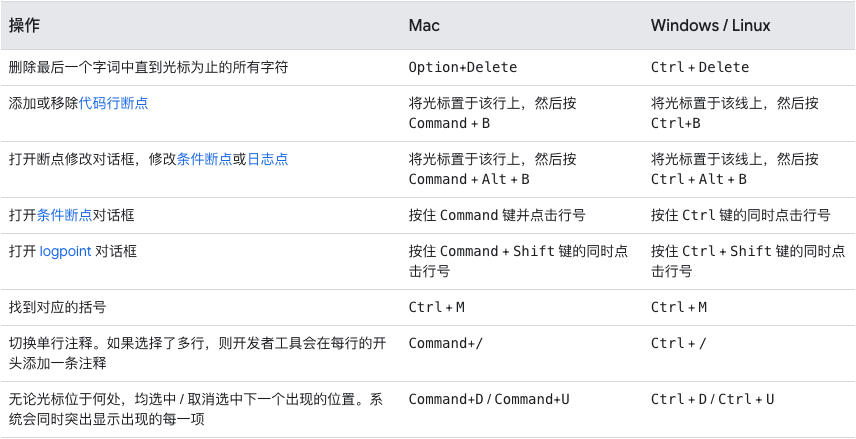
