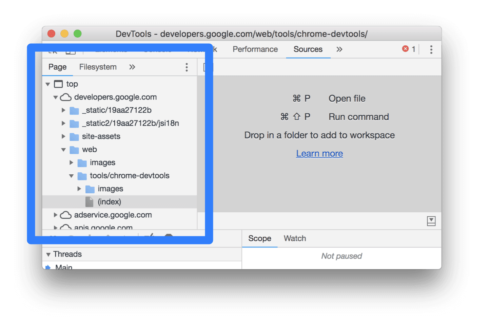
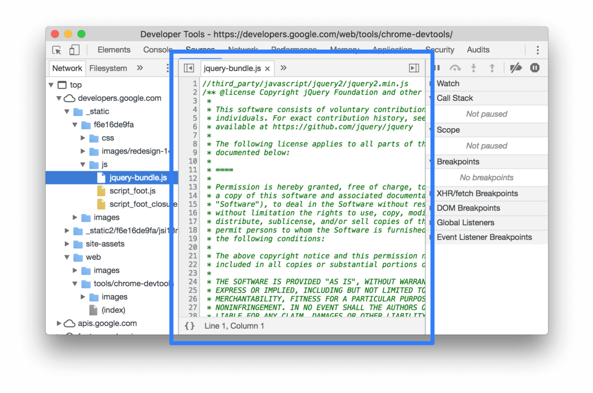
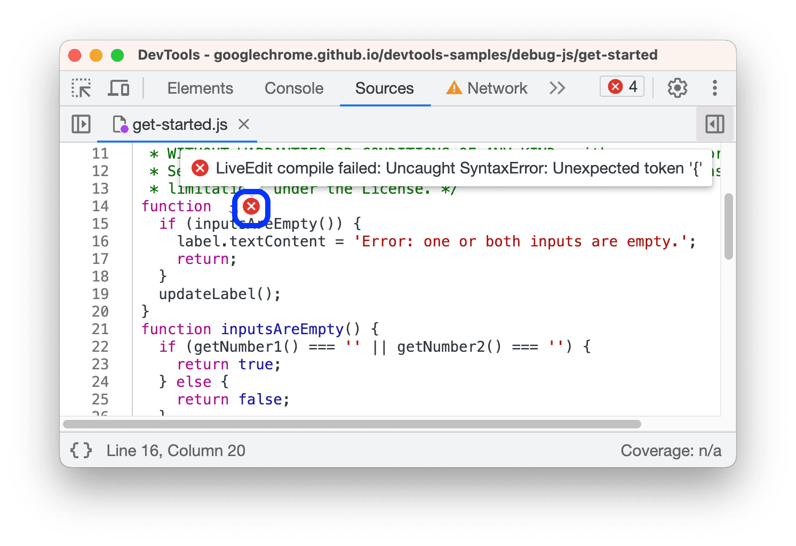

# 查看和编辑文件

## 查看网页资源
点击**网页**标签页，查看网页已加载的所有资源。

**网页**标签页的组织方式：
- 顶层（如上图中的 top）表示 HTML 帧。每个页面上都可以找到 top，表示主文档帧。
- 第二层（如上图中 developers.google.com）表示网页来源。主要关注与网页域名同名的文件夹（如上图中 developers.google.com）。
- 第三层、第四层等等，表示从该来源加载的目录和资源。

在**网页**标签页中点击文件，即可在**编辑器**标签页中查看内容。可以查看任何类型的文件，包括 CSS、JavaScript、HTML 和图片。

## 编辑 CSS 和 JavaScript
在**编辑器**标签页中，你可以编辑 CSS 和 JavaScript 文件。DevTools 会更新页面以运行你的新代码。

**编辑器**还可以帮助调试，它会在语法错误和其他问题旁边添加下划线，并显示内嵌错误提示。

编辑 CSS 文件会立即生效，而编辑 JavaScript 文件后必须保存才能生效。

注意，DevTools 不会重新运行脚本，因此只有在函数内的 JavaScript 更改才会生效。

重新加载页面后，DevTools 会清空你的 CSS 和 JavaScript 更改内容。