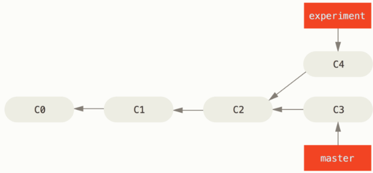

# 变基 (rebase)

在Git中整合来自不同分支的修改主要有两种方式：`merge` 和 `rebase`。在本节中我们将学习什么是变基、怎样使用变基，并展示该操作的惊艳之处，以及何种情况下你应该避免使用它。

## 变基的基本操作

在之前 分支的合并 的一个例子中，开发任务分叉到两个分支，又各自提交了更新。


之前介绍过，整合分支最容易的方法是 ```merge``` 命令。


其实还有一种方法：你可提取在 ```C4``` 提交中引入的补丁和修改，然后再 ```C3``` 的基础上再应用一次。在Git中，这种操作就叫 **变基（rebase）**，将提交到某一分支上的所有修改都移至另一个分支上，就好像“重新播放”一样。

在这个例子中，你可以检出 ```experiment``` 分支，然后变基到 ```master``` 分支：

```
$ git checkout experiment
$ git rebase master
First, rewinding head to replay your work on top of it...
Applying: added staged command
```


它的原理是首先找到这两个分支的最近共同祖先，然后对比当前分支相对于该组件的历次提交，提取相应的修改并存为临时文件，然后将当前分支指向目标分支的最新一次提交，最后应用之前存为临时文件的修改。

现在回到 ```master``` 分支，进行一次快进合并：

```
git checkout master
git merge experiment
```


此时，```C4'``` 指向的快照就和 用 ```merge```的例子中的 ```C5``` 一样了。这两种整合方法的最终结果没有任何差别，但变基使得历史提交更加整洁，是一条直线没有分叉。

请注意，无论是通过变基，还是通过三方合并，整合的最终结果所指向的快照都是一样的，只不过提交历史不同罢了。变基是将一系列提交按照原有次序应用到另一分支，而合并是把最终结果合在一起。
