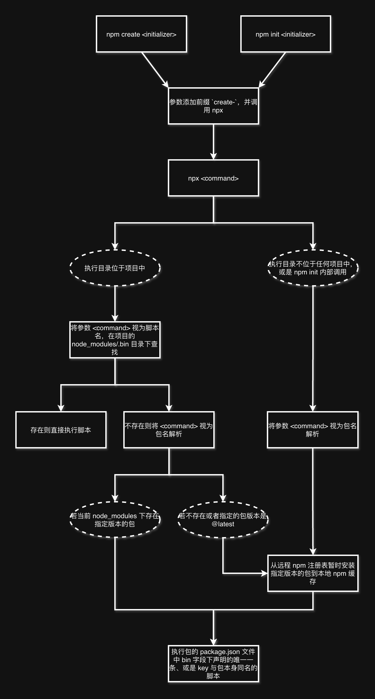

# 包命令执行机制

每当需要创建一个新项目时，我们往往会使用官方的脚手架工具。在命令行直接敲下一句 `npm create`，即可获得一个搭建完善的工程初始目录。

拿 `npm create vue@latest` 举例，Vue 官方文档中对它的解释是：“这一指令将会安装并执行 [create-vue](https://github.com/vuejs/create-vue)，它是 Vue 官方的项目脚手架工具”。奇怪，命令的参数不是 `vue@latest` 吗，为什么安装的是 `create-vue`，而最终执行的脚本文件又是以何种方式提供的呢？

这篇文章带大家一起深入理解 npm 包命令执行机制，看完不仅能轻松解决 `command not found` 的报错问题，还能自己开发一个提供有可执行命令的 npm 包。

## npm create/init

先说 `npm create`，它其实是 `npm init` 的别名，因此`npm create` 完全等同于 `npm init`。这一指令通常用于新建一个项目，后面跟一个参数代表包名，一般是用来创建项目的脚手架。

`npm init` 会在内部调用 `npx`，并且自动给包名参数添加前缀 `create-`，具体规则如下：

* `npm init foo` -> `npx create-foo`
* `npm init @usr/foo` -> `npx @usr/create-foo`
* `npm init @usr` -> `npx @usr/create`
* `npm init @usr@2.0.0` -> `npx @usr/create@2.0.0`
* `npm init @usr/foo@2.0.0` -> `npx @usr/create-foo@2.0.0`

因此，执行 `npm create` 或 `npm init`，最终执行的其实是 `npx`。这一设计其实是 npm 官方为了提升用户体验有意为之，使得命令本身更加语义化，表达出 **“创建”** 或 **“初始化”** 的意图。

## npx

再说到 `npx`。`npx` 是 npm 从 **v5.2.0** 版本开始引入的一个革命性工具，其核心功能是作为一个 **npm 包执行器（Package Executor）**。甚至无需提前安装到本地，`npx` 即可执行任何 npm 包提供的命令。

下面这张图清晰展示了 `npx` 命令的具体执行流程：

现在可以解答我们最开始的疑问了，`npm create vue@latest` 其实背后经历了这些步骤:

1. `npm create` 是 `npm init` 的别名，因此 `npm create vue@latest` 等同于 `npm init vue@latest`。
2. `npm init` 会在内部调用 `npx` 并为参数添加前缀 `create-`，因此实际执行的是 `npx create-vue@latest`。
3. 由于参数指定的版本号是 `@latest`，因此会直接从远程 npm 注册表暂时安装最新版本的 `create-vue` 到本地的 npm 缓存中。
4. 找到 `create-vue` 这个包的 `package.json` 文件中 `bin` 字段下定义的唯一一条、也是 key 与包同名的脚本，执行脚本文件即可创建新项目。

## npm run 与 node\_modules/.bin

还有一种执行命令的方式，通过 `npm run` 执行项目的 `package.json` 中 `scripts` 字段下定义的命令，比如大家再熟悉不过的 `npm run dev` 和 `npm run build`。

细心的朋友可能会发现这样一个问题，比如 `scripts` 字段下的 `dev` 命令中用到了 `vite`，`npm run dev` 可以成功执行，但是如果在命令行直接执行 `vite` 则会报错 `command not found`，这是什么原因呢？

其实是因为当开发者安装一个 `package.json` 文件中包含 `bin` 字段的包时，npm 会根据这个字段的配置，在 **`node_modules/.bin`** 目录中创建相应的可执行文件链接。而 `npm run` 命令的一个核心特性是，在执行任何脚本之前，会**自动将当前项目的 `node_modules/.bin` 目录的绝对路径添加到 `PATH` 环境变量中**。这个操作是临时的，仅对当前正在执行的脚本进程及其子进程有效。

这就是为什么，同样一行命令，通过 `npm run` 可以执行而在命令行直接执行却找不到。

## npm 包如何提供可执行脚本

想玩别人的游戏自然得遵守别人的规则，而遵守规则的前提是理解规则。包命令执行机制就是 npm 官方定的规则，因此只要一个 npm 包能满足这个机制，用户就可以执行包本身提供的可执行命令。

开发一个提供了可执行命令的 npm 包，其核心就在于前文中多次出现的 `package.json` 中的 **`bin`** 字段。在 npm 生态系统中，`package.json` 文件中的 `bin` 字段扮演着至关重要的角色，它定义了一个 npm 包对外暴露的可执行命令。这个字段是连接 npm 包和其命令行接口（CLI）的桥梁，使得一个包不仅仅是一个代码库，还可以成为一个可以在终端中直接调用的工具。`bin` 字段本质上是一个**映射（map）** ，它将一个或多个命令名（key）映射到包内的可执行脚本文件（value）。

前文提到了两种执行包命令的方式，分别对应在 `package.json` 中配置 `bin` 字段时不同的要求：

* 希望用户把包安装到项目中后通过 `npm run` 执行的脚本，只要在 `bin` 字段中声明脚本文件路径即可，key 没有任何限制。
* 希望用户无需安装直接就能执行的脚本，需要在 `bin` 字段下配置脚本的 key 命名为与包本身同名，或者只配置一条脚本。如果希望用户通过 `npm create` 或 `npm init` 执行，则包名本身还必须包含前缀 `create-`。

## 写在最后

npm 包命令执行机制是前端工程化中实现工具链的基石，极大提升了开发者创建新项目、以及在开发过程中使用工具链的便捷性。

并且只有完整理解了这一机制，才能清楚地知道如何开发一个提供有可执行命令的 npm 包。
